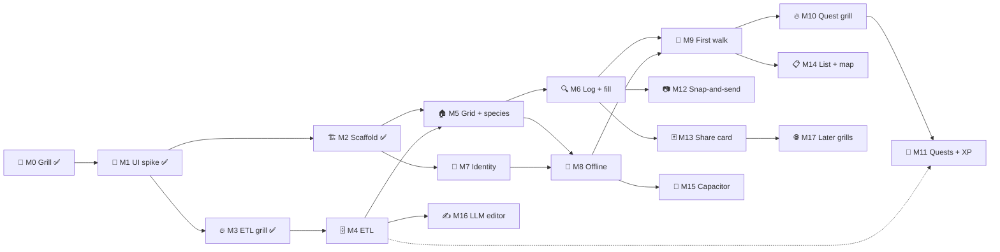

# 🗺️ Roadmap — standkreis-dex

> One table, kept current. A milestone is done when its "done when" is true and its findings or record is in `docs/`. Grills (🔥) produce records and spec sections, not code.

| 🗓️ Updated | 👤 Owner | ➡️ Next |
| --- | --- | --- |
| 2026-09-05 | Sven Reiser | M4 (ETL) and M7 (identity) in one session, [handoff 0006](handoffs/0006-etl-and-identity.md) |

## 📍 Milestones

| # | Milestone | Slice | Done when | Depends on | Status |
| --- | --- | --- | --- | --- | --- |
| M0 | 🔬 Grill | pre | [Record 0001](records/0001-standkreis-dex-the-first-walk.md), [spec 0001](specs/0001-standkreis-dex-the-first-walk.md) | — | ✅ 2026-09-04 |
| M1 | 🎨 UI spike + review | pre | Spec §🎨 chosen, [review 0003](handoffs/0003-ui-spike-review.md) closed | M0 | ✅ 2026-09-04 |
| M2 | 🏗️ Scaffold | 1 | Next.js PWA, tokens, tRPC, Prisma, i18n de/en, spike deleted ([findings 0004](handoffs/0004-scaffold-findings.md)) | M1 | ✅ 2026-09-04 |
| M3 | 🔥 ETL grill | 1 | Region unit, cut, month rule, image ladder, rank rule decided on real data ([record 0002](records/0002-etl-the-plausible-set.md), [findings 0005](handoffs/0005-etl-grill-findings.md)) | M1 | ✅ 2026-09-05 |
| M4 | 🗄️ ETL + plausible set | 1 | Spec §🗃️ runs: taxa, plausibility per region with twelve month shares, assets with licence, text, GloBI edges, look-alikes in Postgres. Mainz-Bingen's grid feels like Saturday to the owner | M3, M2 schema updated to the new ERD | ➡️ next, [handoff 0006](handoffs/0006-etl-and-identity.md) |
| M5 | 🏠 Dex grid + species page | 1 | Grid with filter drawer and "nur jetzt" chip, species page from four sources, honest empty states, mark studied | M2, M4 | |
| M6 | 🔍 Log + fill | 1 | Chooser, backbone search, wild/captive save, fill sheet, Tagebuch by day, E13 for species outside the set | M5 | |
| M7 | 🔐 Identity + data | 1 | Anonymous id, passkey/email sync, export JSON, delete, Du with counters and settings | M2 | ➡️ parallel to M4, [handoff 0006](handoffs/0006-etl-and-identity.md) |
| M8 | 📴 Offline | 1 | Dex for the active filter opens with no network, sightings queue and sync | M5, M7 | |
| M9 | 🚶 The first walk | 1 | The owner uses it on one walk and opens it again the next day | M6, M8 | |
| M10 | 🔥 Quest + recap grill | 2 | Generator rules, repeat avoidance, the two-question recap, XP curve | M9 | |
| M11 | 🧭 Quests + recap + XP | 2 | Three weekly quests, recap unlocks studied XP, Du with level, "kommt bald" replaced | M10, M4 data | |
| M12 | 📷 Snap-and-send | 2–3 | Pl@ntNet key, BioCLIP 2 host, taxon ladder prefilling the search | M6 | |
| M13 | 🃏 Share card | 3 | Render route, coarsened location, no XP on the card | M6 | |
| M14 | 📋 List + map views | when the grid is proven | Toggle already has its place; the 10 km cell lives on the map | M9 | |
| M15 | 📱 Capacitor wrap + stores | when a second user wants it | Camera, GPS, SQLite, haptics via plugins | M8 | |
| M16 | ✍️ LLM editor | polish | Ecology prose from the graph with citations; removes the CC BY-SA intro | M4 | |
| M17 | 🌐 Later grills | later | Sessions, places, friends, feed, BirdNET, iNat export, fish tile cut, image takedown path | M13 | |

## 🔗 Dependencies

## 📝 What earlier milestones changed

| Grill | Changed for later milestones |
| --- | --- |
| M3 | No grid cells: the region is one GADM level-2 polygon, so M4 stores plausibility per region, not per cell. M2's Prisma schema needs `Region`, `Asset` licence fields, the 12 month shares and the 8-tile enum before M4 writes into it |
| M3 | Month is a sort and a chip, not a filter on the denominator: M5's filter drawer loses "Zeitraum" |
| M3 | Lebensraum leaves the Steckbrief; intro falls back de → en; species outside the set get content on first log (M6) |
| M1 | Studied earns XP only after the recap, so M11 owns the XP switch, not M5 |
