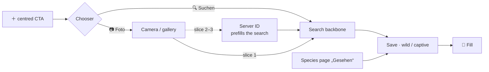

# 🔎 [0002] Findings — UI exploration spike

> Companion to [the handoff](0002-ui-exploration-spike.md). One table per screen, variants side by side, a 👍 and a 👎 with reasons, and anything the mocks put in doubt. Screens are filled in as the spike reaches them.

| 🗓️ Started | 👤 Owner | 🧪 Prototype | 🖼️ Screenshots |
| --- | --- | --- | --- |
| 2026-09-04 | Sven Reiser | `spike/ui/` · `npm run dev` · `#/grid/a` `#/grid/b` `#/grid/c` | [`docs/adr/0001-standkreis-dex-the-first-walk/`](../adr/0001-standkreis-dex-the-first-walk/) |

## 🧬 Fixture

45 species plausible in Rheinland-Pfalz in September, real data shape: GBIF key, Wikidata QID, de/en/sci names, IUCN, Commons lead image **with author and licence**, two-sentence intro from de.wikipedia (CC BY-SA), 12-month occurrence (0–3), GloBI-style interactions pointing inside the fixture (mirrored automatically, 10 kinds). States: 28 silhouette · 9 studied · 5 seen · 3 studied + seen. Amsel and Admiral carry a stand-in "user photo". Feuersalamander has **no interactions on purpose**, for the empty state on screen 3.

Build: `npm run fixture` (Wikidata SPARQL + Commons imageinfo + Wikipedia REST, ~30 s). Authored by hand: species list, months, interactions, states, a few short German names.

## 2 · 🏠 Dex grid

| | A · Flat tiles | B · Grouped, photo cut into silhouette | C · "Jetzt draußen" cards |
| --- | --- | --- | --- |
| 🖼️ | [390](../adr/0001-standkreis-dex-the-first-walk/0002-grid-a.webp) · [360](../adr/0001-standkreis-dex-the-first-walk/0002-grid-a-360.webp) · [scrolled](../adr/0001-standkreis-dex-the-first-walk/0002-grid-a-scrolled.webp) | [390](../adr/0001-standkreis-dex-the-first-walk/0002-grid-b.webp) · [360](../adr/0001-standkreis-dex-the-first-walk/0002-grid-b-360.webp) · [scrolled](../adr/0001-standkreis-dex-the-first-walk/0002-grid-b-scrolled.webp) | [390](../adr/0001-standkreis-dex-the-first-walk/0002-grid-c.webp) · [360](../adr/0001-standkreis-dex-the-first-walk/0002-grid-c-360.webp) · [scrolled](../adr/0001-standkreis-dex-the-first-walk/0002-grid-c-scrolled.webp) |
| Layout | One flat grid, 3 columns, square tiles, name below | Sections per taxon group with per-group counts, 4 columns, no names | Two sections "Jetzt draußen" / "Auch möglich", 3 columns, card with name + state line + attribution line |
| Order | Likely-now first, then group, then name | Group, then name | Peak-this-month first, then name |
| Silhouette | Grey filled shape on tile; green dot = likely now | Grey filled shape | Grey filled shape, "noch nicht" |
| Studied | Amber **outline** + bookmark badge | Amber outline on amber-tinted tile + smaller badge | Amber outline, white card with amber ring, "gelernt" |
| Seen | Photo fills the tile; 8 px attribution over a gradient | Photo **masked into the group silhouette** (Gotcha) on green tile | Photo framed 4:3 in a card, date under the name, 8 px attribution line |
| Studied + seen | Photo + badge | Masked photo + badge | Photo + bookmark + date |
| At 50 % | Three states distinct. Attribution unreadable. Names readable | Three states distinct by tile colour, not by content: masked photos become blobs | States distinct; the state line is noise at this size |
| At 360 px | Fine, names still one line | Fine | Longer names truncate ("Feuersalaman…") |

**🗳️ Owner pick (2026-09-04): A's cells.** Flat 3-column tiles with the name under them. The "first seen" date from C moves to the species page. Search and filter become **one bar**: a search field with a filter button that only shows the count of active filters; the filters themselves live in a bottom drawer. Revised A: [grid](../adr/0001-standkreis-dex-the-first-walk/0002-grid-a.webp) · [filter drawer](../adr/0001-standkreis-dex-the-first-walk/0002-grid-a-filter-drawer.webp).

**👎 Rejected: B's photo-in-silhouette.** Gotcha works because the sticker is *that animal's* contour. With one generic shape per taxon group a photo cut into a bird outline is a brown blob (see Amsel, Kohlmeise, Eichhörnchen in B). It would need per-species vector silhouettes or photo segmentation; neither is in the first slice. Also rejected: C's per-cell state text ("noch nicht", "gelernt") and date, which duplicate the tile or belong on the species page.

**Open from C:** the seasonal split ("Jetzt draußen" / "Auch möglich") survives as the default *sort* in the drawer, not as sections. Owner to confirm on the next look.

**The studied glyph.** The first round used a bookmark; the owner asked what it stands for, which is the answer: it does not read. A bookmark means "saved for later" in every other app. Replaced by an **open book** in amber. Seen has no glyph; the photo is the glyph. Amber = studied, green = seen, everywhere.

**Kept from all three:** the green dot for "likely now" on silhouettes; the grid · list · map toggle's place at the top right; region and month as a quiet context line under the counters.

**🔁 Revision 2 (2026-09-04, owner's drawings).** Header is one row: page title (28 px) and the grid · list · map toggle at the same height. Under it the two axes as **one progress bar inline with the counters** ("12 gelernt · 8 gefunden · 45 möglich"): green = gefunden, amber = gelernt but not yet gefunden, empty = the rest. Region and month leave the header and live only in the filter drawer. The search bar stays at the top and scrolls away; once it is gone a **bottom-right button** takes over and opens the same drawer with a search field on top. Shots: [top](../adr/0001-standkreis-dex-the-first-walk/0002-grid-a.webp) · [scrolled, button](../adr/0001-standkreis-dex-the-first-walk/0002-grid-a-scrolled.webp) · [drawer with search](../adr/0001-standkreis-dex-the-first-walk/0002-grid-a-filter-drawer.webp).

| # | Doubt | Proposal |
| --- | --- | --- |
| 19 | **One bar, two axes.** The 3 species that are both gelernt and gefunden are counted once, in green, so the amber segment shows 9 while the text says 12 gelernt | Accept: the bar shows how full the dex is, the text carries the exact numbers. Alternative is two thin bars, one per axis. Owner call |

### 🎨 Design language, from the owner's inspiration (three Dribbble-style shots)

| Shot | Take | Keep | Drop |
| --- | --- | --- | --- |
| Dark forest splash + login (BioLeaf) | Splash and onboarding only, not the app | Atmosphere, one real Commons photo with attribution | The renders themselves: they look AI-generated, spec §⚖️ forbids that |
| Dark green discovery app (Animap) | Modern, clean; chips too large | Card rhythm, pill chips (smaller), search with camera affordance | Dark as default: the walk is in sunlight, dark UI is the least legible outdoors. Dark follows the system setting later |
| Light plant shop | Closest to the current mock | White cards on pale paper, generous type, bottom pill nav | Shop patterns (price, cart) |

**🌙 Dark mode (2026-09-04).** Follows the system setting; light stays the default for sunlight. Every colour is a token, so one palette swap covers all screens; the onboarding splash stays dark in both. `?theme=dark` on the hash forces it for screenshots. Shots: [grid](../adr/0001-standkreis-dex-the-first-walk/0002-grid-a-dark.webp) · [species page](../adr/0001-standkreis-dex-the-first-walk/0002-species-p1-amsel-dark.webp).

### ❓ Put in doubt by the mocks

| # | Doubt | Proposal |
| --- | --- | --- |
| 1 | **"Every image shows attribution"** in the grid. At tile size an 8 px caption is decorative, not honest: unreadable at 50 % and in sunlight | Grid tiles are thumbnails; attribution is one tap away on the species page, which is how Commons treats thumbnails too. Rule stays for every image at readable size. Owner call |
| 2 | **Two counters.** The mock adds "45 möglich" as a denominator. It is not a score, but it is a third number and it grows when the region grows | Keep as denominator or drop. Owner call |
| 6 | **"Active filter visible"** (handoff §2) vs the owner's "only show the count". The mock shows a count badge on the filter button and region · month as a grey context line under the counters | Confirm that the context line is enough |
| 3 | **Reference image fills a seen species.** Wikidata's lead image is sometimes a herbarium sheet (Brennnessel) or a distant shot; a dex of Wikidata thumbnails looks like Wikipedia | Not a spec change. Note for the ETL: pick images by quality, and nudge "add your photo" on the fill moment |
| 4 | **Month in the filter.** The mock shows "Mainz-Bingen · September" as one chip. Spec §🧬 says plausibility is "optionally per month" | Make month a first-class part of the filter, defaulting to now. Small spec wording change, no decision reopened |
| 5 | **UI language.** The mock is German (names, copy) because the user is. Spec is English and "global from day one" | Mock stays German; the real app localises. Confirm |

### 🩶 Revision 3 · greyscale instead of silhouettes (owner, 2026-09-04)

🙋 The owner: the group silhouettes are generic (one bird for eleven birds) and not reproducible as CSS shapes; the unlock feeling needs the real animal. Proposal: reference image in greyscale at reduced opacity for what is not found yet. Mocked in both themes; **🙋 owner pick: greyscale is the grid, the silhouette variant is deleted** (Silhouette stays only as the group icon in onboarding and as a fallback for species without an image). Mini tiles on species, quests and Tagebuch, the onboarding preview and the fill moment follow.

| | Silhouettes (§2, superseded) | ✅ Greyscale |
| --- | --- | --- |
| 🖼️ | superseded, see Revision 2 shots in git history | [light](../adr/0001-standkreis-dex-the-first-walk/0002-grid-a.webp) · [dark](../adr/0001-standkreis-dex-the-first-walk/0002-grid-a-dark.webp) · [scrolled](../adr/0001-standkreis-dex-the-first-walk/0002-grid-a-scrolled.webp) · [fill](../adr/0001-standkreis-dex-the-first-walk/0002-fill-grid.webp) |
| Not found | Group shape, grey fill | Reference image, greyscale, 45 % opacity |
| Studied | Amber outline shape + book | Greyscale at 70 %, amber inset ring + book |
| Found | Photo, colour, attribution caption | same |
| The gap | "Something bird-shaped lives here" | "This exact jay lives here and you have not met it" |
| Reveal | Shape → photo | Grey → colour → your own photo |
| Scales | No, hand-drawn per group | Yes, every species with an image |
| Light theme | Clean | Faded field guide; pale images (Heupferd, Weißdorn) sink into the tile |
| Dark theme | Clean | Ghost images, the strongest version of the two |
| Attribution | Only on found cells | Every cell is now a licensed image; one line under the grid, details on the species page |

**👍 Recommendation: greyscale.** The grid turns into a field guide you colour in, and the silhouette's only advantage (hiding the identity) was never used because the name is under every cell. The owner's argument about reproducibility is the decisive one: 45 species is a fixture, a region is thousands. **👎 Rejected:** blur (reads as loading), keeping silhouettes for groups without images (mixed grids look broken; hide the species or use a neutral tile).

### ❓ Put in doubt by the greyscale grid

| # | Doubt | Proposal |
| --- | --- | --- |
| 42 | **"Attribution on every image"** (spec §⚖️) now means 45 captions in a grid | Change the rule to "attribution on every image *view*": one line under the grid naming the sources, full author and licence on the species page and on long-press. NC and BY-SA images still allowed under free-forever |
| 43 | **The crop is the product now.** A greyscale underside of a comma or a wasp from below is a bad tease; the silhouette hid bad photos, greyscale exposes them | Square crops chosen per species become content work (record Q7's LLM editor later); until then pick the reference image for the crop, not the licence |
| 44 | **Opacity in light mode.** 45 % over cream reads faded rather than locked | Try 55 % with a slight contrast lift, or a light desaturated tint instead of pure greyscale. Decide on a phone in sunlight, which is where the app is used |
| 45 | **The fill moment** (§5, chosen: iris from silhouette to photo) has to become grey → colour | Same in-place cell, colour sweeps in; keep the green ring. Re-shoot §5 once the grid is picked |

## 3 · 📄 Species page

Routes: `#/species/p1|p2|p3/<id>`. Shot on Amsel (studied + seen, own photo, 5 edges), Brombeere (11 edges), Feuersalamander (no edges), Fliegenpilz (fungus notice).

| | P1 · Full page, hero, chip rows | P2 · Sheet over grid, radial graph | P3 · Full page, square image, sentence list |
| --- | --- | --- | --- |
| 🖼️ | [Amsel](../adr/0001-standkreis-dex-the-first-walk/0002-species-p1-amsel.webp) · [scrolled](../adr/0001-standkreis-dex-the-first-walk/0002-species-p1-amsel-scrolled.webp) · [empty state](../adr/0001-standkreis-dex-the-first-walk/0002-species-p1-empty-state.webp) · [fungus](../adr/0001-standkreis-dex-the-first-walk/0002-species-p1-fungus-notice.webp) | [Amsel](../adr/0001-standkreis-dex-the-first-walk/0002-species-p2-amsel.webp) · [Brombeere, 11 edges](../adr/0001-standkreis-dex-the-first-walk/0002-species-p2-brombeere-11-edges.webp) | [Amsel](../adr/0001-standkreis-dex-the-first-walk/0002-species-p3-amsel.webp) |
| Image | 4:3 hero, attribution under it | 96 px square beside the names | 128 px square beside names and tags |
| Ecology | Chip rows grouped by kind ("frisst", "wird gefressen von"), horizontal scroll | Radial: centre node, spokes labelled by kind, target tiles with dex state | One row per edge as a sentence, target tile with dex state, chevron |
| Actions | Sticky two-button bar (Gelernt · Gesehen) | Floating pill | Inline under the image, above the fold |
| Ecology visible without scrolling? | **No.** The hero eats the fold; "Ökologie" starts at ~85 % | Barely; the graph header at ~60 %, first nodes at 65 % | Yes, header at ~65 %, three rows visible |
| Scales to 11 edges? | Yes, rows scroll sideways | **No.** Labels collide with nodes and each other, unreadable | Yes, but "Brombeere wird gefressen von …" repeats the stem eleven times |
| Sheet vs page | Page | Sheet keeps the grid as context, but the sheet needs its own scroll and hides the bottom bar anyway | Page |

**🗳️ Owner pick (2026-09-04): P1, revised.** Full-width image slider stays (dots, no share button: share-out cards are slice three). Full page, not a sheet. Ecology as chip rows grouped by kind, P1 style. Changes after the pick: group tags in the singular (Vogel, Pflanze); the year strip is full width and says in words what the bars cannot ("Ganzjährig anzutreffen" / "Hauptzeit Sep–Okt") with the current month dark and a "jetzt gute Chancen" hint; the map is a real OpenStreetMap tile pair with the coarse 10 km cell drawn on it and a "Karte öffnen" affordance that would open the detail map as a drawer, Seek-style; button labels shortened to "Gelernt" and "Gesehen" so both fit; primary green moved to a saturated #16a34a for surfaces, with a darker #15803d for text on paper. Revised: [Amsel](../adr/0001-standkreis-dex-the-first-walk/0002-species-p1-amsel.webp) · [scrolled](../adr/0001-standkreis-dex-the-first-walk/0002-species-p1-amsel-scrolled.webp) · [Fliegenpilz](../adr/0001-standkreis-dex-the-first-walk/0002-species-p1-fungus-notice.webp).

**Requirement, not design:** navigating back from a species page must restore the grid's filter and scroll position. The spike does it with sessionStorage; the real app does it with the router.

**👎 Rejected: P2's radial graph.** Pretty at five edges, useless at eleven, and eleven is the normal case once GloBI is real. Also rejected: P1's 4:3 hero (pushes the one differentiator below the fold) and P2's sheet.

**Kept from all three:** the two-axis state line under the names; the target tiles carrying their own dex state, which is the graph made tappable; attribution as one grey line under the image; the month strip and the coarse 10 km map cell side by side; the empty state sentence for missing GloBI data ("… kennt GloBI noch keine Beziehungen … Das heißt nicht, dass es keine gibt").

### 📇 Steckbrief and sections (2026-09-04, after the owner asked what else the page could teach)

Hand-authored overlay in `spike/ui/fixtures/facts.json` for nine species (Amsel, Rotmilan, Mäusebussard, Eichelhäher, Rotkehlchen, Eichhörnchen, Feuersalamander, Brombeere, Fliegenpilz): size, lifespan (AnAge), reproduction, habitat, migration, a sound line standing in for Xeno-canto, and look-alikes.

First round showed two layouts for the facts alone, a horizontal strip ([S1](../adr/0001-standkreis-dex-the-first-walk/0002-species-p1-amsel-facts-strip.webp)) and a list ([S2](../adr/0001-standkreis-dex-the-first-walk/0002-species-p1-amsel-facts-card.webp)). **🗳️ Owner pick: neither; the page gets sections** (owner's sketch). Order and titles:

| Section | Title | Content | Shot |
| --- | --- | --- | --- |
| Head | none | Image slider, attribution, names, two-axis state line, intro | [top](../adr/0001-standkreis-dex-the-first-walk/0002-species-p1-amsel.webp) |
| 1 | **Steckbrief** · sources | Two-column grid: Größe · Alter · Nachwuchs · Lebensraum · Zug · **Status** (the old tag row, folded into a cell) and a full-width **Stimme** row with a play button. An odd last cell stretches | [Amsel](../adr/0001-standkreis-dex-the-first-walk/0002-species-p1-amsel-scrolled.webp) · [Rotmilan](../adr/0001-standkreis-dex-the-first-walk/0002-species-p1-rotmilan.webp) · [Igel, no facts](../adr/0001-standkreis-dex-the-first-walk/0002-species-p1-facts-empty.webp) |
| 2 | **Vorkommen** · Mainz-Bingen · GBIF | Month strip and the coarse map, together | same |
| 3 | **Verwechslungsgefahr** | Look-alike tiles carrying dex state; outside the dex a grey "?" tile with "nicht in deinem Dex"; honest empty line | [scrolled](../adr/0001-standkreis-dex-the-first-walk/0002-species-p1-amsel-scrolled-2.webp) |
| 4 | **Ökologie** · GloBI | Chip rows by kind, unchanged | same |

On Amsel the sections start at 570 · 985 · 1345 · 1480 px of a 1780 px page. Ökologie is now the last thing, below the map. Accepted: in the field recognition beats relationships, and ecology is read on the sofa. The mitigation is a compact Vorkommen, not a reordering.

**👎 Rejected: an "ecology score".** No source measures it; the only computable number is GloBI's edge count, which measures how well studied a species is (Brombeere 11, Feuersalamander 0), not how important. Spec §⚖️ also forbids a third number. Also rejected: a titled "Beschreibung" (encyclopedia smell; two sentences under the name need no heading) and dropping the state line and tags (state line is the dex; tags became the Status cell).

| # | Doubt | Proposal |
| --- | --- | --- |
| 20 | **Coverage.** AnAge covers ~4,500 vertebrates; insects and plants have no lifespan or clutch in any open source. The strip will be empty or one card for most of the dex | Accept and show the empty state; the ETL fills what it can. Do not fake plant "lifespans" |
| 21 | **Look-alikes have no source.** Confusable pairs were authored by hand here; the backbone can only offer "same genus" | Slice one: same-genus siblings from GBIF. Curated pairs later, per region |
| 22 | **Sound licences.** Xeno-canto is mostly CC BY-NC-SA, fine under free-forever, but every clip needs recordist and licence on the row | Show "Xeno-canto · recordist · CC BY-NC-SA" on the row, like image attribution |
| 23 | **What makes "gelernt" true?** With a Steckbrief on the page, three recall questions would give the studied axis meaning | Spec decision, not a mock. Flagged for the owner |

### 📚 Quellen line (owner, 2026-09-04)

The owner asked whether the inline references were required: "Wikipedia · CC BY-SA 4.0" after the intro, "Wikidata · Wikipedia · AnAge" on the Steckbrief header, "GBIF" and "GloBI" on section headers, the source on the sound row. Legally only two things are: the photo caption (CC BY, stays with the image) and an attribution for copied Wikipedia text (CC BY-SA, anywhere reasonable on the page). Wikidata is CC0; AnAge, GBIF, GloBI and xeno-canto are courtesy for a handful of facts. So: **one "Quellen" line at the bottom of every species page**, same faint style as the photo caption, on all three variants: "Quellen · Text: Wikipedia, CC BY-SA 4.0 · Daten: Wikidata, AnAge · Vorkommen: GBIF · Ökologie: GloBI · Stimme: xeno-canto", each part only if the page has that content. Section headers carry no source any more; Vorkommen keeps "Mainz-Bingen" because that is the region, not a source. Same rule as doubt 42 for the grid: attribution per view, not per element. The share-alike clause on the copied intro remains; it disappears only when the intro is rewritten from the facts (record Q7's editor), which is the real fix.

### ❓ Put in doubt by the species page

| # | Doubt | Proposal |
| --- | --- | --- |
| 7 | **The Wikipedia intro breaks the no-toxicity rule.** de.wikipedia's first sentence for Fliegenpilz is "… ist eine giftige Pilzart …". Spec §⚖️ says no edibility or toxicity copy anywhere | ✅ **Owner ruled:** accept for now. The fungus notice becomes a legal paragraph: no statement on edibility or toxicity, no guarantee, and "the intro is Wikipedia's, not checked by us". Spec §⚖️ wording to follow |
| 8 | **Wikidata match quality.** ✅ noted for the ETL. "Rubus fruticosus" resolves to the section Brombeeren ("mehrere tausend Arten"), not a species | ETL note: prefer GBIF backbone rank = species, and show the rank on the page |
| 9 | ✅ **"Gesehen" on a species page** logs a claim for *this* species in one tap. That is the three-tap claim from §4 shortened to one, which is good outdoors and inflates the seen axis if it is accidental | Confirm-on-save with the wild / captive prompt (screen 4) is the brake. No extra confirmation |

## 5 · 🎉 Fill moment

Routes: `#/fill/grid|card|sheet/<id>`. Shot on Eichelhäher: a silhouette with no user photo, so the reference image does the fill. Each shot is the frozen frame right after the claim; the motion (silhouette → photo iris, counter +1) is described, not captured.

| | F1 · In place on the grid | F2 · Full-screen card | F3 · Grid + compact sheet |
| --- | --- | --- | --- |
| 🖼️ | [fill-grid](../adr/0001-standkreis-dex-the-first-walk/0002-fill-grid.webp) | [fill-card](../adr/0001-standkreis-dex-the-first-walk/0002-fill-card.webp) | [fill-sheet](../adr/0001-standkreis-dex-the-first-walk/0002-fill-sheet.webp) |
| What moves | The cell: photo irises out of the silhouette centre, cell lifts 6 %, green ring, "9 gefunden" counter bumps with a +1 pill | Grid blurs, card slides up; white silhouette outline sits over the photo and fades out (the Gotcha morph, framed as a card) | The cell as in F1, plus a sheet from below with the row "Gefunden · name · date · region" |
| You stay where you were? | Yes. The toast is the only chrome | No. The card takes the screen; "Weiter" returns to the grid | Yes, the grid stays visible above the sheet |
| Photo affordance | "Foto" button on the toast, 4 s window then gone | "📷 Foto hinzufügen" as an equal button | "📷 Foto" as a secondary button |
| Theatrical enough? | Barely. In sunlight the ring and the toast are it | Yes. This is the one screen allowed to be a little loud | Middle. The sheet is clearly "something happened" but stays out of the grid's way |
| Shows what was saved? | Date and region in the toast, "Ort grob gespeichert" does not fit | Date, region, "Ort grob gespeichert", attribution of the reference image | Date, region, "grob" |
| Awards a number? | Only the counter | Only the counter line under the card | Only the counter |
| Haptic (Capacitor) | One medium impact when the photo lands | One medium impact when the outline fades, none for the card slide | One medium impact when the photo lands, light tick for the sheet |

**🗳️ Owner pick (2026-09-04): F3, revised.** F1 is too quiet for the moment the whole product is about and its toast hides two rows of the grid. F2 is the most delightful but breaks the walk (blur, "Weiter", back to a grid you never saw fill) and is a share card in disguise, which is slice three. Changes after the pick, all from the owner's review of the buttons: no acknowledge button (dismiss by swiping the sheet down or tapping the grid); the primary action is **"Zur Art ›"**, the row itself taps through too, because the find should lead into learning; **"Foto" only when no photo is attached**; and the reference-image case is labelled on the sheet: "Referenzbild: author · licence · Wikimedia Commons. Dein eigenes Foto ersetzt es." Revised: [reference image fills](../adr/0001-standkreis-dex-the-first-walk/0002-fill-sheet.webp) · [own photo fills](../adr/0001-standkreis-dex-the-first-walk/0002-fill-sheet-own-photo.webp) (shot on Amsel as a stand-in; in the real app a first find with a photo).

**👎 Rejected: F2**, and the white silhouette outline as a static overlay on the photo: a generic bird outline over a jay reads as a mistake in a still frame. If the real app keeps the Gotcha morph it is a 400 ms fade during the fill, never a resting state.

### 🔀 Two ways to a sighting (settled in this round, input for screen 4)

The owner asked whether "Gesehen" on a species page and "take a photo" are two flows. They are, and the spec already separates them (evidence `claimed | photographed | id-assisted`; snap-and-send deferred to slice two or three). Both converge on one save step and one fill:

- Record Q10 rejected "camera first" as *slice order*, not as a button shape. A centred CTA that opens a chooser (camera · gallery · search), iNaturalist-style, is fine.
- **The ID step is a prefill of the search step**, not a screen of its own. Slice one: photo, then type the name. Slice two: the search opens with "vermutlich Eichelhäher" on top and the ladder explaining it. Same screen, better default.
- Photo-first already works in slice one for "I have a guess". Only "no idea at all" waits for the engine.

### ❓ Put in doubt by the fill moment

| # | Doubt | Proposal |
| --- | --- | --- |
| 10 | **Whose photo fills the cell?** With no user photo, the reference image fills, so a claim without proof looks like a photographed find from arm's length | ✅ **Owner ruled:** keep the fill, label the reference case on the sheet, no "dein Foto" label on the cell. Done in the revised F3 |
| 11 | **Where is the wild / captive prompt?** Spec §⚖️ puts it on save. None of the fill mocks show it | ✅ It is the last step of screen 4, shared by both flows; the fill is the reward after it. Never inside the fill |
| 12 | **Repeat sightings.** All mocks are for the *first* find. The second Eichelhäher must not iris again | Second and later finds: F1's quiet toast without the fill animation, counter unchanged (the seen axis counts species, not sightings) |

## 1 · 🎬 Onboarding

Routes: `#/onboard/region` (`?v=search`), `#/onboard/groups`, `#/onboard/ready`. Three screens, one action each. The only real fork is how the region is set; groups and the closing screen have one variant.

| | O1 · Region by location, explained | O1 · Region by search | O2 · Groups | O3 · Ready |
| --- | --- | --- | --- | --- |
| 🖼️ | [location](../adr/0001-standkreis-dex-the-first-walk/0002-onboard-1-region.webp) | [search](../adr/0001-standkreis-dex-the-first-walk/0002-onboard-1-region-search.webp) | [groups](../adr/0001-standkreis-dex-the-first-walk/0002-onboard-2-groups.webp) | [ready](../adr/0001-standkreis-dex-the-first-walk/0002-onboard-3-ready.webp) |
| Mood | Dark photographic, real Commons photo (Rotmilan, Michael Graf, CC BY-SA), attribution at the bottom, promise sentence, then the one question | same | Light, paper | Light, paper |
| The one action | "Meinen Standort nutzen", with the OS permission dialog *explained* before it appears: "Wir speichern nur den Landkreis; genaue Orte bleiben auf deinem Gerät" | Type a place, pick a Landkreis | Tiles per group with silhouette and species count, all on, tap to switch off | "Los geht's" |
| Fallback | "Ort eingeben" as a secondary button | "oder meinen Standort nutzen" as a link | | |
| Ends on the dex? | | | | Yes: the count, a preview of nine silhouettes, one line per axis ("Lernen … Rahmen", "Finden … füllt sich"), "kein Konto nötig" |

**👍 Recommendation: location first, search as the fallback.** Outdoors nobody wants to type; the explanation before the dialog is what Seek never did and what makes the ask acceptable. O2 and O3 as shown. Under a minute: three taps if the location works.

**👎 Rejected:** search first (typing on screen one is the form the handoff warned about); a "skip" on the groups screen (all-on *is* the skip); any account or sync mention before the first sighting (spec: passkey upgrade is offered after it).

### ❓ Put in doubt by onboarding

| # | Doubt | Proposal |
| --- | --- | --- |
| 13 | **Landkreis vs cell.** The UI says "Mainz-Bingen" everywhere; the spec computes plausibility per grid cell and month. A Landkreis is 5–15 cells | Keep the Landkreis as the *label* the user picks and sees; compute plausibility over the union of its cells. Decide in the ETL grill, not here |
| 14 | **Switched-off groups.** Reptiles off in O2: are they gone from the grid only, or from search too? | Grid and counters only. Search always covers the whole backbone; a reptile you log switches the group back on with a one-line notice |

## 4 · 🔍 Log a sighting

Routes: `#/log/chooser`, `#/log/search` (`?q=ei`), `#/log/save/<id>` (`?photo`). One flow, three screens, states shown. The "search-first vs shortlist-first" fork from the handoff dissolved: with an empty query the search screen *is* the shortlist.

| | L1 · Chooser | L2 · Search, empty | L2 · Search, "ei" | L3 · Save |
| --- | --- | --- | --- | --- |
| 🖼️ | [chooser](../adr/0001-standkreis-dex-the-first-walk/0002-log-1-chooser.webp) | [shortlist](../adr/0001-standkreis-dex-the-first-walk/0002-log-2-search-empty.webp) | [results](../adr/0001-standkreis-dex-the-first-walk/0002-log-2-search-results.webp) | [no photo](../adr/0001-standkreis-dex-the-first-walk/0002-log-3-save.webp) · [with photo](../adr/0001-standkreis-dex-the-first-walk/0002-log-3-save-photo.webp) |
| What it does | Opens from the centred ＋: Foto · Galerie · Suchen. One line says the photo is stored, not identified, in slice one | "Jetzt wahrscheinlich · noch nicht gefunden": eight rows, tap one and you are on L3. Most walks need no typing | Word-start match, dex rows first with their state ("gefunden"), then the GBIF backbone with "wird in deinen Dex aufgenommen" | Everything on one screen: species (ändern), when, where ("genau gespeichert · geteilt nur grob"), photo slot, note. **The save button is the wild/captive answer**: "🌳 Wild · speichern" or "🏠 Gehalten · speichern" |
| Taps from the grid | 1 | 2 (shortlist row) | 2 + typing | 3 |
| Photo | Entry point; slice two puts the ID prefill between camera and search | Dashed "Kein Foto angehängt · hinzufügen" strip becomes the thumbnail when one is attached | same | Slot with "wird zum Bild der Art in deinem Dex", or "optional, auch später möglich" |

**👍 Recommendation: as shown.** Three taps outdoors (＋, row, Wild), the camera visible but not first, the wild/captive question unavoidable but free (it *is* the save). The species page's "Gesehen" button jumps straight to L3.

**👎 Rejected:** a separate wild/captive dialog after "Speichern" (a fourth tap and a modal in sunlight); camera as the default tile of the chooser (Q10); a confirm step after L3 (the fill is the confirmation).

### ❓ Put in doubt by the log screen

| # | Doubt | Proposal |
| --- | --- | --- |
| 15 | **Is a green "Wild" still a prompt?** Making Wild the primary button nudges toward it; making both equal costs the outdoor default | Keep Wild primary. Captive is rare and the user knows when it applies; a nudge toward the truth is fine, a nudge toward a lie would not be |
| 16 | **Backbone species join the dex.** After logging Eichenprozessionsspinner, where does it sit in a grid sorted by "likely now" with no occurrence data for it? | Bottom of the grid, tile filled, month strip empty with the honest sentence. The ETL can backfill occurrence for logged species later |
| 17 | **"Genau gespeichert."** The save screen states that the exact point is stored. Spec §⚖️ only coarsens on share; is exact storage what the owner wants on a hobby server? | Store exact, show a one-time note that export and delete exist. Revisit when sync is designed |

## 7 · 🧭 Quests (slice two, mocked on request 2026-09-04)

Route: `#/quests`, `?v=walk`. Not in the first slice (record Q10); mocked because the bottom bar now has the tab. Rules from record Q8 and spec §⚖️: three weekly quests **generated from the user's own state**, no XP, no streak, no rarity, no coordinates, weekly. Three quest kinds come straight from the three inputs the record names:

| Kind | Input | Mock | Done when |
| --- | --- | --- | --- |
| 🔗 Ökologie | interaction graph × your seen species | "C-Falter an der Brombeere": your Brombeere fruits now, GloBI says the comma comes for the juice, you never logged it | target found |
| 🔭 Ausblick (was "Studieren → Entdecken") | plausible-next-month × your studied set | "Drei Herbstankömmlinge lernen": Eichelhäher, Stieleiche, Steinpilz peak in October; what you learn this week you look for next week | all three studied; next week's quest is the find |
| 🍂 Saison | plausible-this-month × habitat, not coordinates | "Ein Pilz im Buchenwald", any of three | one of three found |

| | Q1 · Three cards | Q2 · One walk plan |
| --- | --- | --- |
| 🖼️ | [cards](../adr/0001-standkreis-dex-the-first-walk/0002-quests.webp) | [walk](../adr/0001-standkreis-dex-the-first-walk/0002-quests-walk.webp) |
| Layout | One card per quest: kind chip, title, the **why** sentence, target tiles with dex state, progress as ticks, one action | One card, "Dein nächster Spaziergang", targets as a checklist split into "Draußen suchen" and "Zuhause lernen" |
| Shows the reason? | Yes, every card. This is what keeps it from reading as an authored catalogue | Only the quest title per row; the why is one tap away on the species |
| Progress | Ticks per quest, "✓ Erledigt", no total | Check circles per species, no total |
| Weak spot | Target rows wrap on three-species quests | Steinpilz appears twice (find in one quest, learn in another). Honest, but reads as a bug |
| Freeze | ❌ Removed (🙋 owner, 2026-09-04). Q8's "weekly with a freeze" collapses into the weekly cadence: with no streak, no XP on quests and no weekly total there is nothing a pause protects, and three ignored suggestions cost nothing. If "quiet" is ever needed it is a notification mute, not a quest state | same |
| Last week | Three titles with ✓ or –, no count | same |

**👍 Recommendation: Q1.** The why sentence is the product: it is the interaction graph and the month data talking, and Q2 hides it. Q2's split into outside and at home is worth keeping as a *sort* inside Q1 later. **👎 Rejected:** any weekly total ("2 von 3"), a streak or freeze counter, a coordinates hint ("am Rheinufer"), and a hand-written catalogue. The freeze is gone (see the table): the record's anti-binge intent is carried by the weekly rhythm alone.

### ❓ Put in doubt by the quests

| # | Doubt | Proposal |
| --- | --- | --- |
| 24 | **"Done" means what?** The mock counts a quest done from dex state (seen or studied). A find quest is then done by a claim without a photo | Same brake as doubt 9: the save step. No extra proof for quests, or the honor system breaks in one place only |
| 25 | **Studied is still one tap**, so the Lernen quest can be "done" in three taps without reading | Record already flags it (studied must cost something). The two-question recap belongs in the quest grill, and this mock makes it urgent |
| 26 | **Three per week for 45 species.** With a small region and few silhouettes the generator repeats itself by week three | Generator rules are the quest grill's job; the mock shows the shape, not the supply |

## 8 · 📓 Tagebuch (slice two, mocked on request 2026-09-04)

Route: `#/journal`, `?v=diary`. Fixture `spike/ui/fixtures/sightings.json`: 15 entries, finds and studies mixed, dates match `seenFirst` in the species fixture. A row is `kind · at · species · place · photo · note · evidence · wild`. The Dex is the *set* (what you have); the Tagebuch is the *sequence* (when and where). Same data, sorted by time instead of by species.

| | T1 · Nach Tag | T2 · Als Liste |
| --- | --- | --- |
| 🖼️ | [by day](../adr/0001-standkreis-dex-the-first-walk/0002-journal.webp) | [diary](../adr/0001-standkreis-dex-the-first-walk/0002-journal-diary.webp) |
| Layout | One card per day, header "Heute · Fr 4. Sep" with the day's places on the right. 🙋 Owner pick; the toggle is gone, T2 stays reachable only via `?v=diary` for the record | One flat list, Letterboxd date column (SEP / 4) on the left, no cards |
| Row | Thumb, name, one chip per state, `time · place · 📷 · note`, blue +XP on the right. 🙋 Owner: no photo thumb on the right (in the mock it repeated the tile's image) and no badges on the thumb | same row |
| Chips | 🟢 **Neu entdeckt** (first sighting), ⚪ **Wiederentdeckt** (any later one), 🟠 **Studiert**. One shape, three tones; the owner asked why studiert was inline text while the others were chips | same |
| Repeats | Rotkehlchen three times in three days: Sep 2 Neu entdeckt, Sep 3 and 4 Wiederentdeckt. No count on the chip, the day headers carry the sequence | same |
| XP | 🙋 Owner (third round): a quiet blue "+25" at the right of each row, from the same model as Du (`src/xp.ts`). A repeat in the same month earns nothing and shows nothing, so the two Rotkehlchen repeats and the Amsel repeat carry no number. This overrides doubt 40's "XP only on Du and in the recap" | same |
| A walk | Reads as a walk without saying "walk": Mi 2. Sep, Binger Wald, three rows | The date column does the grouping; a walk is invisible |
| Filter | Alle · Funde · Gelernt pills | same |
| Scans | Better: you find "that Saturday" by the header | Denser, ~20 % more rows per screen |

**👍 Recommendation: T1.** The day is the natural unit of the product ("the first walk", record title). A walk needs no session object: it is a day plus a place, both already on every row. The T2 date column looks nice and is worth nothing here because dates are the same as the row time. **👎 Rejected:** a per-day count ("3 Funde"), a monthly summary, a map of the day, and a session/walk entity with start and stop. The footer says what the record demands on location: stored exact, shown as Gemeinde, shared coarse, export and delete under "Du".

### ❓ Put in doubt by the diary

| # | Doubt | Proposal |
| --- | --- | --- |
| 27 | **Do studies belong in the diary?** "Stieleiche gelernt · zuhause" sits between two finds and dilutes the outdoor memory | Keep them, but default the filter to "Funde" once a user has more than one study. Or move studies to the species page history only. Owner call |
| 28 | **"Erstfund" is a number in disguise.** It rewards the first sighting like a rarity pill would | Keep: it marks a Dex state change, which is the one thing the spec counts. Drop if it starts to feel like a badge |
| 29 | **Exact location on every row** (doubt 17 again). The diary is the screen where the exact place would be most useful to the user and most dangerous to share | Show Gemeinde here as mocked. Exact only on the single sighting page, never on a list, never in share |
| 30 | **Photo thumbs make photographed rows heavier** than claimed rows. That is honest, but it visually ranks claims below photos | Moot: the thumb is gone (owner). 📷 in the meta line is the only trace of a photo; the user's own photo shows in the mini tile once the species has one |
| 46 | **"Wiederentdeckt" on every repeat is noise** for the species you meet daily (Amsel, Rotkehlchen): after a month the diary is a wall of grey chips saying nothing | Options: an ordinal ("3. Sichtung") that turns the chip into a counter and pulls toward doubt 28; or no chip at all on repeats, only on state changes, which is what the mock had before. Prefer the second unless the grey chip earns its place on a phone |

## 9 · ⚙️ Einstellungen (slice two, mocked 2026-09-04; split off "Du" on owner request)

Route: `#/settings`, `?synced`, `?theme=`. First mocked as the "Du" tab; the owner said profile and account settings were being mixed up, so the settings moved here behind a gear on the profile. Record Q3 and spec §⚖️ decide the content: anonymous-first, an account only for sync, export and delete in both states.

| Block | Rows | 🖼️ |
| --- | --- | --- |
| Identity | 📱 "Nur auf diesem Handy", one button: Passkey anlegen. `?synced`: ☁️ "Auf zwei Geräten", Gerät entfernen, E-Mail ergänzen | [list](../adr/0001-standkreis-dex-the-first-walk/0002-settings.webp) · [synced](../adr/0001-standkreis-dex-the-first-walk/0002-settings-synced.webp) |
| Dein Kreis | Region · Gruppen · Standort ("genau auf dem Gerät, als Gemeinde im Tagebuch, grob beim Teilen") | |
| Darstellung | Design Hell/Dunkel/System · Quests wöchentlich | |
| Deine Daten | Exportieren (JSON, also without account) · An iNaturalist senden · Alles löschen | |
| Über | Quellen und Lizenzen · Open Source · Version | |

**👍 As is.** Dull on purpose: the screen you open to export, leave, or delete has to be boring and findable. **👎 Rejected:** a share card of the dex on top (first variant P2). The card is the Dex's Gotcha moment turned outward (record Q9) and belongs on the Dex header and the fill moment.

### ❓ Put in doubt by the settings

| # | Doubt | Proposal |
| --- | --- | --- |
| 31 | **Where does the passkey nudge live?** Spec says "offered after first sighting"; the mock only has the card here | One sheet after the first sighting, dismissable, never repeated. After that this card is the only place. No banner on the Dex |
| 32 | **"An iNaturalist senden · Später"** is a promise in the UI. Rows for unbuilt things are how settings rot | Hide until built. Kept in the mock only so the spec's "export to iNat later" is visible to the owner |
| 33 | **"Alles löschen" wipes the sync copy too.** One tap, two devices, no way back | Two-step confirm that names the devices, the export row directly above as the escape. Never a "delete only here": that recreates Seek's split-brain |
| 34 | **The Design toggle is a fake setting** in the spike (`?theme=`). Real app: store a choice, or follow the system only? | Follow the system, no toggle, until someone asks |

## 10 · 🙋 Du as a profile (mocked 2026-09-04 on owner request)

Route: `#/you`, `?v=plain`. 🙋 The owner asked for a gamified profile: XP from diary entries and finished quests, a level that "reflects your general knowledge and discoveries", regional progress and progress per group, settings out. The agent pushed back with record Q8 ("No XP") and both variants on screen; **the owner reaffirmed: XP intentionally, as personal progression, not competition.** That is the pick. XP is the default, the plain page stays for the record.

| | ✅ Mit XP (default) | Ohne XP (`?v=plain`) |
| --- | --- | --- |
| 🖼️ | [top](../adr/0001-standkreis-dex-the-first-walk/0002-you.webp) · [scrolled](../adr/0001-standkreis-dex-the-first-walk/0002-you-scrolled.webp) | [plain](../adr/0001-standkreis-dex-the-first-walk/0002-you-plain.webp) |
| Top | Profile card, theme-following: avatar (own photo, initials until then) with the level as a badge, **the name** as title, "Level 4 · Mainz-Bingen", XP bar, "60 / 150 XP bis Level 5", ⓘ opens the [XP drawer](../adr/0001-standkreis-dex-the-first-walk/0002-you-xp-info.webp) | Region bar only |
| Then | Region card: the Dex header bar and its three numbers over the **whole year's** plausible set, nothing else (🙋 owner: the two rings were too much; progress is regional, not monthly) · Nach Gruppe double bars · Dein Jahr month cells · Quests as four weeks of dots · Zuletzt neu tiles | same |

### 🎚️ The XP model, as mocked

Personal progression means the number must measure *your* nature knowledge, not your logging volume. So the tariff pays for new things and caps repeats:

| Source | XP | Why |
| --- | --- | --- |
| Erstfund (first find of a species) | +25 | The Dex state change; the thing the product is about |
| Gelernt | +15 | Learning counts (record Q8b). Assumes studied costs something (doubt 25) |
| Quest erledigt | +40 | Bounded: three a week, generated from your own state |
| Foto am Fund | +5 | Small nudge toward evidence, not a requirement |
| Wiederfund | +10, **once per species and month** | A re-find in a new month is a seasonal observation; the tenth Amsel this week is not |

Level = 150 XP each, **numbers only, no level names** (🙋 owner, second round: "Kenner" is the user's name, levels don't get one). Also from that round: no "+XP diese Woche", the tariff lives in a drawer behind ⓘ and not on the card, the card follows the theme instead of being always dark. Name and photo are set in Einstellungen › Profil. **Colour (🙋 owner, third round): level and XP are blue** (`sky`, a new token), so the app has one colour per axis: amber = studiert, green = entdeckt, blue = progression. Green stays the brand and the entdeckt state; blue appears only on the avatar ring, the level badge, the XP bar and the XP figures in the drawer, nowhere else. Rules that keep it non-competitive, all of which are product decisions now: **never on a share card, never compared to anyone, no decay, no streak, freeze costs nothing, no rarity multiplier** (record's ethics rule stays). The fixture lands on Level 4 after five days, so the ladder in the mock is steep; the real curve is a tuning job, not a design one.

**⚠️ Record Q8 is reversed by the owner.** "No XP" is a 🗳️ decision and the record is immutable, so this needs a new record entry (Q8c) and a spec §⚖️ edit, not a footnote here. Doubts 24 and 25 (what "done" and "studied" cost) now carry money-equivalent weight: every honor-system tap is XP.

### ❓ Put in doubt by the profile

| # | Doubt | Proposal |
| --- | --- | --- |
| 35 | **Q8 reversed.** XP is in on the owner's word; the record's evidence (Di Cecco, Atsumi, iNat staff) is about *competitive* volume rewards and does not cover a private, capped tariff. That gap is the argument for Q8c | Write Q8c: XP private and capped, with the five rules above as the tests. Revisit if repeat-find gaming shows up in real data |
| 36 | **The plausible set moves.** 45 in September, more in May: the rings shrink in spring without the user doing anything wrong | Say it on the page ("45 sind *jetzt* hier wahrscheinlich"). Add a yearly view when the fixture has a year |
| 37 | **Per-group bars for two-species groups** ("0 von 2 Reptilien") read as failure | Hide groups switched off in onboarding; show tiny groups as tiles, not bars |
| 38 | **"Dein Jahr" copy promises October** from the quest data. Copy in a progress view is one more thing to generate | Keep the month cells, drop the sentence, let the Quests tab do the talking |
| 39 | ~~Level names are claims about the person~~ **Settled by the owner: numbers only.** New in its place: **a name and a photo on an anonymous-first product.** Both are stored, and both are exactly what record Q3 said the product does not need | Keep both local-only and optional; never in sync payloads until a passkey exists, never on a share card. The name row says "Niemand sonst sieht ihn"; hold it to that |
| 41 | **"45 möglich" is not September.** The fixture has 45 species, 22 of them plausible in September, 44 at some point of the year. The Dex header and onboarding say 45 for September, the profile says 45 for the year; only the profile is right | Header counts the active filter's set (22 now), profile counts the year (44 or 45). The gap between the two numbers is the seasonal pull and should be visible, not hidden |
| 40 | **Where does XP show besides here?** A "+25" toast on the fill moment is the obvious ask and the obvious slippery slope | Fill moment stays as chosen (no XP, spec §🎨 5). XP appears on Du, on the Tagebuch rows (🙋 owner, third round) and in the weekly quest recap. The Tagebuch number also shows the model's edges: a repeat in the same month is a grey chip with no number, which the owner should look at before the toast question comes up again |

## 🗣️ Vocabulary · studiert and entdeckt (owner, 2026-09-04)

🙋 The owner renamed the two axes: **gelernt → studiert** ("gelernt" claims retention, "studiert" claims attention, which is what the tap can honestly certify; matches the record's "studied") and **gefunden → entdeckt** ("gefunden" is the word for lost keys; "entdeckt" is the explorer's word, and new-to-you is exactly what a personal dex records). Applied to every screen. Earlier sections quote the old words as they were at the time.

| Old | New | Where |
| --- | --- | --- |
| gelernt · gefunden | studiert · entdeckt | Counters, badges, state row, filter chips, Tagebuch rows |
| Gelernt ✓ · ＋ Gesehen | Studiert ✓ · ＋ Entdeckt | Species page sticky bar |
| Erstfund | Neu entdeckt | Tagebuch pill, XP drawer |
| Wiederfund | Wiederentdeckt | XP drawer |
| Funde | Entdeckungen | Tagebuch pill, settings export copy |
| Noch nicht gefunden | Noch nicht entdeckt | Filter drawer, log shortlist heading |
| Lernen · Finden | Studieren · Entdecken | Onboarding, quest titles and actions |
| Quest kind "Studieren → Entdecken" | Ausblick | The three kinds name the *why*, not the *what*: Ökologie (a link), Saison (a time), Ausblick (what comes next month). Rejected: Vorbereitung (sounds like work), Vorsprung (competitive echo), Hausaufgabe (school), Vorschau (media word) |
| Fund (the log's object) | Sichtung | Kept apart on purpose: the log saves a Sichtung, the dex derives "entdeckt" from the first one. "Foto zur Sichtung", "Deine Sichtung · 10 km-Zelle" |

English in the spec stays "studied · seen"; only the German UI changes. Doubt for the spec update: "studiert" carries a university ring in German; "gelesen" is the lighter fallback if it feels stiff on a phone.

## 🏷️ Cell badges · book left, check right (owner, 2026-09-04)

A cell carries at most two badges, one per axis: 📖 amber book top-left = gelernt, ✓ green check top-right = gefunden. Same size, same shape, also in the species page state row. **🙋 Owner (third round): badges on the Dex grid only.** Mini tiles on species, quests, Tagebuch and Du carry none; there the image itself tells the state (grey, grey with amber ring, colour). The species page state row keeps both marks as inline icons (🙋 owner confirmed): that row is the legend for the grid. The green sun ("jetzt wahrscheinlich", in season) is gone: the owner asked twice what it meant, and the default sort "Jetzt draußen zuerst" already carries the information. If season needs to be visible again, it is a filter chip, not a glyph.

## 🔁 Order rule · gelernt before gefunden (owner, 2026-09-04)

The owner spotted three orders: the species page said gelernt · gefunden, the Dex header bar drew green before amber, the profile said gefunden · gelernt. Handoff §2 specifies the counters as "42 studied · 17 found", and Q8b's path is learn, then find. So: **gelernt before gefunden everywhere, amber before green, in text and in bars.** Applied to the Dex header, the profile region card and group rows, the Tagebuch pills (Alle · Gelernt · Funde), the filter drawer's Zeigen row (Alle · Gelernt · Gefunden · Noch nicht gefunden) and left untouched where it already held (species page state row and sticky bar, onboarding "Lernen · Finden").

## 6 · 🧭 Bottom bar

Routes: `#/grid/a`, `?bar=learn`, `?bar=five`. Same grid, three bars.

| | B1 · Dex · ＋ · Tagebuch · Du | B2 · Dex · ＋ · Lernen · Du | B3 · Dex · Lernen · ＋ · Tagebuch · Du |
| --- | --- | --- | --- |
| 🖼️ | [journal](../adr/0001-standkreis-dex-the-first-walk/0002-bottombar-journal.webp) | [learn](../adr/0001-standkreis-dex-the-first-walk/0002-bottombar-learn.webp) | [five](../adr/0001-standkreis-dex-the-first-walk/0002-bottombar-five.webp) |
| The ＋ | Raised centred circle, opens the chooser (L1). Not a tab, an action | same | same |
| Third destination | Tagebuch: the sightings timeline, newest first. Record Q1 makes the sighting the atom, so this is the second view of the same data | Lernen: in slice one this would be … the species pages, which the grid already opens. Empty until quests exist | Both |
| Slice one content | Full | Thin | One thin tab |

**👍 Recommendation: B1.** The journal earns its tab because it is the atom (Q1) and because "what did I see last Saturday" is the second most likely question after "what could I see". Lernen has nothing to show until quests (slice two); when they come, they replace nothing, they fill the tab B3 shows. So B1 now, B3 later, no redesign.

**👎 Rejected:** B2 (an empty tab in slice one); anything named Missions or Social; more than five.

**🗳️ Owner pick (2026-09-04, drawing): Dex · Quests · ＋ · Tagebuch · Du.** B3 with Quests in the second slot, now, not later. Note: the handoff §6 said "wrong if it has a Missions tab" and the spec puts quests in slice two; the tab is therefore empty in slice one, or holds a single "kommt bald" line. Icons are one stroke set (grid, flag, photo, person) instead of text glyphs. Shot: [grid](../adr/0001-standkreis-dex-the-first-walk/0002-grid-a.webp). The `?bar=` variants are removed from the spike.

### ❓ Put in doubt by the bottom bar

| # | Doubt | Proposal |
| --- | --- | --- |
| 18 | **What is under "Du" in slice one?** No profile, no account | Counters, region and groups (the onboarding again), export JSON, delete everything, the passkey upgrade once offered. That is the acceptance criteria list, so it is enough for a tab and it is where the legal texts live |

## ✅ Answered in review 0003 (owner, 2026-09-04)

The doubts that blocked the spec rewrite, one line each. Everything not listed stays open and moves to the ETL or slice-two grills.

| Doubt | Answer |
| --- | --- |
| 1, 42 | Attribution **per image view**. One sources line under the grid, caption on every readable image, Quellen line per species page, full author and licence on long-press. The per-cell captions on found tiles are dropped |
| 2, 41 | "möglich" stays as the denominator, not a score. It counts the **active filter's set**: region, groups and Zeitraum, so 22 in September and 44 with "Ganzes Jahr". Du counts the year. Onboarding names the month |
| 4 | Confirmed: month is a first-class filter, defaulting to now |
| 5 | Mock stays German; the app ships German and English with i18n keys from the scaffold |
| 13 | The Landkreis is the label the user picks and sees; plausibility is computed over the union of its cells. Cell size is the ETL grill's |
| 17, 29 | The ladder: exact on the device, Gemeinde on every list, exact only on the single sighting, 10 km cell on the species map, coarse on share. Spec §⚖️ carries it |
| 23, 25 | Studied earns XP only after the two-question recap. Until the recap exists, studied is one tap and earns nothing |
| 35 | Record addendum Q8c written: XP private and capped, with the five rules as tests. The three "keine Punkte" lines became "keine Rangliste" |
| 39 | Name and photo optional, local only, never in a sync payload before a passkey exists, never on a share card |
| 45 | Closed: fill sheet reshot grey → colour |
| 46 | No chip on repeats. Chips mark state changes only (Neu entdeckt, Studiert) |
| Freeze | Removed, record Q8 amended |
| Quests tab | Stays in slot two; slice one shows a single "kommt bald" line. Q10 is not widened |
