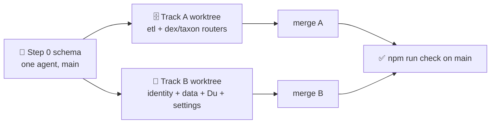

# 🗄️🔐 [0006] Handoff — the ETL (M4) and identity (M7), one session, two tracks

> A handoff, not a spec. Child of [spec 0001](../specs/0001-standkreis-dex-the-first-walk.md) §🗃️ §🏗️ and [record 0002](../records/0002-etl-the-plausible-set.md). Read the documents in §⬆️ before anything else; nothing here overrides them.

| 🗓️ Written | 👤 Owner | ⬆️ Parent | ⏱️ Budget |
| --- | --- | --- | --- |
| 2026-09-05 | Sven Reiser | [Spec 0001](../specs/0001-standkreis-dex-the-first-walk.md) · [Record 0002](../records/0002-etl-the-plausible-set.md) · [Findings 0004](0004-scaffold-findings.md) | 1 session: one schema step, then two agents in parallel worktrees, production code |

---

## 🎯 Why

M2 left a trunk that M4 and M7 can branch from without touching each other's files. Both are pure plumbing with no screen to argue about: M4 fills the species tables, M7 makes the anonymous identity durable. Running them side by side halves the calendar and forces the one thing they share, the schema, to be settled first.

**Step 0 is sequential and small.** The scaffold's schema still says "plausibility per cell and month" and has no place for a passkey. One agent changes the schema, one migration, one commit to `main`. Only then do two worktrees open. Nobody edits `schema.prisma` after step 0.

## ⬆️ Input

| Read | Why |
| --- | --- |
| [Spec 0001](../specs/0001-standkreis-dex-the-first-walk.md) §🧬 ERD, §🗄️, §🗃️, §🏗️ Identity row, §⚖️ "Your data is yours" | The tables, the job order, the cache policy, the identity promise |
| [Record 0002](../records/0002-etl-the-plausible-set.md) E2 E3 E5 E6 E7 E8 E9 E10 E11 E13 | Every rule the ETL implements, with the numbers that justify it |
| [Findings 0005](0005-etl-grill-findings.md) §🧬 fixture | The expected result: 929 ± 2 species for Mainz-Bingen, 364 "nur jetzt" in September |
| `scripts/etl-probe/lib.mjs`, `matrix.mjs` | The pipeline in miniature: cached fetch with budgets and gaps, `gbifFacet`, `resolveRegion`, `wikidataForGbif`, the cut, `words()`. Port, do not rewrite from memory |
| [Findings 0004](0004-scaffold-findings.md) | Prisma 7 with driver adapter, cookie `dex_id`, tRPC context, static export switch |
| [Record 0001](../records/0001-standkreis-dex-the-first-walk.md) Q3 | Anonymous-first, passkey for sync, export and delete in both states |
| [Findings 0002](0002-ui-exploration-findings.md) §9 Einstellungen, §10 Du, doubts 31 32 33 39 | What the Du and settings screens hold and what was rejected |

## 🛠️ Step 0 · the schema (sequential, ≈ 1 hour)

| Change | From | To |
| --- | --- | --- |
| `Region` | none | `gadmGid` unique, `name`, `higher` (country › state), `monthTotals Int[]` (12), `refreshedAt`, `status` (queued · ready · failed) |
| `Plausibility` | `cell`, `month`, `obsCount`, `source` | `regionId`, `obs` (whole year), `monthShare Int[]` (12, per mille), `peak Int`, `words String`; unique on `[taxonId, regionId]`. `source` dropped: GBIF alone |
| `Group` enum | 7 values | `Tile`: bird · mammal · amphibian · reptile · fish · insect · plant · fungus (record 0002 E5, E12) |
| `Taxon` | `group`, `facts` | `tile`, `order`, `class`, `genus`; `intro Json?` gains `lang`; `facts` keeps size · lifespan · reproduction · migration · sound, **no habitat**; `namePath` (P846 · name · none) |
| `Lookalike` | none | `[taxonId, regionId, siblingId]`, same genus within the set (E10) |
| `Interaction` | 6 kinds | unchanged; `preysOn` folds into `eats` at import (E9) |
| `Filter` | `region Json`, `regionName`, `groups`, `wholeYear` | `regionId`, `tiles Tile[]`, `nowOnly Boolean @default(false)` |
| `Passkey` | none | `identityId`, `credentialId` unique, `publicKey Bytes`, `counter`, `transports String[]`, `deviceName`, `createdAt`, `lastUsedAt` |
| `Identity` | `credential String?` | `credential` dropped; `email String? @unique` (reserved, unused in M7); `passkeys Passkey[]`; `deletedAt` not added, deletion is a hard cascade |

One migration, `npm run check` green, seed unchanged, committed to `main`. The M2 findings row "Schema beyond the ER diagram" is amended in [findings 0004](0004-scaffold-findings.md).

## 🛠️ Track A · the ETL (M4)

| Aspect | Choice | Why |
| --- | --- | --- |
| Where | `app/etl/` as a TypeScript CLI on the same Prisma client: `npm run etl -- region "Mainz-Bingen"`, `npm run etl -- content`, `npm run etl -- refresh`. No dependency beyond `tsx` | The probe proved fetch + JSON + Postgres is all it needs; a queue framework is M8 at the earliest |
| Files owned | `app/etl/**`, `app/src/server/routers/dex.ts`, `app/src/server/routers/taxon.ts`, `app/prisma/seed.ts` | Track B never opens these |
| Fetch layer | Port `lib.mjs`: URL-keyed disk cache under `app/etl/.cache/` (gitignored), per-host gaps (iNat 1,100 ms, Wikidata and GloBI 300 ms), 4 GBIF facets in flight, retries with backoff, one User-Agent with a contact address | E11; the probe ran 7,000 responses with zero 429s on exactly these settings |
| Region job | GADM search → `Region` row · 13 GBIF facets (year + 12 months) → cut per tile (90 %, floor 10, tiles from `class`/`order`/`phylum`/`kingdom` as `matrix.mjs` does) → `Plausibility` rows with shares, peak and `words()` · `Lookalike` rows | E1 E2 E3 E5 E10. Status `queued → ready`; a failed facet leaves the region `failed` with the error, never half-written |
| Content job | For every taxon without content: GBIF `species/{key}` → Wikidata batch (P846, then exact name with rank check; non-species item → nothing) → image ladder (iNat default photo CC0/BY/BY-NC → Commons P18 unless specimen/plate/larva/egg/map → next licensed iNat → tile icon) → Wikipedia de → en → GloBI pruned to the six kinds, `preysOn` → `eats`, out-of-set targets stored as `Taxon` rows with no plausibility | E6 E7 E8 E9. Runs once per taxon; `Taxon.contentAt` marks it; nothing expires |
| GloBI cap | Page to the end for species that hit 1,000 edges, then keep the edges whose target is in any region's set first, the rest up to 200 | Record 0002 risk "GloBI's cap": storing the first 1,000 unordered is arbitrary |
| Refresh | `refresh` re-runs the region job for regions older than 30 days; content is never re-fetched without `--purge <gbifKey>` | E11 |
| Read API | `dex.set({regionId, tiles, nowOnly, month})` returns the tiles' species with `nowRatio`, `words`, lead asset, names; `taxon.page({gbifKey})` returns everything the species page renders (§🎨 3). Both pure reads, no identity needed | M5 consumes these; writing them here keeps M5 off the ETL's tables |
| Fish tile | Stored for every region; `dex.set` hides the tile when the region has none | E12 |
| Outside the set | `taxon.ensure({gbifKey})` queues content for a backbone species that has no row yet, used by M6's log flow | E13 |
| Not here | Xeno-canto, Pl@ntNet, BioCLIP, the LLM editor, any paid or keyed source, a job queue, a cron | Spec §🗄️ deferred rows; M16; M8 |

## 🛠️ Track B · identity and data (M7)

| Aspect | Choice | Why |
| --- | --- | --- |
| Files owned | `app/src/server/routers/identity.ts`, `app/src/server/routers/data.ts`, `app/src/server/webauthn.ts`, `app/src/app/[locale]/you/**`, `app/src/app/[locale]/settings/**`, `app/src/components/Identity*`, both locale files for the new keys only | Track A never opens these |
| Passkey | WebAuthn through `@simplewebauthn/server` and `@simplewebauthn/browser`, resident keys, `userVerification: preferred`. Register on the anonymous identity ("Passkey anlegen"), authenticate on a second device to **adopt** that identity: the second device's anonymous rows merge into the first (sightings and studies by `[taxonId, at]`, duplicates dropped), then its identity is deleted | Record Q3: one identity, many devices. Merge, not replace, or the second device's first-day sightings vanish |
| Email | **Not in M7.** The `email` column exists; no send path, no magic link | Needs a mail provider, which is an external service the project does not have. Open in §❓ |
| Challenge storage | `Challenge` rows are not added to the schema; the challenge lives in a short-lived signed cookie (5 minutes) | Keeps step 0's migration final |
| Export | `data.export` streams JSON: identity id, created, filter, sightings with photos' URLs, studies. Works anonymous or with passkeys | Spec §⚖️ "Your data is yours", both states |
| Delete | `data.delete` two-step: first call returns device count and sighting count, second call with the returned token deletes the identity and cascades. Never "only here" | Doubt 33 |
| Du | The profile card without XP (M11 owns XP): name and initials, "Mainz-Bingen", the three counters over the whole-year set read from `dex.set` when the region is ready, else "wird vorbereitet"; gear to Einstellungen | Findings 0002 §10, plain variant until M11 |
| Einstellungen | Identity block (📱 "Nur auf diesem Handy" · Passkey anlegen; ☁️ "Auf N Geräten" · Gerät entfernen), Deine Daten (Exportieren · Alles löschen), Über (Quellen · Version). **No** Dein Kreis rows (M5 onboarding), **no** Design toggle (doubt 34), **no** iNaturalist row (doubt 32) | The screen you open to leave has to be boring and findable |
| Passkey nudge | Not built; the hook is one exported function `shouldOfferPasskey(identity)` returning false until M6 calls it after the first sighting | Doubt 31, the wording is open in the spec |
| Name and photo | `displayName` editable on Du, local to the identity, excluded from any payload until a passkey exists | Doubt 39 |

## 🔀 Working in parallel



| Rule | Why |
| --- | --- |
| Two worktrees, two branches `m4-etl` and `m7-identity`, both from the step-0 commit | Same repo, no file overlap by the ownership rows above |
| The only shared files are `_app.ts` (each track adds one router line) and the two locale JSON files (each adds its own keys). Merge conflicts there are resolved by taking both | Everything else conflicting is a rule violation, not a merge problem |
| Track A merges first, Track B rebases, then `npm run check` on `main` | Track B's Du reads `dex.set`; until A lands it uses the "wird vorbereitet" branch |
| Neither track edits `schema.prisma`, `docs/specs/`, or `docs/records/`. A needed schema change stops the track and goes to the owner | Step 0 is the contract |

## 🧪 Checks

| # | Track | Check | Pass looks like |
| --- | --- | --- | --- |
| C1 | 0 | `npm run check` green after the migration; `prisma migrate reset` + seed works | One new migration, no drift |
| C2 | A | `npm run etl -- region "Mainz-Bingen"` from an empty cache | Region `ready` in under 2 minutes; 929 ± 2 taxa with plausibility; tile counts within 2 of findings 0005 (🐦 69 🦋 431 🌿 388 🍄 23 🦌 8 🐸 7 🦎 5, 🐟 0) |
| C3 | A | `dex.set` for September, `nowOnly: true` | 364 ± 5 species; Turmfalke "Ganzes Jahr", Hausrotschwanz "Mär–Okt", Mauersegler not in the September set but present in the year |
| C4 | A | `npm run etl -- content` for Mainz-Bingen, then a second run | First run ≈ 20 minutes bounded by iNaturalist, zero 429s; second run makes zero network calls |
| C5 | A | Image ladder on the 19 known specimen leads (Kohlweißling, Waldrebe, Wegwarte, Bärlauch …) | None of them is the lead asset; every lead asset has author, licence, licenceUrl, sourceUrl |
| C6 | A | `npm run etl -- region "Kyoto"` | 303 ± 3 taxa; 🐟 19; intro `lang` is `en` for at least 90 species; a German name missing for ≈ 159 |
| C7 | A | GloBI for Amsel and for a grass moth | Amsel ≤ 200 stored edges, in-set targets first; the moth keeps all 14; no `interactsWith`, no `adjacentTo` |
| C8 | B | Register a passkey in one browser, authenticate in a second | Second browser shows the first's id; its two pre-existing anonymous sightings now belong to the merged identity; the old identity row is gone |
| C9 | B | Export in both states | Valid JSON with every sighting and study; no `displayName` in the anonymous export |
| C10 | B | Delete | First call names "2 Geräte · 14 Sichtungen"; second call with the token removes identity, passkeys, sightings, studies, assets owned; the cookie is cleared |
| C11 | B | Du and Einstellungen at 390 × 844, both themes, both languages | Match [settings](../adr/0001-standkreis-dex-the-first-walk/0002-settings.webp) minus the rows this handoff removes; every string from a key |
| C12 | all | `npm run check` on `main` after both merges; static export still builds | The tRPC route stays out of the export; the ETL is not bundled into the app |

## ⬇️ Output

| Deliverable | Lands |
| --- | --- |
| Migration | `app/prisma/migrations/<date>_regions_tiles_passkeys/` |
| ETL | `app/etl/` with a README row per command; `.cache/` gitignored |
| Read routers | `app/src/server/routers/dex.ts`, `taxon.ts` |
| Identity | `identity.ts` (passkey register, authenticate, devices, remove), `data.ts` (export, delete), `webauthn.ts` |
| Screens | `/[locale]/you`, `/[locale]/settings` |
| Findings | `0006-etl-and-identity-findings.md`: one table per track, what was decided that the spec did not say (WebAuthn library and relying-party id, merge rule details, ETL command shapes, GloBI paging), plus the C2 and C6 numbers |
| Roadmap | M4 and M7 marked ✅ with the date; M5 marked next |
| Probe | `scripts/etl-probe/` deleted in Track A's final commit once C2–C7 pass; its `out/fixture-*.json` move to `app/etl/fixtures/` as test inputs |

**Definition of done:** C1 to C12 pass, the spec §🗃️ and §🏗️ need no edit, and M5 can start with `dex.set` and `taxon.page` as its only data dependency.

## ❓ Open, for the owner during the session

- **Relying-party id for passkeys.** Passkeys are bound to a domain. `localhost` works in dev; the production domain must be chosen before the first real passkey is registered, or every user re-registers. Decide the domain now or accept a dev-only passkey.
- **Email attach.** Deferred here; needs a mail provider. Decide whether the free tier of a provider counts as "free forever" or whether passkeys alone are the account.
- **Kyoto in seed?** Loading two regions on every fresh clone costs 25 minutes of content fetch. Proposal: seed loads the fixtures' plausibility only, content fetch stays a manual command.

## 🚫 Not in this handoff

The grid, species page, onboarding, filter drawer (M5) · log flow, fill sheet, Tagebuch (M6) · offline caching and the sightings queue (M8) · XP, level, quests (M10, M11) · email magic links · a job queue or scheduler · Xeno-canto · any keyed source · CI hosting · a production database.

## 👉 Start the session with

```
Read docs/handoffs/0006-etl-and-identity.md and the three documents it names first in §⬆️.
Do step 0 alone: change app/prisma/schema.prisma as the table says, one migration, npm run check green, commit to main, show me the diff of the schema.
Then open two worktrees from that commit and run Track A and Track B as two agents in parallel, each owning only its files.
Stop Track A after C2 and show me the tile counts before it fetches any content.
```
