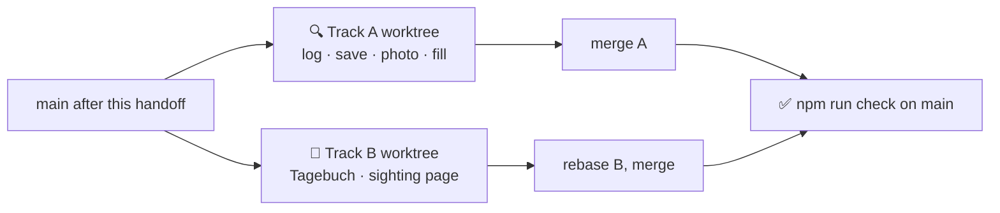

# 🔍📓 [0008] Handoff — log a sighting, the fill moment and the Tagebuch (M6)

> A handoff, not a spec. Child of [spec 0001](../specs/0001-standkreis-dex-the-first-walk.md) §🎨 4 5 6, §🧬, §⚖️ and [record 0002](../records/0002-etl-the-plausible-set.md) E13. Read the documents in §⬆️ before anything else; nothing here overrides them.

| 🗓️ Written | 👤 Owner | ⬆️ Parent | ⏱️ Budget |
| --- | --- | --- | --- |
| 2026-09-05 | Sven Reiser | [Spec 0001](../specs/0001-standkreis-dex-the-first-walk.md) · [Findings 0002](0002-ui-exploration-findings.md) · [Findings 0007](0007-atlas-grid-and-species-findings.md) | 1 session: two agents in parallel worktrees, production code |

---

## 🎯 Why

M5 shows what could be found and lets you read up on it. Nothing can be *found* yet: the ＋ opens a sheet that says "kommt bald", the species page has no "Entdeckt", the Tagebuch is a title. M6 closes the loop the owner asked for before anything else is built: a sighting fills a cell, the counters move, the diary shows the day. Only after this loop is closed do new regions, offline and quests make sense.

The sighting is the atom (record Q1). Everything on screen in this milestone is either a way to create one or a way to look at them again.

## ⬆️ Input

| Read | Why |
| --- | --- |
| [Spec 0001](../specs/0001-standkreis-dex-the-first-walk.md) §🎨 4 (log), 5 (fill moment), 6 (bar); §🧬 the model; §⚖️ locations ladder, wild only, name and photo are yours | The chosen screens, the evidence and wildness enums, what may never be shown where |
| [Findings 0002](0002-ui-exploration-findings.md) §4 log, §5 fill and "two ways to a sighting", §8 Tagebuch; doubts 10 11 12 15 16 17 27 28 29 30 31 40 46; vocabulary and order rules | Every decision on the mocks, the doubts this milestone must answer |
| [Findings 0007](0007-atlas-grid-and-species-findings.md) | The grid's search module, URL state, `identity.progress` shape with `seenAt`, the species page's sticky bar and state row, doubts B6 B7 |
| [Record 0002](../records/0002-etl-the-plausible-set.md) E13 | A species outside the set joins the dex, gets content, never enters the region's set |
| [Record 0001](../records/0001-standkreis-dex-the-first-walk.md) Q1 Q3 Q10 | Sighting as the atom, anonymous first, camera not first |
| `app/prisma/schema.prisma` `Sighting`, `Asset`, `Evidence`, `Wildness` | The columns exist since M2; nothing to add |
| Reference shots in [`docs/adr/0001-…/`](../adr/0001-standkreis-dex-the-first-walk/) | `0002-log-1-chooser`, `0002-log-2-search-empty`, `0002-log-2-search-results`, `0002-log-3-save`, `0002-log-3-save-photo`, `0002-fill-sheet`, `0002-fill-sheet-own-photo`, `0002-journal` |

## 🌱 What is already there

| Piece | Where | State |
| --- | --- | --- |
| The ＋ and a placeholder sheet | `Shell.tsx`, `LogSheet.tsx` | The button works; the sheet says "kommt bald" |
| Set search | `AtlasSearch.ts` | Folded prefix and word match over the set; reuse for the shortlist and the set rows |
| `taxon.ensure({gbifKey})` | `taxon.ts` | Creates the Taxon row from GBIF; content stays empty until an `etl content` run |
| `identity.progress` | `identity.ts` | `seen`, `seenAt`, `studied`; the grid and Profil already read it |
| Species page sticky bar | `SpeciesPage.tsx` | "Studiert" only; the state row says "noch nicht entdeckt" with no date |
| Export and delete | `data.ts` | Export lists photo URLs; delete cascades the rows, not files |
| `shouldOfferPasskey` | `webauthn.ts` | Returns false; nobody calls it |
| Schema | `Sighting {at, lat, lng, place, note, evidence, wildness, photos}`, `Asset {sightingId, ownerId, origin}` | Complete for this milestone; **no migration** |

## 🛠️ Track A · log, save, photo, fill

| Aspect | Choice | Why |
| --- | --- | --- |
| Files owned | `app/src/components/Log*`, `Fill*`, `PasskeyNudge*`, `app/src/app/[locale]/log/**`, `app/src/app/api/photo/**`, `app/src/server/routers/sighting.ts` (new), `taxon.ts` (one query `search`, `ensure` gains the content kick), `data.ts` (file cleanup on delete), `webauthn.ts` (`shouldOfferPasskey` body), `SpeciesPage.tsx` (the "Entdeckt" button and the state row date only), `AtlasGrid.tsx` (the fill only), `Shell.tsx` (the ＋ opens the chooser route), `app/etl/content.ts` (one option `keys?: number[]`) | Track B never opens these |
| Chooser | The ＋ opens a bottom sheet: **Suchen** primary, **Foto**, **Galerie**. One line under the photo tiles: "Das Foto wird gespeichert, nicht bestimmt." Foto and Galerie take the picture first, then land on the same search | Spec §🎨 4, Q10: camera visible, not first |
| Search | Empty query = the shortlist "Jetzt wahrscheinlich · noch nicht entdeckt": the set sorted by `nowRatio`, seen species removed, eight rows. Typing: set rows first with their state via `AtlasSearch`, then the backbone through `taxon.search({q})` = GBIF `species/search` with `datasetKey` backbone, `rank: SPECIES`, `status: ACCEPTED`, `qField: VERNACULAR` and `SCIENTIFIC`, 10 rows, keys already in the set dropped, each marked "wird in deinen Atlas aufgenommen" | Findings 0002 §4; most walks need no typing |
| Outside the set | Picking a backbone row calls `taxon.ensure`, which now also starts the content job for that one key **in-process, not awaited** (`runContent({keys})`). The species page shows what has arrived; the grid cell shows the tile icon until the lead image lands | Record 0002 E13; the same in-process rule as M5's region job, M8 replaces it |
| Save screen | One screen: species with thumb, **when** (now, editable), **where** ("genau gespeichert · geteilt nur grob"), photo slot, note. Two buttons: **"Wild · speichern"** primary, **"Gehalten · speichern"** secondary. No confirm step | Spec §🎨 4; doubt 15 keeps Wild primary; doubt 11 puts wildness here and nowhere else |
| Location | Browser geolocation asked on the save screen, explained before the prompt like onboarding; refusal is fine and leaves `lat`/`lng` null. Exact point stored. `place` = the GADM level-3 name from GBIF `geocode/reverse` (Gemeinde or Verbandsgemeinde), else the region name | Spec §⚖️ ladder; doubt 17 store exact; doubt 29 lists show Gemeinde |
| `sighting.create` | `{taxonId, at, lat?, lng?, note?, wildness, photoId?}` → `evidence` = `photographed` when a photo is attached else `claimed`. Returns the row plus `first: boolean` (no earlier **wild** sighting of this taxon) | Captive and cultivated never fill the dex (spec §⚖️), so `first` is computed over wild rows only |
| Photo | Client: resize to 1,600 px on the long edge, re-encode as JPEG through a canvas, which drops EXIF including GPS. Upload as multipart to `POST /api/photo`, stored under `app/data/photos/<uuid>.jpg` (gitignored), served by `GET /api/photo/<id>`. `Asset {origin: 'user', ownerId, sightingId, author: displayName ?? 'Du', licence: 'eigenes Foto', sourceUrl: the GET url}`. Delete removes the file; `data.delete` removes every file of the identity | Spec §⚖️ strip EXIF on share, name and photo are yours; no object store yet, hosting is M8's question |
| Own photo in the grid | `dex.set` stays a pure read; the grid overlays the identity's latest wild photo per taxon from a new `sighting.photos` query (`taxonId → url`) | Spec §🎨 2: own photo first, else the reference image |
| Fill moment | After a save with `first: true`, land on the grid with `?fill=<sightingId>`: the cell scrolls into view, sweeps grey → colour over 400 ms, green ring, the entdeckt counter ticks once; a compact sheet from below reads "Entdeckt · Eichelhäher · 4. Sep · Nieder-Olm · Ort grob gespeichert", labels a reference-image fill with its attribution, offers **Foto** only when none is attached, ends with "Zur Art ›". No acknowledge button, no confetti, no XP. Repeat sighting: a quiet toast "Wiedergesehen · Eichelhäher", no fill, counter unchanged | Spec §🎨 5, doubt 10 12 40 |
| From the species page | Sticky bar gains **"Entdeckt"** next to "Studiert"; it opens the save screen with the species preset. After the save, the same rule: first wild sighting → grid with the fill; repeat → back to the page with the toast. The state row shows "✓ entdeckt · 4. Sep" from `seenAt` | Spec §🎨 3 and 4; findings 0007 doubt B7 |
| Passkey nudge | After the **first** wild sighting ever, once the fill sheet is dismissed: one sheet, dismissable, never repeated (`localStorage` flag), "Später" and "Passkey anlegen" (deep-links to Einstellungen). `shouldOfferPasskey` = no passkey and exactly one wild sighting. No banner anywhere else | Doubt 31; spec §🏗️ "offered after first sighting". Wording in §❓ |
| Not here | Server-side identification, the taxon ladder (M12), share cards (M13), XP on anything (M11), a job queue (M8) | Scope |

## 🛠️ Track B · the Tagebuch and the single sighting

| Aspect | Choice | Why |
| --- | --- | --- |
| Files owned | `app/src/app/[locale]/journal/**`, `app/src/app/[locale]/sighting/[id]/**`, `app/src/components/Journal*`, `Sighting*`, `app/src/server/routers/journal.ts` (new: `days`, `get`, `update`, `remove`), one line in `_app.ts` | Track A never opens these |
| Tagebuch | One card per day, newest first, header "Heute · Fr 5. Sep" / "Gestern" / "Mi 2. Sep" with the day's distinct places on the right. Rows: mini tile (own photo, else reference, greyscale rules from the grid; no badges), name, one chip, meta line `time · Gemeinde · 📷 · note`. Pills **Alle · Entdeckt · Studiert**. Studies are rows too ("Studiert · zuhause" has no place). Infinite scroll by day, 30 days per page | Findings 0002 §8 T1, owner's pick; doubt 27 kept, owner call in §❓ |
| Chips | 🟢 **Neu entdeckt** on the first wild sighting of a taxon, 🟠 **Studiert** on a study row, **no chip on repeats** and none on captive rows; captive rows say "gehalten" in the meta line instead | Doubt 46 second option, doubt 28 |
| `journal.days` | `{before?: date, kind?: all·seen·studied}` → days with rows `{id, kind, at, taxon card, place, hasPhoto, note, wildness, first}`; `first` computed the same way as Track A's `sighting.create` (earliest wild sighting per taxon) | One rule for "first" in both tracks: **earliest wild row per taxon**, ties by `createdAt` |
| Single sighting | `/sighting/[id]`: the photo or the reference image, species link, date and time, **exact place** as one OSM tile with the point and the Gemeinde line under it, note, wildness. Edit: note, when, wildness. **Löschen** with one confirm line. Deleting the only wild sighting of a taxon turns its cell grey again; the counters follow | Spec §⚖️ exact only on the single sighting; the user must be able to undo a mistake |
| Empty states | No sightings: one line "Noch keine Sichtung. Tipp auf ＋, wenn du etwas siehst." with nothing else. A day with only studies still gets its card | Honest empty state rule from M5 |
| Not here | XP figures on rows (M11), a map of the day, a walk or session entity, a per-day count, the T2 list view | Findings 0002 §8 rejected list |

## 🔀 Working in parallel



| Rule | Why |
| --- | --- |
| Two worktrees, `m6-log` and `m6-journal`, both from `main` | No file overlap by the ownership rows |
| Shared: `_app.ts` (each adds one router line), both locale JSONs (own keys under `log`, `fill`, `nudge` for A; `journal`, `sighting` for B). Conflicts resolved by taking both; close the previous object with a comma, as the 0007 merge had to | The 0007 merge needed exactly this once |
| Track B seeds its own sightings through SQL or Prisma in a script, it does not wait for Track A's save screen | B must not block on A |
| Track A merges first, B rebases, `npm run check` on `main` | A owns the routes B links to |
| Neither track edits `schema.prisma`, `docs/specs/`, `docs/records/`, or the ETL beyond the one `keys` option | The schema already holds every column |
| `git` on the owner's Mac may ask for the Xcode licence after an update; if it does, tell the owner rather than working around it | Happened in 0007 |

## 🧪 Checks

| # | Track | Check | Pass looks like |
| --- | --- | --- | --- |
| C1 | A | ＋ → shortlist row → "Wild · speichern", location refused | Three taps; the grid fills the cell with the reference image, sheet names species, date, region, "Ort grob gespeichert" and the attribution; "1 entdeckt" in the header and on Profil |
| C2 | A | Same species again | Quiet toast, no fill, counter unchanged, two rows in the DB |
| C3 | A | "Gehalten · speichern" for a species never seen wild | Row stored with `wildness: captive`; cell stays grey, counters unchanged, Tagebuch shows the row with "gehalten" |
| C4 | A | Type "Eichenprozessionsspinner" (not in the set) | Backbone row marked as joining; after save the cell sits at the bottom with the tile icon; within 2 minutes the species page has names, intro and a lead image; the region's set size is still 929 |
| C5 | A | Foto → pick a JPEG with EXIF GPS → save | File under `app/data/photos/`, no GPS tag in it (check with `exiftool` or a hex scan for "GPS"), `evidence: photographed`, the cell shows the own photo in colour, the sheet has no Foto button |
| C6 | A | "Entdeckt" on the Amsel page with location allowed | Save screen preset; after save the grid fills; back on the page the state row reads "✓ entdeckt · 5. Sep"; `place` is a Gemeinde name, not "Mainz-Bingen" |
| C7 | A | First wild sighting on a fresh identity, dismiss the fill sheet | Passkey nudge appears once; "Später" and a reload never show it again; a second identity with a passkey never sees it |
| C8 | B | Tagebuch with the seeded fixture: three days, one repeat, one study, one captive | Day cards newest first, "Neu entdeckt" once per taxon, no chip on the repeat, "Studiert" on the study, "gehalten" on the captive row, places in the header; pills filter |
| C9 | B | Open a sighting, edit the note, delete it | Note persists; after deleting the only wild sighting of a taxon the cell is grey and the counters drop by one |
| C10 | B | Tagebuch and sighting page at 390 and 360, both themes, both locales | Parity with `0002-journal` minus XP; every string from a key |
| C11 | all | Export, then delete, on an identity with photos | Export lists the photo URLs; delete removes rows and files; a second export is empty |
| C12 | all | `npm run check` on `main` after both merges; static export builds | The photo route and tRPC stay out of `out/`; the log and journal routes render statically with the client fetching |

## ⬇️ Output

| Deliverable | Lands |
| --- | --- |
| Screens | `/[locale]/log` (chooser, search, save), `/[locale]/journal`, `/[locale]/sighting/[id]`, the fill in the grid, "Entdeckt" on the species page, the nudge sheet |
| Routers | `sighting.ts` (create, photos, remove-photo), `journal.ts` (days, get, update, remove), `taxon.search`, `taxon.ensure` with the content kick |
| Photo route | `app/src/app/api/photo/` with `app/data/photos/` gitignored |
| Findings | `0008-log-and-journal-findings.md`: one table per track with what the spec did not say (backbone query shape, Gemeinde fallback, resize numbers, fill timing, first-rule), the C1 to C7 and C8 to C10 evidence, shots in `docs/handoffs/0008-shots/` |
| Roadmap | M6 marked ✅ with the date; M8 marked next; a row in "what earlier milestones changed" for the in-process content kick and the photo storage question |
| Spec | Only if a mock had to change: a dated note in §🎨, nothing silent |

**Definition of done:** C1 to C12 pass, and the owner can walk once with the phone browser, log three species with one photo, and read that walk back in the Tagebuch the next day.

## ❓ Open, for the owner during the session

- **Nudge wording.** Proposal: title "Auch auf dem Laptop?", body "Ein Passkey nimmt deine Sichtungen mit auf andere Geräte. Kein Konto, keine E-Mail.", buttons "Passkey anlegen" · "Später". Spec §❓ leaves this open; the session closes it.
- **Studies in the Tagebuch** (doubt 27). Proposal: keep them, default pill "Alle". Flip to "Entdeckt" only if the owner's own diary reads badly after a week.
- **Where the fill happens after "Entdeckt" on a species page.** Proposal: always the grid, one fill implementation; the page shows the toast on repeats. Alternative: fill the page's own state row and never leave it.
- **Photo storage on disk** is a laptop answer. Fine for M6 and M9's first walk; an object store or the device (M15) decides later. Not a decision now, a note.

## 🚫 Not in this handoff

Identification of photos and the taxon ladder (M12) · offline queue and sync (M8) · new regions (owner: after the loop closes) · XP, quests, recap (M10, M11) · share cards (M13) · list and map views (M14) · email attach (M7b) · any schema change · iNaturalist export.

## 👉 Start the session with

```
Read docs/handoffs/0008-log-and-journal.md and the three documents it names first in §⬆️.
Open two worktrees from main and run Track A and Track B as two agents in parallel, each owning only its files.
Stop Track A after C1 and show me the save screen and the fill before it builds photos and the nudge.
```
