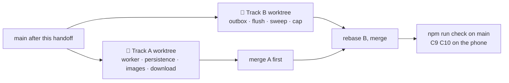

# 📴 [0009] Handoff — the atlas without signal, the sightings queue (M8)

> A handoff, not a spec. Child of [spec 0001](../specs/0001-standkreis-dex-the-first-walk.md) §🏗️ "Offline", §⚖️ and [record 0001](../records/0001-standkreis-dex-the-first-walk.md) Q1 Q5. Read the documents in §⬆️ before anything else; nothing here overrides them.

| 🗓️ Written | 👤 Owner | ⬆️ Parent | ⏱️ Budget |
| --- | --- | --- | --- |
| 2026-09-05 | Sven Reiser | [Spec 0001](../specs/0001-standkreis-dex-the-first-walk.md) · [Findings 0007](0007-atlas-grid-and-species-findings.md) · [Findings 0008](0008-log-and-journal-findings.md) | 1 session: two agents in parallel worktrees, production code |

---

## 🎯 Why

The loop is closed: a sighting fills a cell, the counters move, the diary shows the day. It works on a laptop with a wire. The product is used in a forest where the phone shows one bar or none (spec §🏗️: "Nature has no signal"). M8 makes the walk survive that: the atlas the walker chose opens with no network, a sighting saved in the field lands on the phone first and on the server when the signal returns, and nothing the walker did is lost in between.

M8 is the last milestone before M9, the owner's first real walk. It also collects the small server debts M5 and M6 deferred to it: the in-process jobs that die on restart, the uncapped GBIF search, the abandoned photo rows.

**Not a rewrite.** The stack stays Next.js PWA (record Q5); Capacitor and SQLite are M15. Everything here is a service worker, IndexedDB and a few server sweeps.

## ⬆️ Input

| Read | Why |
| --- | --- |
| [Spec 0001](../specs/0001-standkreis-dex-the-first-walk.md) §🏗️ table rows "Offline", "Phone", "Identity"; §⚖️ | The one-line contract, the wrap that comes later, what may never leave the phone |
| [Record 0001](../records/0001-standkreis-dex-the-first-walk.md) Q1 Q5 | The sighting is the atom; PWA first, iOS evicts storage after ~7 days unused |
| [Findings 0007](0007-atlas-grid-and-species-findings.md) doubts B1 B3, C2 deferred | Export needs the DB; OSM tiles need a proxy; the region job waits for "M8's queue" |
| [Findings 0008](0008-log-and-journal-findings.md) doubts A3 A6 A7 A11 B2 | GBIF search uncapped, capability photo URL, abandoned photos, content kick in-process, `sighting/_/` on a static host |
| [Findings 0004](0004-scaffold-findings.md) | Why the export exists, `NEXT_PUBLIC_API_URL`, the `.tsx`-only trick |
| `app/public/sw.js`, `app/src/components/ServiceWorker.tsx` | The worker is registered from the first launch and caches nothing |
| `app/src/trpc/client.tsx` | One `QueryClient`, `staleTime` 60 s, `httpBatchLink` with credentials |

## 🌱 What is already there

| Piece | Where | State |
| --- | --- | --- |
| Service worker | `public/sw.js` | `skipWaiting` + `clients.claim`, no fetch handler |
| Manifest | `public/manifest.webmanifest` | "Atlas", standalone, one SVG icon |
| Static export | `npm run build:export` | The client-only build the worker will precache from; tRPC and `/api/photo` stay out |
| Query cache | `trpc/client.tsx` | In memory only; a reload with no network shows nothing |
| Reference images | `Asset.url` | 1,193 remote URLs: iNaturalist `medium.jpg` (~60 KB, 1,040), Wikimedia thumbs (153). The grid loads `medium` for every cell |
| In-process jobs | `dex.ts` region job, `taxon.ts` content kick | Cached on `globalThis`; lost on restart; `Region.status` and `Taxon.contentAt` say what was left unfinished |
| Photos | `server/photos.ts`, `api/photo/**` | On disk under `app/data/photos/`, capability URL, files cleaned on delete |
| Schema | `Sighting.id @default(uuid())`, `RegionStatus {queued, ready, failed}`, `Taxon.contentAt` | Enough for a client-minted id and a restart sweep; **no migration** |

## 🛠️ Track A · the atlas without signal

| Aspect | Choice | Why |
| --- | --- | --- |
| Files owned | `app/public/sw.js`, `app/src/components/ServiceWorker.tsx`, `app/src/trpc/client.tsx` (persister only), `app/src/components/Offline*`, `FilterDrawer.tsx` (one row), `IdentityProfile.tsx` (one row), `AtlasGrid.tsx` (image variant only), `app/src/server/routers/dex.ts` (image variant on `lead`) | Track B never opens these |
| Worker | Hand-written, no Workbox, no build plugin. Three routes: **navigations** network-first with a 3 s timeout, fallback to the cached shell of the same locale (`/de/`, `/en/`); **`/_next/static/**`** cache-first forever (hashed); **reference images** (the three hosts above and `/api/photo/`) cache-first, one named cache, capped at 2,000 entries by insertion order. Everything else passes through | ~150 lines beat a plugin that fights Next 16's export; the routes are few and known |
| Shell precache | On `install`: `/de/`, `/en/`, `/de/log/`, `/de/journal/`, `/de/you/`, the `en` twins, `/manifest.webmanifest`, `/icon.svg`. Version string from the build id; a new worker drops the old shell cache on `activate` | The pages are client-rendered from queries; the shell is all the HTML the walk needs |
| Query persistence | `@tanstack/query-persist-client` + `idb-keyval`, `maxAge` 30 days, only queries with `meta.persist` set: `dex.set`, `identity.progress`, `identity.me`, `sighting.photos`, `sighting.outside`, `journal.days` first page, `taxon.card` for visited species | The atlas is `dex.set` + `identity.progress`; persisting those two is the milestone. Search results, GBIF backbone, maps never persist |
| Image variant | Grid cells read the **`small`** variant of iNaturalist URLs (`medium.jpg` → `small.jpg`, 240 px, ~15 KB) and the existing Wikimedia thumbs; the species page keeps `medium`. Done once server-side in `dex.set`'s `lead` (`leadSmall`), not by string surgery in the component | 929 × 60 KB is 56 MB in a cache that iOS evicts; 929 × 15 KB is 14 MB. Cells are 110 px wide |
| "Für unterwegs laden" | One row in the filter drawer, under Sortierung, and on Profil: "Atlas offline · 929 Bilder · ~14 MB" with a button. Tap: the page fetches every `leadSmall` of the active set through the worker (so they land in the image cache), a progress line "412 / 929", done state "Offline bereit · 5. Sep". Cancelable, resumable (already cached URLs are skipped). No auto-download on cellular; the button is the consent | Spec §🏗️ "caches the dex for the active filter"; the walker decides when to spend 14 MB |
| Offline state | A one-line banner under the header when `navigator.onLine` is false or a query fails with a network error: "Offline · dein Atlas ist da, Suche und Karten warten aufs Netz". No modal, nothing blocks. Species page offline: text and images from cache, the map card says "Karte wartet aufs Netz" | Honest empty states, findings 0007 |
| Not here | Precaching every species page, offline GBIF search, tile caching for maps, background sync API (Safari lacks it) | Scope; the walk needs the grid and the save, not the map |

## 🛠️ Track B · the sightings queue and the server sweeps

| Aspect | Choice | Why |
| --- | --- | --- |
| Files owned | `app/src/components/Queue*`, `LogSave.tsx` (the submit path only), `LogPhoto.tsx` (the upload path only), `Fill.tsx` (offline variant of the sheet), `Journal.tsx` (one chip), `app/src/server/routers/sighting.ts` (`create` accepts `id`), `taxon.ts` (search cap), `app/src/server/sweep.ts` (new), `app/src/server/photos.ts` (sweep helper), `app/etl/cli.ts` (one command), `instrumentation.ts` (new) | Track A never opens these |
| Outbox | IndexedDB store `outbox` (`idb-keyval` namespace, shared library with Track A, no shared file): rows `{id, kind: 'sighting' \| 'photo' \| 'study', payload, blob?, createdAt, attempts, lastError}`. `sighting.create` from the save screen **always** goes through the outbox: write the row, then flush. Online the flush completes in the same tick; offline it waits. The client mints `Sighting.id` (`crypto.randomUUID()`) and sends it; `create` accepts an optional `id` and is idempotent on it (`upsert`, no double rows on a retried flush) | One path, not two; the schema already defaults to uuid, so the client id costs nothing |
| Photos in the outbox | The resized JPEG blob (already 1,600 px, EXIF-free from M6) goes into the outbox row; the flush uploads it first, then creates the sighting with the returned `photoId`. Blob cap 2 MB per row, 50 rows in the outbox; the 51st save says "Erst wieder ins Netz, dann speichern" | iOS gives a PWA hundreds of MB, but eviction after 7 days unused (record Q5) means: flush early, keep the box small |
| Flush | On `online`, on app foreground, after every save, and every 60 s while rows exist. In order, one at a time, stop on the first network error, drop a row only on a 4xx that is not 401/429 and show it in the diary as "konnte nicht gespeichert werden · erneut" with the payload kept | Sequence keeps "first" honest; a bad row must not block the good ones behind it forever, so it falls out with a visible trace |
| The fill offline | `first` is computed on the client from persisted `identity.progress` (no `seenAt` for the taxon = first) so the grid fills and the sheet opens without a server. The sheet's date line gains "· wird gesendet"; the counters tick. When the flush lands, the query cache is invalidated and the server's `first` wins; the only visible difference is a lost fill if another device logged the same species first, which cannot happen before a passkey exists | The fill moment is the product; it cannot wait for a signal that is not there |
| Diary offline | Rows still in the outbox render in `journal.days` from the outbox merged on the client, with a small grey chip "wartet aufs Netz"; the sighting page for such a row shows the same chip and no map | The walker sees what they logged, the truth about where it lives |
| Studies | `study.mark` goes through the outbox too (kind `study`), same flush | A study on the species page while offline must not vanish |
| Restart sweep | `instrumentation.ts` `register()` runs `sweep()` once on server start: every `Region` with `status = queued` older than 5 minutes restarts its region job; every `Taxon` in a ready region's set with `contentAt = null` gets the content kick in batches of 20; user `Asset` rows with `sightingId = null` older than 24 h are deleted with their files. Also `npm run etl sweep` for by hand | Findings 0007 C2, 0008 A7 A11: heal on restart instead of a queue table; no migration, no worker process |
| Search cap | `taxon.search` gets an in-memory token bucket per identity: 30 calls per minute, then `TOO_MANY_REQUESTS`; the client shows "Kurz warten" under the search field and keeps the set results | Findings 0008 A3; one walker never hits it, a scraper does |
| Photo URL | Stays a capability URL. Written down in the findings as the M8 decision with the reason: the export and a later device sync need a stable URL, and the uuid is the secret. A signed URL comes with an object store, not before | Findings 0008 A6; do not build twice |
| Not here | Two-device merge rules beyond "server wins after flush", Background Sync API, conflict UI, a job table, an object store | M15, or never |

## 🔀 Working in parallel



| Rule | Why |
| --- | --- |
| Shared files: the two locale JSONs (each track appends its own top-level object: `offline` for A, `queue` for B) and `package.json` (A adds `@tanstack/query-persist-client` and `idb-keyval`; B uses them, adds nothing) | Take both on conflict, as in 0008 |
| B does not wait for A's persistence: the outbox is its own IndexedDB store and works with an in-memory query cache; B computes `first` from whatever `identity.progress` the client has | B must not block on A |
| Neither track touches `schema.prisma`, `journal.ts`, `SpeciesPage.tsx`, `AtlasSearch.ts` | Frozen for this milestone |
| Dev servers: A on 3002, B on 3003, main stays on 3000; headless Chrome over CDP as in `scripts/m5a`, `m6a`, `m6b`; offline is simulated with `Network.emulateNetworkConditions {offline: true}` | Same tooling as M5 and M6 |
| Track A merges first, B rebases, `npm run check` on `main`; then the owner runs C9 and C10 on a real phone | The worker and persistence are the ground B's chips stand on |

## 🧪 Checks

| # | Track | Check | Pass looks like |
| --- | --- | --- | --- |
| C1 | A | Open the atlas online, go offline (CDP), reload | The grid renders from the persisted `dex.set` and `identity.progress`, seen cells in colour, counters right, the banner shows; no blank page, no error toast |
| C2 | A | "Für unterwegs laden", then offline, scroll the whole grid | Progress reaches 929 / 929, "Offline bereit · 5. Sep"; every cell has its image offline; the cache holds ≤ 2,000 entries and ≈ 14 MB for Mainz-Bingen |
| C3 | A | Offline, open a species page visited before and one never visited | Visited: text, images, state row from cache, map card "Karte wartet aufs Netz". Never visited: the page says "Diese Art wartet aufs Netz" with the name from the set, nothing spins forever |
| C4 | A | Deploy a new build (new worker) while the old shell is cached | The new worker activates on the next launch, the old shell cache is gone, the image cache survives |
| C5 | B | Offline, ＋ → shortlist → "Wild · speichern" | The grid fills with "· wird gesendet" on the sheet; the counters tick; the diary shows the row with "wartet aufs Netz"; the outbox has one row; the DB has none |
| C6 | B | Go online | The row flushes within 5 s; the DB row has the client's id; the diary chip disappears; the fill is not shown again; `identity.progress` matches the server |
| C7 | B | Offline, save with a photo, then online | The blob sits in the outbox; after the flush the photo file exists, the sighting has `evidence: photographed`, the grid shows the own photo; the outbox is empty |
| C8 | B | Kill the dev server with a region `queued` and a taxon without content, start it again | `sweep()` logs both, the region reaches `ready`, the taxon gets `contentAt`; an abandoned photo older than 24 h is gone with its file |
| C9 | all | Phone on airplane mode: open the installed PWA, log two species, land in the diary, airplane mode off | Both rows arrive on the server within a minute, in order; nothing was typed twice; the owner did not see a spinner longer than 3 s |
| C10 | all | `npm run check` on `main`; the export served by a plain file server with the worker | Green; the worker installs from the export; `sw.js` is not cached by the browser (no-cache header or query version) |

## ⬇️ Output

| Deliverable | Lands |
| --- | --- |
| Worker, persistence, download row, offline banner | `public/sw.js`, `trpc/client.tsx`, `Offline*`, one row in the filter drawer and Profil |
| Outbox and flush, diary chip, offline fill | `Queue*`, `LogSave.tsx`, `Fill.tsx`, `Journal.tsx` |
| `sighting.create` with client id, search cap, restart sweep, `etl sweep` | `sighting.ts`, `taxon.ts`, `server/sweep.ts`, `instrumentation.ts`, `etl/cli.ts` |
| Findings | `0009-offline-findings.md`: cache sizes measured, the flush rules as built, the C1 to C10 evidence, shots in `docs/handoffs/0009-shots/` |
| Roadmap | M8 ✅ with the date; M9 marked next; "what earlier milestones changed" gains the client-minted id and the restart sweep |
| Spec | §🏗️ "Offline" row gains one sentence on the outbox if the build differs from the row; nothing silent |

**Definition of done:** C1 to C10 pass, and the owner walks into a dead zone with the phone, logs two species, and both are on the server before dinner.

## ❓ Open, for the owner during the session

- **Where does the phone reach the server for M9?** A LAN `next dev --experimental-https` on the laptop gets the first walk done with camera and geolocation working (both need https). A real host (the domain is bought, Resend waits for DKIM) is a deploy milestone this roadmap does not have. Proposal: LAN https for M9, a small "M8b · Deploy" row after it.
- **Image variant.** `small` (240 px) is soft on a 3× phone. Alternative: `medium` for the visible 30 cells, `small` for the rest. Proposal: `small` everywhere in the grid, measure on the walk, revisit in M14.
- **Download consent.** One button, no automatic download. Alternative: download on Wi-Fi without asking. Proposal: the button; the walker learns what the app does.
- **Restart sweep instead of a job table.** Cheaper, no migration, but two dev servers on one DB would both sweep. Proposal: accept for M8, revisit when a second machine runs the ETL.

## 🚫 Not in this handoff

Capacitor, SQLite, native camera (M15) · new regions from the UI (owner: after M9) · quests, XP (M10 M11) · map tile proxy (findings 0007 B3, deploy) · signed photo URLs and an object store (deploy) · two-device merge beyond "server wins" · offline GBIF search · iNaturalist export · any schema change.

## 👉 Start the session with

```
Read docs/handoffs/0009-offline.md and the three documents it names first in §⬆️.
Open two worktrees from main and run Track A and Track B as two agents in parallel, each owning only its files.
Stop Track A after C1 and show me the atlas offline before it builds the download and the banner.
```
