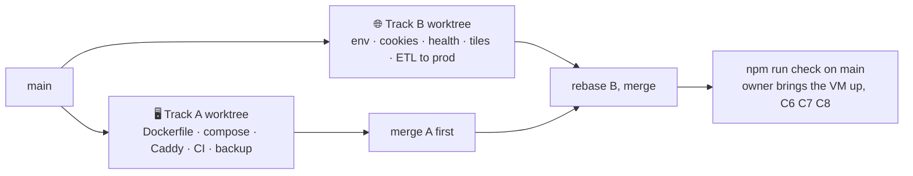

# 🚀 [0010] Handoff — one VM, one domain (M8b · Deploy)

> A handoff, not a spec. Child of [spec 0001](../specs/0001-standkreis-dex-the-first-walk.md) §🏗️ "Phone", "Identity" and [handoff 0009](0009-offline.md) §❓ "Where does the phone reach the server for M9?". Read the documents in §⬆️ before anything else; nothing here overrides them.

| 🗓️ Written | 👤 Owner | ⬆️ Parent | ⏱️ Budget |
| --- | --- | --- | --- |
| 2026-09-05 | Sven Reiser | [Findings 0009](0009-offline-findings.md) · [Findings 0007](0007-atlas-grid-and-species-findings.md) B3 · [Findings 0006](0006-etl-and-identity-findings.md) email row | 1 session: two agents in parallel worktrees, then one evening of the owner's hands on the VM |

---

## 🎯 Why

M9 is the owner's first real walk. The phone needs an origin that is https, reachable from a field, and stable enough for a passkey (the relying-party id is the domain) and for Resend's DKIM (M7b). Tonight the app is served from a laptop over LAN https; that ends at the garden gate.

**Owner's call 2026-09-05: one Hetzner VM, Docker Compose, Caddy.** Vercel was rejected because `main` keeps photos on disk, runs the region job, the content kick and the restart sweep in-process, and has one user. The VM matches the code; Vercel would have meant an object store and a job table first.

## ⬆️ Input

| Read | Why |
| --- | --- |
| [Findings 0009](0009-offline-findings.md) §🔀 Merge, doubts M3 M4 | The worker, the outbox and the export are proven on `localhost`; the first https origin is where `Secure` cookies and the passkey RP id start to matter |
| [Findings 0007](0007-atlas-grid-and-species-findings.md) B3 | "OSM tiles need a proxy before launch": the map hits `tile.openstreetmap.org` from every phone with no User-Agent policy |
| [Findings 0006](0006-etl-and-identity-findings.md) email and identity rows | Resend EU, the `dex_id` cookie, `WEBAUTHN_*` |
| `app/src/server/webauthn.ts` header, `app/src/instrumentation.ts`, `app/src/server/photos.ts` | The three places that read the environment: RP id and origin, the sweep on start, `PHOTO_DIR` |
| `app/docker-compose.yml`, `app/etl/README.md` | The dev Postgres; the ETL commands that fill a fresh DB in ~20 minutes |

## 🌱 What is already there

| Piece | Where | State |
| --- | --- | --- |
| Production build | `npm run build` → `.next/`, `next start` | Works, `prebuild` mints the build id, `postbuild` writes the worker manifest; **no `output: 'standalone'`** yet |
| Dev DB | `app/docker-compose.yml` | Postgres 17 on 5433, user `dex`/`dex`; two migrations under `prisma/migrations/`, `prisma migrate deploy` never run anywhere |
| Env | `DATABASE_URL`, `PHOTO_DIR`, `WEBAUTHN_RP_ID`, `WEBAUTHN_ORIGIN`, `WEBAUTHN_SECRET`, `NEXT_PUBLIC_API_URL`, `ETL_*` | No `.env.example`; the server warns "WEBAUTHN_SECRET is not set" |
| Photos | `app/data/photos/` | On disk, capability URL (0009 decision) |
| Map | `SpeciesMap.tsx` | Nine raster tiles straight from `tile.openstreetmap.org` |
| Jobs | `instrumentation.ts` `register()` | Sweep on start; region job and content kick in-process |
| CI | none | `npm run check` runs on laptops only |
| Data | dev DB | Mainz-Bingen and Kyoto sets, 1,193 assets, the owner's sightings; re-creatable by the ETL except sightings, photos, identities |

## 🛠️ Track A · the box

| Aspect | Choice | Why |
| --- | --- | --- |
| Files owned | `app/Dockerfile`, `app/.dockerignore`, `deploy/` (new: `compose.yml`, `Caddyfile`, `deploy.sh`, `backup.sh`, `.env.example`, `README.md`), `.github/workflows/`, `app/next.config.ts` (the `output` line only), `app/package.json` (scripts only) | Track B never opens these |
| Image | Multi-stage `node:22-alpine`: install, `prisma generate`, `next build` with `output: 'standalone'`, copy `.next/standalone` + `.next/static` + `public`; `CMD node server.js`; `HOSTNAME=0.0.0.0`, `PORT=3000` | The standalone tracer keeps the image ~200 MB; `instrumentation.ts` runs under `node server.js` like under `next start` |
| Migrations | A one-shot `migrate` service in Compose: `prisma migrate deploy` before `app` starts (`depends_on: condition: service_completed_successfully`) | Deploy is the only place migrations ever run for production; the owner's dev rule (no reset, no push) stays |
| Compose | `deploy/compose.yml`: `db` (postgres:17-alpine, volume `pg`, no host port), `migrate`, `app` (volume `photos` → `/data/photos`, `PHOTO_DIR=/data/photos`, `restart: unless-stopped`, `healthcheck` on `/api/health`), `caddy` (`caddy:2-alpine`, ports 80 443, volumes `caddy_data` `caddy_config`) | Four services, one file, `docker compose up -d` |
| Caddy | `Caddyfile`: `{$DOMAIN} { encode zstd gzip; reverse_proxy app:3000 }`. Nothing else: Caddy issues and renews Let's Encrypt on its own | Zero-config TLS is the reason Caddy was chosen over nginx |
| Deploy | `deploy/deploy.sh` on the VM: `git pull --ff-only && docker compose -f deploy/compose.yml up -d --build && docker image prune -f`. No registry, the VM builds; a build takes ~3 min on a CX22 | One box, one user; a registry is a later question |
| CI | `.github/workflows/check.yml`: `npm ci && npm run check` on every push and PR; a `deploy.yml` on `main` that runs `deploy.sh` over SSH (`appleboy/ssh-action`, key in a repo secret), **disabled by default** (`workflow_dispatch` only) until the owner turns it on | The merge discipline we have, now enforced; auto-deploy is the owner's switch |
| Backups | `deploy/backup.sh`: nightly `pg_dump -Fc` + `tar` of the photos volume to `/var/backups/dex/`, 14 days kept, `rsync` to a Hetzner Storage Box if `BACKUP_TARGET` is set; a `cron` line in the README | Sightings, photos and identities are the only data the ETL cannot rebuild |
| Not here | Kubernetes, a registry, a CDN, blue-green, staging | One VM |

## 🛠️ Track B · the app on a real origin

| Aspect | Choice | Why |
| --- | --- | --- |
| Files owned | `app/src/app/api/health/route.ts` (new), `app/src/app/api/tiles/[z]/[x]/[y]/route.ts` (new), `app/src/components/SpeciesMap.tsx` (the URL only), `app/public/sw.js` (the tiles route only), `app/src/server/webauthn.ts`, `app/src/server/identity.ts` (cookie flags), `app/src/server/env.ts` (new), `app/etl/README.md` (one section), `app/.env.example` (new) | Track A never opens these |
| Env | `server/env.ts`: read every variable once with `zod`, fail at start with the name of what is missing when `NODE_ENV=production` (`DATABASE_URL`, `WEBAUTHN_RP_ID`, `WEBAUTHN_ORIGIN`, `WEBAUTHN_SECRET`, `PHOTO_DIR`); `.env.example` documents each with the dev value | A production server signing tokens with the dev secret is the bug this milestone must make impossible |
| Cookie | `dex_id` and the passkey session: `Secure` when the request is https (behind Caddy: `x-forwarded-proto`), `SameSite=Lax`, `HttpOnly`, 400 days | Safari caps a cookie at 7 days unless it is `Secure` and set by the server, which it is |
| Passkey | `WEBAUTHN_RP_ID=standkreis.de`, `WEBAUTHN_ORIGIN=https://standkreis.de`; `localhost` stays the dev default | The RP id is the domain forever; a subdomain move later would orphan every passkey, so the app lives on the apex |
| Health | `/api/health`: `SELECT 1`, `{ ok, buildId, sweepAt }` | Compose healthcheck and the uptime monitor read one line |
| Tiles | `/api/tiles/{z}/{x}/{y}` proxies `tile.openstreetmap.org` with the app's User-Agent and `Cache-Control: public, max-age=604800`; `SpeciesMap.tsx` reads its own route; the worker treats `/api/tiles/` like an image (cache-first, `dex-images`) | Findings 0007 B3; OSM's policy wants a User-Agent and no bulk; a week of cache on nine tiles per region is nothing |
| ETL to prod | `etl/README.md` §🚀: `ssh -L 5434:localhost:5432 <vm>` then `DATABASE_URL=postgresql://…@localhost:5434/dex npm run etl -- region "Mainz-Bingen"` and `content`; **or** `pg_dump` the dev DB's `Region Taxon Plausibility Lookalike Asset` tables and restore. Sightings and identities never travel | The ETL's `.cache/` on the laptop makes a prod fill a matter of minutes; the VM has no reason to hold GBIF keys |
| Not here | Object store, signed photo URLs, Resend (M7b), rate limits beyond the search cap, analytics | Later milestones |

## 🔀 Working in parallel



| Rule | Why |
| --- | --- |
| Two worktrees from `main`; each agent edits only its files | The lists above do not overlap |
| Shared files: `package.json` (A: scripts; B: `zod` is already a dependency, nothing to add), `next.config.ts` (A only), `sw.js` (B only) | Merge by hand if both touch `package.json` |
| Neither agent has a VM. Track A proves the image with `docker compose -f deploy/compose.yml up` **on the laptop** with `DOMAIN=localhost` (Caddy issues an internal cert); Track B proves against `next start` | The owner buys the box after the handoff, not before |
| Track A merges first, B rebases, `npm run check` on `main`; then the owner runs C6 C7 C8 on the VM with the phone | Nothing in this handoff needs a real domain to be built, only to be finished |

## 🧪 Checks

| # | Track | Check | Pass |
| --- | --- | --- | --- |
| C1 | A | `docker build` of `app/Dockerfile` on the laptop | Image < 300 MB; `docker run -e DATABASE_URL=… -p 3010:3000` serves `/de/`; the served HTML carries the same build id as `sw-manifest` printed |
| C2 | A | `docker compose -f deploy/compose.yml up` with `DOMAIN=localhost`, empty volumes | `migrate` exits 0 with both migrations applied, `app` healthy, `https://localhost/de/` answers through Caddy; a photo uploaded lands in the `photos` volume and survives `compose down && up` |
| C3 | A | `backup.sh` against the running stack, then restore into a fresh stack | The sighting and its photo are back |
| C4 | B | `NODE_ENV=production node server.js` without `WEBAUTHN_SECRET` | Exits within a second naming the variable; with all set, `/api/health` says `ok` |
| C5 | B | `curl -I https://localhost/de/` through Caddy from C2 (or a `x-forwarded-proto: https` header against `next start`) | `Set-Cookie: dex_id=…; Secure; HttpOnly; SameSite=Lax`; the tile route returns a PNG with the cache header; the worker caches it offline |
| C6 | owner | DNS points at the VM, `docker compose up -d` on the VM | `https://standkreis.de/de/` on the phone, padlock, no warnings; `/api/health` `ok` |
| C7 | owner | "Zum Home-Bildschirm" on the phone, the region set filled by the ETL over the tunnel, "Für unterwegs laden" done | Airplane mode: atlas opens, a species opens, a sighting saves; airplane off: the row is on the server |
| C8 | owner | A passkey created on the phone, Safari closed, the app opened a day later | Same identity, no passkey prompt; `backup.sh` ran overnight (`ls /var/backups/dex`) |

## ⬇️ Output

| What | Where |
| --- | --- |
| Box | `app/Dockerfile`, `deploy/` with a README the owner can follow top to bottom in one evening |
| App | env guard, cookie flags, `/api/health`, `/api/tiles`, `.env.example` |
| CI | `.github/workflows/check.yml` live, `deploy.yml` on a switch |
| Findings | `0010-deploy-findings.md`: image size, build time on the laptop, the C1 to C5 evidence, what the owner must type for C6 to C8 |
| Roadmap | M8b ✅, M9 next |

**Definition of done:** C1 to C5 pass on `main`; the owner finishes C6 to C8 with the phone in hand.

## ❓ Open, for the owner during the session

- **Apex or subdomain.** `standkreis.de` is the passkey RP id for good. Proposal: the app on the apex now; a later landing page can live on `www.` and the app never moves.
- **VM size.** CX22 (2 vCPU, 4 GB, ~€3.8) builds the image in ~3 min and runs everything with room; CX32 doubles that for ~€6.5. Proposal: CX22, Falkenstein, IPv4 included.
- **Auto-deploy on `main`.** Every merge would ship. Proposal: off until M9 has happened once by hand.
- **Backup target.** `/var/backups` on the same disk is not a backup. Proposal: Hetzner Storage Box BX11 (~€3.8) via `rsync`, from day one.

## 🚫 Not in this handoff

Resend and the magic link (M7b, needs the DKIM records this milestone makes possible) · object store and signed photo URLs · a job table · staging · monitoring beyond `/api/health` (owner: Better Stack free tier, five minutes) · Sentry · any schema change · new regions.

## 📋 Owner's todo, in order

| # | Do | Where | Notes |
| --- | --- | --- | --- |
| 1 | Buy `standkreis.de` | INWX or netcup (~€5–7/yr, flat) rather than united-domains (€5 first year, €19 after) | Turn on WHOIS privacy; DNS can stay at the registrar |
| 2 | Hetzner Cloud account, project "standkreis", SSH key uploaded | console.hetzner.cloud | Use the Mac's `~/.ssh/id_ed25519.pub` |
| 3 | Create the server: CX22, Falkenstein, Ubuntu 24.04, your key, IPv4 + IPv6 | Hetzner console | Note the IPv4 |
| 4 | DNS: `A` `@` → IPv4, `AAAA` `@` → IPv6, TTL 300 | Registrar's DNS | Takes minutes to an hour |
| 5 | Run the M8b handoff (two agents) and merge | This repo | Nothing here needs the VM |
| 6 | On the VM: `deploy/README.md` top to bottom (Docker, clone, `.env`, `compose up -d`) | SSH | `WEBAUTHN_SECRET` from `openssl rand -hex 32` |
| 7 | Fill the DB over the tunnel: `region "Mainz-Bingen"`, then `content` | Your Mac, `etl/README.md` §🚀 | ~20 min, the laptop's `.cache/` helps |
| 8 | C6, C7, C8 with the phone | Field | Airplane mode, one sighting, one passkey |
| 9 | Storage Box + `backup.sh` cron, Better Stack monitor on `/api/health` | Hetzner, betterstack.com | Both free or ~€4 |
| 10 | Resend account, EU region, add the domain, its DKIM records at the registrar | resend.com | Unblocks M7b; no code until then |
| 11 | Turn on `deploy.yml` if you want merges to ship | GitHub → Actions | Repo secret `DEPLOY_SSH_KEY` |

## 👉 Start the session with

```
Read docs/handoffs/0010-deploy.md and the documents it names in §⬆️.
Open two worktrees from main and run Track A and Track B as two agents in parallel, each owning only its files.
Neither agent has a VM: Track A proves the stack with docker compose on this machine, Track B against next start.
```
