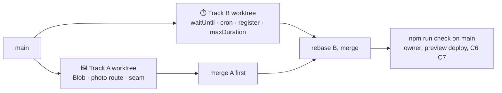

# ▲ [0011] Handoff — the app on Vercel (M8b · Deploy, take two)

> A handoff, not a spec. Child of [handoff 0010](0010-deploy.md), which built a one-VM deploy that is proven and parked. Read the documents in §⬆️ before anything else; nothing here overrides them.

| 🗓️ Written | 👤 Owner | ⬆️ Parent | ⏱️ Budget |
| --- | --- | --- | --- |
| 2026-09-06 | Sven Reiser | [Handoff 0010](0010-deploy.md) · [Findings 0010](0010-deploy-findings.md) · [Findings 0009](0009-offline-findings.md) | 1 session: two agents in parallel worktrees, then the owner's preview deploy and phone |

---

## 🎯 Why

Hetzner refused the owner's card (2026-09-05, after the VM deploy was merged). **Owner's call: Vercel**, project created, root directory `app`, functions in `fra1`, Neon Postgres in Frankfurt from the marketplace, the five variables set. The first deploy will build.

It will not run the product for long. Three things in `main` assume one process on one disk, and serverless has neither:

| In `main` | Assumes | On Vercel |
| --- | --- | --- |
| Photos under `PHOTO_DIR` (`server/photos.ts`, `api/photo/[id]`) | a disk that stays | `/tmp` is per invocation: a photo uploaded now is gone on the next request |
| Region job, content kick (`dex.ts` `startRegionJob`, `taxon.ts` `kickContent`) | a process that outlives the response | the function is frozen after the response; the job dies mid-flight |
| Restart sweep (`instrumentation.ts` `register()`) | a server that starts once | starts on every cold start, so "sometimes", and races itself across instances |

This handoff moves each to what Vercel offers: **Vercel Blob** for photos, **`waitUntil`** for the in-request jobs, a **cron route** for the sweep. No queue service, no job table, no schema change.

**The VM deploy stays in the repo** (`app/Dockerfile`, `deploy/`, both workflows): it is proven by findings 0010 and is the way out if Vercel's bill or limits bite. One line in `deploy/README.md` says it is not the live path.

## ⬆️ Input

| Read | Why |
| --- | --- |
| [Findings 0010](0010-deploy-findings.md) both sections | What was built for the VM and what of it stays: env guard, `Secure` cookies, `/api/health`, `/api/tiles` are all Vercel-ready |
| [Findings 0009](0009-offline-findings.md) Track B "The flush rules as built", Track A worker decisions | The outbox uploads `/api/photo` then creates the sighting; the worker caches `/api/photo/` cache-first: the URL shape must not change |
| [Findings 0008](0008-log-and-journal-findings.md) A6 A7 A11 | Capability URL, content kick, abandoned photos: the three decisions this handoff revisits under serverless |
| `app/src/server/photos.ts`, `app/src/app/api/photo/`, `app/src/server/routers/journal.ts` `remove`, `app/src/server/identity*.ts` delete path | Every reader and writer of photo files |
| `app/src/server/routers/dex.ts` lines 20–60, `taxon.ts` lines 35–55, `app/src/server/sweep.ts`, `app/src/instrumentation.ts` | The three in-process jobs |
| `app/src/server/env.ts`, `app/.env.example` | Where new variables are declared |

## 🌱 What is already there

| Piece | State on Vercel |
| --- | --- |
| Build | `prebuild` build id, `next build`, `postbuild` worker manifest: works, the build id is in the served HTML (findings 0010 C1 logic, same code) |
| `output: 'standalone'` in `next.config.ts` | Vercel ignores it with a warning; make it conditional on `!process.env.VERCEL` |
| Env guard | Runs in `register()`, `process.exit(1)` on a missing variable: on Vercel that is a failed function with a clear log line. Keep |
| Cookies, `/api/health`, `/api/tiles` | Vercel terminates TLS and sets `x-forwarded-proto: https`: `Secure` cookies work; tiles proxy works, a week of `Cache-Control` also lands in Vercel's edge cache |
| Search cap (`server/searchCap.ts`) | In-memory per instance: a scraper gets 30/min **per warm instance**. Accepted for M9; noted |
| Migrations | Build command `npx prisma migrate deploy && npm run build`; the Neon URL is the pooled one, `migrate deploy` copes. Owner's dev rule (no reset, no push, no dev migrate) unchanged |
| Worker, outbox, export | Unchanged; the export is not deployed (Vercel serves the server build) |

## 🛠️ Track A · photos in Blob

| Aspect | Choice | Why |
| --- | --- | --- |
| Files owned | `app/src/server/photos.ts`, `app/src/app/api/photo/**`, `app/src/server/routers/journal.ts` (the `remove` call only if the helper's signature changes; aim: it does not), `app/src/server/env.ts` (**one** optional variable `BLOB_READ_WRITE_TOKEN`, see §🔀), `app/package.json` (`@vercel/blob` only), `app/.env.example` (one line) | Track B never opens these |
| Store | `@vercel/blob`: `put('photos/<assetId>.jpg', bytes, { access: 'public', addRandomSuffix: false, contentType: 'image/jpeg' })`; `del()` on remove; the blob's path is derived from the `Asset` id, nothing new is stored in the DB | Schema frozen; the uuid is already the secret (findings 0008 A6), the blob host adds nothing guessable |
| Two stores, one seam | `photos.ts` keeps its exports (`writePhoto`, `deletePhotoFiles`, `deletePhotoFilesOfIdentity`, `photoUrl`) and picks the backend once: `BLOB_READ_WRITE_TOKEN` set → Blob, else disk under `PHOTO_DIR` | The sweep (Track B's file) and the journal call these by name; dev, the VM and the tests keep the disk |
| Serving | `GET /api/photo/<id>` stays the URL the worker caches. Blob backend: **302** to the blob URL with `Cache-Control: private, max-age=31536000, immutable`; disk backend unchanged | The worker's `fetch` follows redirects and caches under the request URL, so offline photos keep working; streaming 1,600 px JPEGs through a function costs money for nothing |
| Upload | `POST /api/photo` unchanged on the outside (multipart, 2 MB cap, EXIF-free JPEG from the client); inside it calls `writePhoto` | The outbox's flush must not change |
| `PHOTO_DIR` on Vercel | The env guard stops requiring it when the Blob token is set (`PHOTO_DIR` optional, default stays for dev) | The owner set `PHOTO_DIR=/tmp/photos` as a stopgap; it can go |
| Not here | Signed URLs, image resizing on the server, a migration of existing dev photos (there are none worth keeping), the Blob `client upload` flow | The 2 MB cap keeps the function path fine |

## 🛠️ Track B · jobs that survive the response

| Aspect | Choice | Why |
| --- | --- | --- |
| Files owned | `app/src/server/routers/dex.ts` (the job plumbing, not the router's shape), `app/src/server/routers/taxon.ts` (`kickContent` only), `app/src/server/sweep.ts`, `app/src/instrumentation.ts`, `app/src/server/jobs.ts` (new), `app/src/app/api/cron/sweep/route.ts` (new), `app/vercel.json` (new), `app/next.config.ts` (`output` line, `maxDuration` if needed), `app/src/server/env.ts` (**one** optional variable `CRON_SECRET`), `app/etl/README.md` (§🚀 rewritten for Neon: no tunnel, the unpooled URL from the Mac), `deploy/README.md` (one line at the top: parked) | Track A never opens these |
| One helper | `server/jobs.ts`: `background(promise)` = `waitUntil` from `@vercel/functions` when on Vercel, `void promise` elsewhere. `startRegionJob` and `kickContent` keep their `globalThis` maps (they still dedupe within a warm instance) and hand their promise to `background()` | `waitUntil` keeps the function alive after the response up to `maxDuration`; the region job is ~30 s, a content kick a few seconds |
| Duration | Route segment config `export const maxDuration = 300` on the tRPC route handler (fluid compute, Hobby allows it) and on the cron route | A cold region job with a slow GBIF must not hit the 60 s default |
| Sweep | `GET /api/cron/sweep`: `Authorization: Bearer <CRON_SECRET>` (Vercel sends it), runs `sweep()`, returns the `SweepResult`; `vercel.json` `crons: [{ path: '/api/cron/sweep', schedule: '0 4 * * *' }]` | Hobby runs a cron once a day; enough for "heal what died", since the jobs themselves now finish in-request |
| `register()` | Env check stays; the sweep on start runs only when **not** on Vercel (`process.env.VERCEL` unset) | On Vercel the cron owns it; a sweep per cold start would race itself. The advisory lock (`pg_try_advisory_xact_lock`) stays as the second guard |
| `/api/health` `sweepAt` | Reads the last cron run: the cron route stamps `globalThis.dexSweepAt` like before, so on Vercel it is "since this instance woke", documented as such | No schema for a stamp; good enough for a monitor that only reads `ok` |
| Not here | A job table, Vercel Queues, Inngest, retries beyond what the sweep already does, the ETL on Vercel (it runs on the Mac against Neon) | One user, one region; the cron heals |

## 🔀 Working in parallel



| Rule | Why |
| --- | --- |
| Two worktrees from `main`; each agent edits only its files | The lists do not overlap except two shared files below |
| Shared: `env.ts` and `.env.example` (A adds `BLOB_READ_WRITE_TOKEN`, B adds `CRON_SECRET`, both optional, both at the **end** of the lenient object and the file); `package.json` (A adds `@vercel/blob`, B adds `@vercel/functions`) | Merge by hand: take both lines |
| Neither agent has the Vercel project. The owner puts `BLOB_READ_WRITE_TOKEN` into `app/.env.local` **before** the session (Vercel → Storage → Blob → create store → the token); Track A tests against the real Blob store from the Mac. Track B tests `waitUntil` against `next start` (the helper falls back to `void`) and the cron route with `curl` | Blob cannot be faked honestly; the rest can |
| Track A merges first, B rebases, `npm run check` on `main`; then the owner deploys and runs C6 C7 on the phone | |

## 🧪 Checks

| # | Track | Check | Pass |
| --- | --- | --- | --- |
| C1 | A | `next start` with the token in `.env.local`: upload a photo through the log flow, open the sighting, delete it in the diary | The blob appears under `photos/<id>.jpg` in the Vercel dashboard, `/api/photo/<id>` 302s to it, the image renders; after delete the blob is gone (`list()` empty) |
| C2 | A | Same without the token | Disk path as before; `npm run check` green; `deletePhotoFiles` signature unchanged (Track B's sweep compiles untouched) |
| C3 | A | The worker offline with a Blob photo (production build, CDP or the Simulator, findings 0009's driver) | The diary and the sighting show the photo offline after one online view |
| C4 | B | `next start`: log a species outside the set | The content kick lands (`Taxon.contentAt` set) and the response was not held for it; on Vercel the same via `waitUntil` is the owner's C6 |
| C5 | B | `curl -H "Authorization: Bearer $CRON_SECRET" localhost:3002/api/cron/sweep` and once without the header | `SweepResult` JSON; 401 without; `register()` skips the sweep when `VERCEL=1` is set in the env |
| C6 | owner | Preview deploy from `main` with all variables | Build green, `/api/health` `ok`, a photo uploaded from the phone is there after ten minutes and after a redeploy; an out-of-set species logged gets its content within a minute |
| C7 | owner | `standkreis.de` attached, the phone as in 0010 C7 C8 | PWA installed, airplane-mode sighting flushed, passkey survives a day |

## ⬇️ Output

| What | Where |
| --- | --- |
| App | Blob-backed photos with the disk seam, `jobs.ts`, cron route, `vercel.json`, `register()` split |
| Docs | `etl/README.md` §🚀 for Neon; `deploy/README.md` parked line |
| Findings | `0011-vercel-findings.md`: C1 to C5 evidence, the Blob costs seen, doubts, what the owner sets |
| Roadmap | M8b ✅ once C6 C7 pass, M9 next |

**Definition of done:** C1 to C5 on `main`; the owner finishes C6 C7 with the phone.

## ❓ Open, for the owner during the session

- **Blob region.** Vercel Blob stores are global (US-backed); a photo of a salamander is not personal data, the location is not in the file (EXIF stripped, M6). Proposal: accept; if EU residency ever matters, the seam takes Cloudflare R2 in an afternoon.
- **Hobby limits.** One cron a day, 100 GB bandwidth, function duration 300 s with fluid compute. Proposal: stay on Hobby through M9; Pro only when the cron needs to be hourly.
- **Search cap per instance.** Proposal: accept for M9; a `Neon`-backed bucket is a later line.
- **Preview deploys and passkeys.** Every branch gets a `*.vercel.app` URL where passkeys fail by design (RP id). Proposal: fine; previews are for looking, not logging in.

## 🚫 Not in this handoff

Resend and the magic link (M7b: add the domain at Resend, DKIM at united-domains, then the code) · a job table or queue service · signed photo URLs · image resizing · deleting the VM deploy · any schema change · new regions.

## 📋 Owner, before the session

| # | Do | Where |
| --- | --- | --- |
| 1 | Storage → Blob → create store `standkreis-photos` → copy `BLOB_READ_WRITE_TOKEN` into `app/.env.local` on the Mac (the file is git-ignored) | Vercel |
| 2 | Storage → Neon: note the **unpooled** connection string for the ETL from the Mac | Vercel / Neon |
| 3 | Settings → Environment Variables: `CRON_SECRET=$(openssl rand -hex 32)`, remove `PHOTO_DIR` after Track A merges (or leave it, harmless) | Vercel |
| 4 | Settings → Domains: add `standkreis.de` and `www.standkreis.de`; set the `A` / `CNAME` records Vercel shows at united-domains | Vercel, united-domains |

## 👉 Start the session with

```
Read docs/handoffs/0011-vercel.md and the documents it names in §⬆️.
Open two worktrees from main and run Track A and Track B as two agents in parallel, each owning only its files.
Track A has BLOB_READ_WRITE_TOKEN in app/.env.local and tests against the real store; Track B tests against next start.
```
