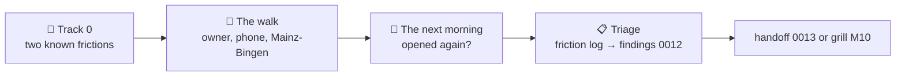

# 🚶 [0012] Handoff — the first walk (M9)

> A handoff, not a spec. Child of [spec 0001](../specs/0001-standkreis-dex-the-first-walk.md) §🚶 "The first slice: one complete walk". Read the documents in §⬆️ before anything else; nothing here overrides them.

| 🗓️ Written | 👤 Owner | ⬆️ Parent | ⏱️ Budget |
| --- | --- | --- | --- |
| 2026-09-06 | Sven Reiser | [Spec 0001](../specs/0001-standkreis-dex-the-first-walk.md) §🚶 · [Findings 0011](0011-vercel-findings.md) · [Findings 0009](0009-offline-findings.md) | ½ agent session before the walk, one walk, one morning after, ½ agent session for the triage |

---

## 🎯 Why

Everything the spec asked for is built and live at [atlas.standkreis.de](https://atlas.standkreis.de) with Mainz-Bingen filled (929 species). M9 is not a build milestone. **Its definition of done is a person, not a check**: the owner uses the app on one real walk and opens it again the next day for no reason. No agent can pass it.

What an agent can do: remove the two frictions already known so they do not eat the walk, and afterwards turn the owner's notes into the next handoff. **Nothing else gets built before the walk.** The temptation is to add a feature "so the walk goes better"; the walk exists to find out what that feature is.



## ⬆️ Input

| Read | Why |
| --- | --- |
| Spec 0001 §🚶 acceptance criteria | The nine boxes; the walk is where they get ticked or not |
| Findings 0011 §📱 | The "One moment" onboarding hang (server 500 with no error state) |
| Findings 0011 Track A doubt A1, `app/src/trpc/client.tsx:26` | The sighting page is blank offline: `journal.get` is not in `PERSISTED` |
| Findings 0009 Track B "The flush rules as built" | What the outbox promises the walk (airplane-mode sightings flush later) |
| [GLOSSARY](../GLOSSARY.md) | The words the friction log should use |

## 🔧 Track 0 · two frictions, one agent, `main`

| # | Friction | Fix | Files |
| --- | --- | --- | --- |
| F1 | Onboarding search shows "One moment …" forever when `dex.lookupRegion` fails | Show the query's error: one line (`de`/`en`), the input stays editable, a retry on the next keystroke. No spinner longer than the request | the onboarding component, both locale JSONs |
| F2 | A sighting page opened offline is blank ("Einen Moment") unless it was opened online once | Add `['journal', 'get']` to `PERSISTED` with a cap like `PAGE_CAP` (newest N sightings, N = 30); the diary already persists `journal.days` | `app/src/trpc/client.tsx` |

| Check | Pass |
| --- | --- |
| C1 | `next start` with `DATABASE_URL` pointing at a dead port: onboarding search shows the error line within 2 s, typing again retries |
| C2 | Production build, headless Chrome offline (`app/scripts/m8a/offline.mjs` pattern): a sighting logged online, page never opened, opens offline with species and photo |
| C3 | `npm run check` green; the persisted store stays under 1 MB with 30 sightings (print the size) |

Not in Track 0: anything the owner has not yet felt on a walk.

## 🚶 The walk · owner

### Before leaving

| Step | Why |
| --- | --- |
| Safari → atlas.standkreis.de → Share → "Zum Home-Bildschirm" | The PWA, not the tab: the worker, the icon, the full screen |
| Open it from the icon, region Mainz-Bingen, groups you care about | The set on the grid is "what I could find on Saturday" or it is not |
| Airplane mode on, open the icon: the grid must appear | Spec §🚶 "the dex opens with no network" (M8 C9) |
| Airplane mode off | |

### On the walk, at least

| Do | Ticks |
| --- | --- |
| Look something up before you see it (a species page, on the path) | species page composes, attribution, honest empty states |
| Log 3 sightings: one from the grid, one **outside the set** via search, one **with a photo** | log by search and claim, silhouette fills, out-of-set joins the dex |
| Log one of them in airplane mode, switch back on later, check it arrived | the outbox promise |
| Mark one species studied | grid rendering and counter change |
| Do nothing for ten minutes and see whether you open the app on your own | the only question that matters |

### The next morning

| Do | Note |
| --- | --- |
| Did you open it without a reason? | yes / no, and what you looked at |
| Open the diary, one sighting, its photo | still there, offline too |
| Export the JSON (settings) | the file exists and holds the walk |

### The friction log

One row per moment, written on the phone or right after. No fixes, no ideas, only what happened.

| ⏱️ When | 📍 Where in the app | 😐 What happened | 🎯 What I expected | 🔥 Severity |
| --- | --- | --- | --- | --- |
| before the walk, 2026-09-06 | species page, Steckbrief | Status and maybe Alter/Nachwuchs, one "noch keine Angaben" line, no Größe, Lebensraum, Zug, Stimme, no prose beyond the Wikipedia intro | Something to learn from: the spike's Steckbrief, a voice, two paragraphs that read like a naturalist wrote them | 🟠 → **M9b 📇 Steckbrief** in the roadmap; the walk says whether it is 🔴 on the path or on the sofa |
| | | | | 🔴 stopped me · 🟠 annoyed me · 🟡 noticed |

Also, in one line each: what surprised you positively; what you looked for and did not find; whether the set felt right.

## 📋 Triage · agent, after the walk

| Do | Output |
| --- | --- |
| Read the friction log, reproduce every 🔴 and 🟠 on the production build or the Simulator | `0012-first-walk-findings.md`: the spec's nine acceptance boxes ticked or not with the walk as evidence, the friction log with a reproduction per row |
| Sort: bug in what exists (→ a fix list) · missing thing the spec already names (→ handoff 0013) · Steckbrief depth (→ the M9b grill) · new idea (→ M10 grill input, no code) | Four lists, each row named by a GLOSSARY word |
| Roadmap | M9 ✅ only if the next-morning answer is yes; otherwise M9 stays open with the fix list as M9.1 and the walk is repeated |

Question for the triage to keep asking: is this friction, or is this the product being honest (an empty source, a species with no image)? The spec allows the second.

## ❓ Open, for the owner

- **Which walk?** A route you actually take, not a good one for the app. Proposal: the usual one, on a day you would have gone anyway.
- **The set's groups.** All eight tiles or the ones you care about? Proposal: the ones you care about; the grid must feel like yours.
- **The next-morning rule.** No reminder, no note on the fridge. If you do not open it, that is the finding.

## 🚫 Not in this handoff

New regions · quests (M10) · ID assist · list or map views · anything from spec §🚶 "Explicitly not in the first slice" · Resend (M7b) · fixing frictions the owner has not logged.

## 👉 Start the session with

```
Read docs/handoffs/0012-first-walk.md and the documents it names in §⬆️.
Run Track 0 on main: the two frictions, C1–C3, findings section "Track 0". Nothing else before the walk.
```

After the walk:

```
Read docs/handoffs/0012-first-walk.md §📋 and the owner's friction log below. Reproduce, sort, write the findings, propose the roadmap line.
```
