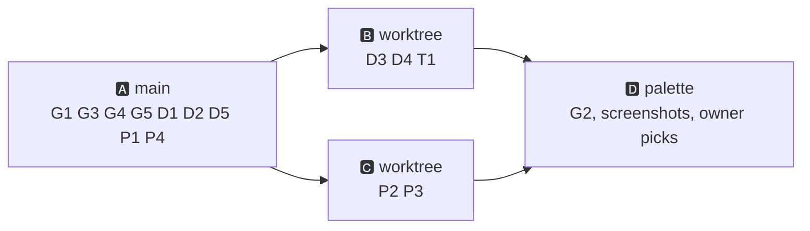

# 🎨 [0014] Handoff — UI second pass (owner's notes before the walk)

> A handoff, not a spec. Child of [handoff 0012](0012-first-walk.md); sibling of [0013](0013-onboarding-second-pass.md), which did the onboarding rows. Read the documents in §⬆️ before anything else; nothing here overrides them.

| 🗓️ Written | 👤 Owner | ⬆️ Parent | ⏱️ Budget |
| --- | --- | --- | --- |
| 2026-09-06 | Sven Reiser | [Spec 0001](../specs/0001-standkreis-dex-the-first-walk.md) §🎨 · [Findings 0007](0007-atlas-grid-and-species-findings.md) · [Findings 0013](0013-onboarding-second-pass-findings.md) | Track A on `main` (½ session), Tracks B and C in worktrees (1 session each), then the palette experiment |

---

## 🎯 Why

The owner walked through the whole app on the phone after the onboarding pass and wrote 19 notes. None of them is built yet; the onboarding notes (O1–O10 and the copy) are all live since 0013 and the four follow-up commits of 2026-09-06. This handoff sorts the 19 into four tracks, names what the agent decides and what stays the owner's call.

## ⬆️ Input

| Read | Why |
| --- | --- |
| Spec §🎨 | The look: one grid, three cell states, honest empty states |
| Findings 0007 | How the grid cell, the species page and the sections were built |
| `app/src/app/globals.css` tokens | `moss`, `amber`, `night`, `tile` … there is no blue token yet |
| `app/src/components/{AtlasGrid,SpeciesPage,SpeciesSlider,LogSheet,FilterDrawer,Shell,IdentityProfile,Journal,SightingPage}.tsx` | The files each row touches |

## 📋 Triage

Status: 🆕 not started · 🟡 partly there · ✅ done. Size: XS < 1 h · S ½ day · M 1 day.

### 🌍 General

| # | Owner's note | Status | Size | Track | Agent's take |
| --- | --- | --- | --- | --- | --- |
| G1 | Drawers cannot be pulled down; after a new discovery this is annoying. Click-outside works | 🆕 | S | A | `LogSheet` and `FilterDrawer` get drag-to-dismiss on the handle and the header: pointer events, follow the finger, close past 30 % or on a fast flick. Same helper for both |
| G2 | Try turquoise for the green and purple for the orange | 🆕 | S | D | Tokens make this a swap. Moss is the "nature" meaning of the whole app and turquoise reads fintech; purple for "studiert" can work. **Not decided by the agent**: the palette track ships two screenshot sets (today's and the proposal, same six screens), the owner picks. Runs last, after A–C merged, because it touches every screen |
| G3 | Bottom nav: no labels, better icons, clearer active state | 🆕 | S | A | Three tabs, icons are unambiguous. Active = filled glyph + moss dot under it; inactive = outline in `ink-soft`. `aria-label` keeps the names |
| G4 | Studied and discovered borders on images: more saturated amber, and a green border for discovered. Onboarding demo, atlas grid, Tagebuch | 🟡 amber ring exists, green ring only in the fill moment | S | A | One `--color-amber` step up (check contrast on white). `ring-2 ring-moss ring-inset` on every seen cell, permanently, in `Cell`, `DemoCell` and the journal tiles. The fill moment keeps its 3 px sweep |
| G5 | Selected states (onboarding, filter drawer) in blue, not primary: primary is overused in the filter menu. Selected chips get a slight blue background | 🆕 | S | A | New token `--color-sky` (+ `sky-soft`), used for *selection* only: radio dot in step 1, check badge in step 2, chips in the filter drawer and the diary. Moss stays for actions and for "entdeckt" |

### 📄 Detail page

| # | Owner's note | Status | Size | Track | Agent's take |
| --- | --- | --- | --- | --- | --- |
| D1 | Swap the positions of "Entdeckt" and "Studiert" | 🆕 | XS | A | Order becomes seen, then studied; same in `Journal` and the grid legend if any |
| D2 | Remove the 3D emoji from the "entdeckt" button | 🆕 | XS | A | The button keeps the `Icon` set only, no emoji anywhere on the page (spec §🎨: no emoji in the UI) |
| D3 | The ⓘ for photo and source references, everywhere; the detail page has many spots | 🆕 | M | B | One `SourceInfo` popover component (ⓘ → sheet with licence, author, link). Slider image, facts, occurrence, lookalikes, ecology, Quellen line. The onboarding tile thumbs get it too |
| D4 | Horizontal ecology sliders are hard to oversee with many items. Instead: category title with the total on the right, "frisst ———— (6)", items in a wrapping grid, "mehr anzeigen" after three rows | 🆕 | M | B | Agreed; the slider was a spike leftover. `SpeciesSlider` stays for images only. Three rows = 9 chips at 390 px; the button toggles, no pagination |
| D5 | Should sections like "Verwechslungsgefahr" show when empty? | 🆕 | XS | A | Hide when empty: an empty lookalikes or ecology section is noise, not honesty. Keep the empty line only where absence is a fact worth reading: Vorkommen (no records this month) and Steckbrief (M9b). Owner may veto |

### 👤 Profile

| # | Owner's note | Status | Size | Track | Agent's take |
| --- | --- | --- | --- | --- | --- |
| P1 | "1 studiert · 1 entdeckt …" font too big | 🆕 | XS | A | 15 px `ink-soft`, same as the atlas counters |
| P2 | Avatar upload and region change from the profile | 🆕 | M | C | Region change is a link to `/onboarding?mode=change`, exists. Avatar is new: one Blob object per identity behind the `photos.ts` seam, `identity.avatar` on the identity row (migration, runs in the Vercel build), square crop client-side, ≤ 256 px. Shown in the profile and nowhere else for now |
| P3 | Progress per group not visible; a net (radar) chart, one axis per group, two areas for studied and discovered | 🆕 | M | C | At the owner's numbers (1 of 120 per group) both areas collapse to a dot for months. **Build the bars first**: eight rows, group name, two thin bars (studied amber, discovered moss) with the numbers. Radar as a candidate for the M10 quest grill, on a square-root scale if it comes. Owner may overrule and get the radar in C instead |
| P4 | Species → species links leave you bouncing between two pages, no way back to the index. Global, worst on the detail page | 🆕 | S | A | The species page's back affordance stops meaning `history.back()`. It goes to where the chain started: the atlas or the diary, remembered in `sessionStorage` when the first species page is entered from a tab. The tab bar stays as the second way out |

### 📓 Tagebuch detail

| # | Owner's note | Status | Size | Track | Agent's take |
| --- | --- | --- | --- | --- | --- |
| T1 | Never reviewed: spacing off, "Zur Art" badly placed, "Wann" is both label and field, own photo vs none not visible. Could be a drawer | 🆕 | M | B | Agreed, it was only made to work offline (Track 0 F2). Redesign: photo hero when own photo exists, else the reference image with a small "Referenzfoto" tag and a "Foto hinzufügen" action; one meta line (date · Landkreis · Gruppe), the note, "Zur Art" as the primary button. **Drawer from the diary, page for deep links**: same component in both; the route stays because it is persisted offline and linkable |

## 🛤️ Tracks



| Track | Where | Rows | Shared files | Merge |
| --- | --- | --- | --- | --- |
| A | `main` | G1 G3 G4 G5 D1 D2 D5 P1 P4 | `globals.css` (tokens `sky`, `amber`), `Shell.tsx`, `AtlasGrid.tsx`, `SpeciesPage.tsx` | first |
| B | `../standkreis-dex-b` | D3 D4 T1 | `SpeciesPage.tsx`, `SightingPage.tsx`, `Journal.tsx`, locale JSONs | rebases on A, merges second |
| C | `../standkreis-dex-c` | P2 P3 | `IdentityProfile.tsx`, `photos.ts`, one migration, locale JSONs | rebases on A and B |
| D | `main`, after C | G2 | tokens only | owner's pick from the shots, else reverted |

B and C both touch the locale JSONs: each adds its own keys at the end of its block, merged by hand.

## 🧪 Checks

| # | Check | Pass |
| --- | --- | --- |
| C1 | Simulator: log a sighting, pull the sheet down | Closes on drag, closes on flick, stays on a short wobble |
| C2 | Grid with one studied and one seen species | Amber ring reads on white and on the splash demo; green ring on the seen cell; both in the diary |
| C3 | Filter drawer with two tiles off and "studiert" on | Selected chips blue, the action button the only moss on the sheet |
| C4 | Species page with an empty lookalikes list | Section absent; Vorkommen keeps its empty line |
| C5 | Atlas → species → lookalike species → back | Lands on the atlas, scroll position kept |
| C6 | Species page ecology with 14 items in one category | Count "(14)" on the right, three rows, "mehr anzeigen" shows the rest |
| C7 | Diary → sighting with own photo, and one without | Hero vs reference tag visible at a glance; drawer from the diary, page from a pasted link, offline too |
| C8 | Profile: avatar upload from the Simulator's photo library, region change | Avatar in the profile after reload; region path lands on onboarding step 1 in change mode |
| C9 | Palette shots | Six screens × two palettes in `0014-shots/`, the owner picks |
| C10 | `npm run check` green after every merge | |

## ⬇️ Output

Findings `0014-ui-second-pass-findings.md`: one section per track, C1–C10 with shots, the drag helper's thresholds, doubts (D5, P3 and G2 are the ones where the agent's take may be wrong), "For the merge".

## 🚫 Not in this handoff

The Steckbrief (M9b) · quests (M10) · new regions · anything from the walk itself, which has not happened.

## 👉 Start the session with

```
Read docs/handoffs/0014-ui-second-pass.md and the documents it names in §⬆️.
Track A on main: the nine rows, C1–C5. Then findings section "Track A".
```
