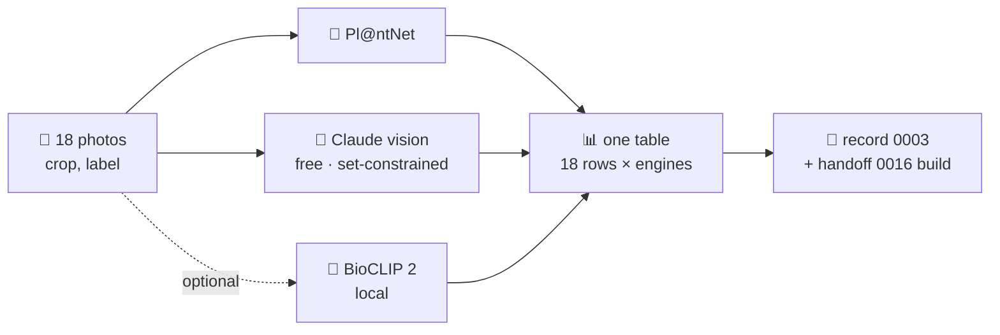

# 🔥📷 [0015] Handoff — the ID engine grill (M12)

> A handoff for a grill, not a build. Child of [spec 0001](../specs/0001-standkreis-dex-the-first-walk.md) "The ID engine is a commodity you rent" and of M9's finding. Its output is a record and a build handoff, not app code. Read the documents in §⬆️ before anything else; nothing here overrides them.

| 🗓️ Written | 👤 Owner | ⬆️ Parent | ⏱️ Budget |
| --- | --- | --- | --- |
| 2026-09-06 | Sven Reiser | [Spec 0001](../specs/0001-standkreis-dex-the-first-walk.md) §🗄️ §⚖️ · [ROADMAP](../ROADMAP.md) M12 · [Grill 0005](0005-etl-grill.md) for the format | 1 grill session, throwaway scripts, under 5 € of API calls |

---

## 🎯 Why

M9 closed with one finding, the owner's words: *"The walk only really becomes useful if we have autorecognition of species. I did a small walk but would have to guess the species at the moment."* Order is now M12 → M9b → M10.

Before M12 is built, three questions decide its shape and nobody has numbers: **which engine**, **what it does with the photos the owner actually takes**, and **whether the region's set helps or hurts**. The owner put 18 of their own photos in `docs/research/walks/01/`. That is the fixture. The grill scores every engine on it, against Mainz-Bingen's set of 929, and ends with the owner picking.



## ⬆️ Input

| Read | Why |
| --- | --- |
| Spec §🗄️ source table rows "ID assist", §⚖️ "Locations go down a ladder", "No AI-generated imagery" | The rented-engine stance; **exact places never leave the phone**, so EXIF GPS is stripped before any upload |
| Spec §🚶 "Explicitly not in the first slice" · §"Open" last bullet | Snap-and-send UX: ladder animation, confidence, correcting a wrong suggestion. The grill produces the facts the UX needs, not the UX |
| [Grill 0005](0005-etl-grill.md) §❓ §🛠️ | The format: one question at a time, evidence from the probe, the owner decides, 🙋 marks an override |
| `app/src/server/routers/taxon.ts` `search`, `app/src/server/routers/dex.ts` `set` | Where a result would land: the search the ladder prefills, the set it is scored against |
| [GLOSSARY](../GLOSSARY.md) | Words for the findings: set, outside the set, silhouette, claim |

## 📁 The fixture · what is in `walks/01`

The agent looked at all 18 before writing this. **This is not a leaf-and-flower set. It is a "what I see from the path" set**, and that is the point.

| Files | What they are | Note |
| --- | --- | --- |
| `IMG_3084`–`IMG_3097.PNG` (14) | **Screenshots of the Photos app**, 1206 × 2622, with status bar, crop icon, thumbnail strip on three of them | Step 0 crops the chrome. Three carry the album's place label: *Oestrich-Winkel* (Rheingau-Taunus, Hessen, across the Rhine) and *Talhänge südlich von Kirrberg*. Not everything was shot in Mainz-Bingen |
| `PHOTO-2026-09-06-19-29-*.jpg` (4) | Camera originals, 1530 × 2040 / 2040 × 1148 | Two are **drone shots** of flowering trees from above |

The agent's first read of the subjects, for the owner to correct in §📝:

| # | File | Agent's guess | Kind | In the set? |
| --- | --- | --- | --- | --- |
| 1 | IMG_3084 | Fruit tree, heavy with small green-yellow fruit, 20 m, mist · pear? | whole tree, distance | likely (Pyrus) |
| 2 | IMG_3085 | Fruit tree by a hut, mist | whole tree, distance | ? |
| 3 | IMG_3086 | Broad fruit tree at a fence, mist · apple? | whole tree, distance | ? (Malus) |
| 4 | IMG_3087 | Tall tree with drooping fruited branches · pear or walnut? | whole tree, distance | ? |
| 5 | IMG_3088 | Young tree, fine leaves, red earth · young walnut or ash? | young tree | ? |
| 6 | IMG_3089 | Round-crowned tree on a dry meadow · apple? | whole tree, distance | ? |
| 7 | IMG_3090 | Wide tree at a fence, dry meadow · cherry? | whole tree, distance | ? |
| 8 | IMG_3091 | Leaning old fruit tree on a slope, valley behind | whole tree, distance | ? |
| 9 | IMG_3092 | **Bonsai** on a bench in front of a green door · olive or *Ficus*? | pot plant, cultivated | no, and should say so |
| 10 | IMG_3093 | **Pot plant** on the same bench · *Schefflera*? | pot plant, cultivated | no, and should say so |
| 11 | IMG_3094 | Small tree in tall dry grass, *Oestrich-Winkel 24. August* · young walnut? | young tree | ? |
| 12 | IMG_3095 | **Praying mantis** (*Mantis religiosa*) on a hand, indoors, *2. August* | the one animal, close-up | yes if in the set (spreading in Rheinhessen) |
| 13 | IMG_3096 | Forest path, oaks and pines, autumn colour, sandstone | **scene**, several species | no single answer: the honest result is "several" |
| 14 | IMG_3097 | **Pumpkin** plant with fruit and flower, *Talhänge südlich von Kirrberg, 5. August 2024* | crop, cultivated | no |
| 15 | PHOTO …-38 | **Young sweet cherry** with ripe cherries, staked, blue sky | tree, fruit visible | yes (*Prunus avium*) |
| 16 | PHOTO …-44 | Shrub or small tree in full white bloom, spring · blackthorn, wild cherry, or *Prunus cerasifera*? | shrub, flowers visible | likely |
| 17 | PHOTO …-45 | **Drone**, top-down, one white-flowering tree in a meadow | drone | ? |
| 18 | PHOTO …-45 2 | **Drone**, oblique, flowering trees at a wood edge, low sun | drone, several | several |

What that means for the grill: **ten of eighteen are whole trees at 20 to 50 m in mist.** No engine will give a species from that with confidence, and the app must not pretend. The finding the grill is really after is not "Pl@ntNet 71 % vs Claude 64 %" but **what the camera screen has to tell the owner** ("näher ran: ein Blatt, eine Frucht, die Rinde") and **what a good engine answers when it cannot know** (genus, family, or "several").

## ❓ The questions

| # | Question | What the answer needs |
| --- | --- | --- |
| I1 | **Which engine for which group.** Pl@ntNet is plants only. Claude vision does everything and reads context (a stake, a bench, a hand). BioCLIP 2 is free, local, plants and animals | Top-1 / top-3 / genus hit per engine on the 18, split plants vs animals vs cultivated vs scene |
| I2 | **Whole trees.** What each engine does with the ten distance shots, and with Pl@ntNet's `habit` organ hint vs none | Per photo: the answer, the confidence, whether the confidence is honest (high on wrong = the worst cell). One sentence for the camera screen that follows from it |
| I3 | **Does the set help or hurt.** Claude gets the region's 929 names as the only allowed answers (plus "outside the set" and "several"); Pl@ntNet's list is filtered to the set after the fact | Constrained vs unconstrained on the same 18. Watch the bonsai, the pumpkin, the *Schefflera*: a constrained engine that forces them into a set member has failed the honesty rule |
| I4 | **The taxon ladder.** What the response gives to build family → genus → species with a "why" (Pl@ntNet gives ranked species with scores and the organ; Claude can be asked for the ladder and the visible evidence) | Three ladders written out by hand from real responses: the cherry (15), a misty tree (1), the mantis (12) |
| I5 | **Cost, latency, terms.** Per photo: seconds and cents; both engines' terms on storing and training on uploaded photos; Pl@ntNet's free tier (500/day) against a realistic walk (20 photos) | A table; the sentence the app says before the first upload ("Das Foto geht an …") |
| I6 | **Privacy.** What leaves the phone: the photo minus EXIF (GPS, date), nothing else. Server-side or client-side call | A decision: the server proxies (keys stay on Vercel, EXIF stripped there, photo not stored unless the sighting is saved) |
| I7 | **Offline.** No engine offline. Snap in airplane mode: the photo waits in the outbox and the ladder arrives at the flush, or the app says "erst online"? | A decision and the outbox change it implies, one sentence |
| I8 | **BioCLIP 2 at all.** Only if I1 leaves a hole Claude does not fill for animals, or the cost line in I5 is bad. Runs on the Mac in Python (`open_clip`, ViT-L, ~1.7 GB), zero-shot over the 929 names, no key | Skip with a reason, or the same 18-row column |

## 🛠️ The probe

Throwaway scripts in `app/scripts/id-probe/`, Node, no framework, JSON out, one script per engine, every response cached under `app/scripts/id-probe/.cache/` (git-ignored, add the line). The 18 photos never enter git: `docs/research/walks/**` images are ignored, `labels.csv` is tracked.

| Step | Script | Does |
| --- | --- | --- |
| 0 | `prep.mjs` | Crops the Photos-app chrome off the 14 screenshots (fixed pixel bands, check by eye), strips EXIF from all 18 with `sharp`, writes `walks/01/prep/<n>.jpg` ≤ 1600 px. Writes `labels.csv` from the table above for the owner to correct |
| 1 | `set.mjs` | Dumps Mainz-Bingen's set from the dev DB: `gbifKey, sciName, names.de, tile` (929 rows) to `set.json`. Dev DB only, never Neon |
| 2 | `plantnet.mjs` | `POST https://my-api.plantnet.org/v2/identify/all?api-key=…`, once with no organ and once with `organs=habit` for the tree shots, `leaf`/`flower`/`fruit` where visible. Top-5 with scores, joined to `set.json` by `sciName` |
| 3 | `claude.mjs` | `claude-sonnet-5` (cheap, vision) and one run of `claude-opus-5` on the ten misty trees. Two prompts: **free** (name it, ladder, evidence, confidence, or "several"/"cannot tell") and **constrained** (the 929 names in the system prompt with prompt caching, answer only from the list or "outside the set"). JSON out |
| 4 | `score.mjs` | One table: 18 rows × (Pl@ntNet, Pl@ntNet habit, Claude free, Claude set, BioCLIP?) with ✅ species / 🟡 genus / ⬜ honest "cannot tell" / ❌ wrong-and-confident, plus latency and cents per call. Markdown out, pasted into the findings |

Keys: `PLANTNET_API_KEY` and `ANTHROPIC_API_KEY` in `app/.env.local`, names added to `app/.env.example` with a comment, values never printed or committed. The scripts read `process.env` and refuse to start naming what is missing.

## 📝 What the owner does first

| Do | Where |
| --- | --- |
| Create the Pl@ntNet key (my.plantnet.org, free tier) and the Anthropic key | `app/.env.local` as `PLANTNET_API_KEY=` and `ANTHROPIC_API_KEY=` |
| Correct the guesses in §📁 after `prep.mjs` has written `labels.csv`: your name for each subject, whether it stood in Mainz-Bingen | `docs/research/walks/01/labels.csv` |
| Optional: add two or three **close-ups** (a leaf, a fruit, bark) of the same trees | `docs/research/walks/01/` · gives I2 its control group |

## ⬇️ Output

| Deliverable | Lands |
| --- | --- |
| Findings | `0015-snap-and-send-grill-findings.md`: the 18 × engines table, the three ladders, the cost table, the terms, I1–I8 with the owner's decisions |
| Record | `docs/records/0003-id-engines.md`: which engine(s), constrained or not, the honesty rule for "cannot tell", what leaves the phone, offline behaviour |
| Roadmap | M12's row rewritten from the record; the M12 build handoff (`0016`) can be written without a question |
| Probe | `app/scripts/id-probe/` stays until the build has replaced it |

**Definition of done:** the owner has read the 18-row table and said which column they would trust on a path, one sentence for the camera screen exists that follows from the misty trees, and the record names what leaves the phone.

## 🚫 Not in this grill

Building the camera screen, the ladder animation or the confidence UI · training or fine-tuning anything · new regions · the Steckbrief (M9b) · quests (M10) · anything that stores a photo at a third party.

## 👉 Start the session with

```
Read docs/handoffs/0015-snap-and-send-grill.md and the documents it names in §⬆️.
Write prep.mjs and set.mjs, run them, show me labels.csv and the 18 cropped photos as a contact sheet before calling any engine.
Then plantnet.mjs and claude.mjs on all 18, score.mjs, and the findings table. Ask the grill questions one at a time after that.
```
