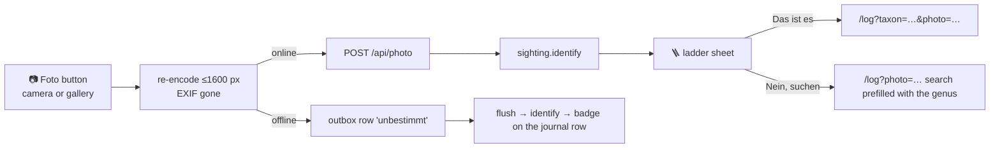

# 📷 [0016] Handoff — Snap-and-send (M12 build)

> A handoff, not a spec. Child of [record 0003](../records/0003-id-engines.md); the build the grill [0015](0015-snap-and-send-grill.md) decided. Read the documents in §⬆️ before anything else; nothing here overrides them.

| 🗓️ Written | 👤 Owner | ⬆️ Parent | ⏱️ Budget |
| --- | --- | --- | --- |
| 2026-09-06 | Sven Reiser | [Record 0003](../records/0003-id-engines.md) · [Findings 0015](0015-snap-and-send-grill-findings.md) §🪜 §❓ · [Spec 0001](../specs/0001-standkreis-dex-the-first-walk.md) §⚖️ | Track A server (½ session, `main`), Track B screen (1 session, worktree), then the owner's walk |

---

## 🎯 Why

M9's finding: the walk is only useful with recognition. Record 0003 picked the engine. This builds the loop: **photo → ladder → the save screen with the species prefilled**, online in ~6 s, offline through the outbox.



## ⬆️ Input

| Read | Why |
| --- | --- |
| Record 0003 §🗳️ I1–I7, §⚠️ | The decisions this builds, the threshold 0.7, the sentences |
| Findings 0015 §🪜 (three ladders), `app/scripts/id-probe/claude.mjs` (the set prompt, the JSON shape, caching) | The prompt is written; port it, do not reinvent it |
| `app/src/components/{LogFlow,LogSearch,LogSave,LogPhoto,LogSheet}.tsx` | The log flow is the URL (`/log`, `/log?taxon=`, `?photo=` rides along); `PhotoInput` with `capture` exists |
| `app/src/components/Queue.ts`, `QueueFlusher.tsx`, `app/src/server/routers/sighting.ts` | The outbox rows carry a blob; `create` takes the client's id |
| `app/src/server/env.ts`, `app/src/server/photos.ts`, `docs/DEPLOY.md` | Where the key is declared, how a photo is read back for the engine |
| `app/src/components/SourceInfo.tsx`, `Sheet.tsx` (0014b) | The ⓘ sheet for the upload sentence; the sheet primitive the ladder uses |

## 🛠️ Tracks

### 🅰️ Server · `main`

| # | Do | Not |
| --- | --- | --- |
| A1 | `ANTHROPIC_API_KEY` in `env.ts` (required in production, the server refuses to start without it, same as the others); `docs/DEPLOY.md` row | never in the client bundle |
| A2 | `sighting.identify({ photoId, regionId })`: reads the asset through `photos.ts`, builds the set prompt for the region **once per region and cached** (the 929 `sciName · German name` lines, `cache_control` ephemeral), calls `claude-sonnet-5` with the JSON shape of `claude.mjs` set prompt plus `subject: single \| several \| none` first. Returns `{ subject, answer: { gbifKey, sciName } \| null, outside: string \| null, confidence, ladder: { family, genus, species }, evidence: string[], hint }` | no Pl@ntNet, no Opus, no streaming |
| A3 | The join: `answer` matched to the set by exact `sciName`; `outside` and genus-only answers go through `taxon.search` for a key, else `null` | no new taxon rows created by the scan; that stays the claim's job |
| A4 | Threshold in the server: species rank only at `confidence ≥ 0.7`, else the answer is the genus (`ladder.genus`) and `answer` is null | |
| A5 | Prompt language follows the request locale (findings I4: the set prompt answered in English) | |
| A6 | Cost line in the response: input/cached/output tokens, so the journal can show "1,4 ¢" in the ⓘ sheet and the owner can watch the spend | |

Checks: A-C1 `identify` on the 18 prepped photos of `walks/01` from a script, same table as `score.mjs` (a regression against the grill, ✅7 🟡5 expected, three cultivated "outside"); A-C2 the cache hit on the second call of a region (cache read tokens > 0); A-C3 a photo that is not an image, a 429 and a timeout each give a typed error, never a 500.

### 🅱️ Screen · worktree `../standkreis-dex-scan`

| # | Do | Not |
| --- | --- | --- |
| B1 | The log sheet's "Foto" opens the camera as today; a new first line on the sheet: *"Foto machen, wir schauen, was es ist"*. Before the first upload ever, one sentence with the ⓘ: *"Das Foto geht ohne Ort und Datum an Anthropic (USA, nach spätestens 30 Tagen gelöscht, kein Training)."* Once, then only in the ⓘ | no consent checkbox |
| B2 | Re-encode on the client (`canvas.toBlob`, ≤ 1600 px, JPEG 0.85) before upload, which drops EXIF; the existing thumbnail path may already do this, then reuse it | |
| B3 | **The ladder sheet** (`Sheet` from 0014b): the photo small at the top, the three rungs animating in one after another (family → genus → species, 220 ms apart), the evidence lines under the rung they belong to, the confidence as words not a number (*sicher · wahrscheinlich · unsicher* at ≥ 0.7 / ≥ 0.4 / below). `subject: several` → *"Mehrere Arten im Bild, welche meinst du?"* and the search. `subject: none` or `outside` → *"Nicht im Atlas von {region}: vermutlich {outside}"* with the search prefilled with that name | no percentage on screen |
| B4 | Buttons: **"Das ist es"** → `/log?taxon=<gbifKey>&photo=<assetId>` (the save screen as today); **"Nein, suchen"** → `/log?photo=<assetId>&q=<genus>`; the hint line (*"Bitte einmal nah heran …"*, record I2) under the rungs whenever the answer stopped at the genus, with a **"Noch ein Foto"** button that reopens the camera | |
| B5 | Offline: the sheet says *"kein Netz · wird beim nächsten Mal bestimmt"*, the sighting is saved as unbestimmt with the photo in the outbox (`idPending` on the row); `QueueFlusher` calls `identify` after the upload and writes the ladder to the row; the journal row shows a badge until the user opens it and takes or rejects the answer | no new IndexedDB store |
| B6 | The ⓘ on a scanned sighting: engine, the cost line, the terms sentence | |

Checks: B-C1 headless Chrome on the production build with a fixture photo injected through the file input: the ladder sheet appears with three rungs, "Das ist es" lands on the save screen with the species and the photo; B-C2 `several` and `outside` paths; B-C3 airplane mode (`Network.emulateNetworkConditions`): saved as unbestimmt, back online → the badge; B-C4 the first-upload sentence shows once; B-C5 `npm run check`; B-C6 Simulator, the owner, with a real photo.

## 📝 Owner

| Do | Where |
| --- | --- |
| `ANTHROPIC_API_KEY` in Vercel (Production + Preview) | Vercel → Settings → Environment Variables |
| A walk in Mainz-Bingen, 20 photos, close-ups included: the second fixture, `docs/research/walks/02/` | the phone; then `score.mjs` again (record 0003 §⚠️) |

## ⬇️ Output

Findings `0016-snap-and-send-findings.md`: the prompt as shipped, the regression table against the grill, A-C1–B-C5 with shots, the cost per scan in production after the owner's walk, doubts, "For the merge".

## 🚫 Not in this handoff

Pl@ntNet · BioCLIP (M12b, record 0003 §🔁) · a new region · the Steckbrief · the ladder on the species page · streaming.

## 👉 Start the session with

```
Read docs/handoffs/0016-snap-and-send.md and the documents it names in §⬆️.
Track A on main: A1–A6, A-C1–A-C3, findings section "Track A". Then Track B in the worktree.
```
