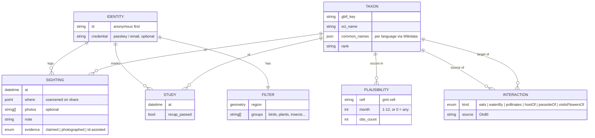
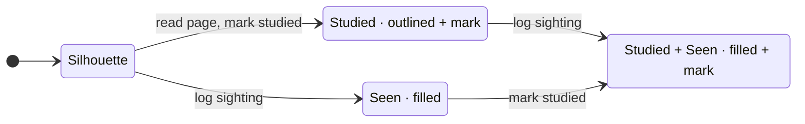
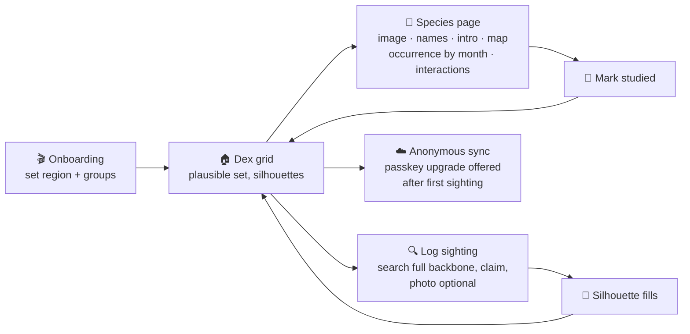

# 🧪 [0001] standkreis-dex — a Pokédex for nature, and the first walk

> **Spec.** Lives while the epic is open; distilled into an ADR and deleted when it closes. Decisions and their rejected alternatives are in the immutable record [`docs/records/0001-standkreis-dex-the-first-walk.md`](../records/0001-standkreis-dex-the-first-walk.md). Research behind it: [`docs/research/`](../research/).

| 🗓️ Date | 👤 Owner | 🎯 Status |
| --- | --- | --- |
| 2026-09-04 | Sven Reiser | Grilled · awaiting UI exploration (step 4) |

---

## 🧭 What it is

A **personal collection layer over open biodiversity data**, on web and phone, that gets a curious casual adult outside and teaches them something every time they open it.

**The promise:** *See what could be living around you right now, learn about it before you meet it, and fill the silhouette when you do.*

**Who:** curious casuals who want to get closer to nature. Sven is user #1. Not kids (Seek owns that, and app-store kids rules forbid location). Not power naturalists (iNaturalist owns that).

**Where:** global from day one. Every species list and every species page is computed from worldwide open data, never curated per region.

**Money:** free forever. Donations if server bills ever hurt. This is a product decision that unlocks non-commercial data (BirdNET, Xeno-canto, iNaturalist CC BY-NC photos) and is not to be quietly reopened.

## 🚫 What it refuses to be

| Refusal | Why |
| --- | --- |
| A species-identification engine | The ID engine is a commodity you rent (Pl@ntNet, BioCLIP 2). iNaturalist's model is closed. Accuracy is not the moat. |
| A science platform | No identifier community, no research-grade pipeline. Sightings can be *exported* to iNaturalist later; they are never *the* dataset. |
| A leaderboard | Volume rewards degrade behaviour and churn users. No XP, no global ranks, no rarity multipliers. |
| A social network in v1 | Share-out cards only. Friends and feeds are possible later on the same identity model, and are where every competitor's ethics problems live. |
| A foraging or toxicity guide | The best app scores 74% on real poisoning cases. Fungi are in the dex; edibility is never stated. |
| A reading app | Learning is progress, but only *seeing* fills a silhouette. See §Two axes. |

---

## 🧬 The model

### Sightings are the atom, the dex is a view

A species is **discovered** on its first sighting. "Seen 14 times, first in March" is derived, never stored. Sessions (walks) and places (patches) can be derived later by clustering sightings on time and location; neither is modelled now.

### Two axes per species

| Axis | Set by | Renders as | Counts on home |
| --- | --- | --- | --- |
| 📖 **Studied** | Opening the species page and marking it, optionally passing a two-question recap | Outlined silhouette with a mark | "42 studied" |
| 👁️ **Seen** | Logging a sighting: claimed (no proof), photographed, or ID-assisted | Filled with your photo if there is one, else the reference image | "17 found" |

Learning makes winter a season instead of a churn cliff. Seeing stays the only thing that fills the grid, so the walk stays the payoff. Quests (deferred) bridge the two: *study three species that arrive in April* → *the three you studied are flying now within 10 km*.

### The plausible set

The dex shows the species with **enough recorded observations in your filter region**, computed from GBIF and iNaturalist occurrence facets per grid cell, thresholded, optionally per month. Move the region, the dex changes. Logging searches the **full GBIF backbone**, so anything found outside the set joins your dex the moment you see it.

The threshold is the curation. Tune it until "what I could find on Saturday" is what the grid shows; that tuning is a first-slice task, not a later one.

---

## 🗄️ Data sources (all free, all open)

| Need | Source | Licence | Notes |
| --- | --- | --- | --- |
| Taxonomy backbone, names | GBIF `species/match`, Catalogue of Life via ChecklistBank | CC0 / CC BY | No key for reads |
| Plausible set | GBIF `occurrence/search` facets by cell + month; iNaturalist `observations/species_counts` | per dataset | Cache per cell per month; iNat ≤ 60 req/min |
| Common names in the user's language, IUCN status, lead image | Wikidata (P846 → QID → labels, P141, P18) | CC0 | |
| Intro text | Wikipedia in the user's language | CC BY-SA | Attribute, share-alike on the text |
| **Ecology: interactions** | **GloBI** API: eats, eatenBy, pollinates, hostOf, parasiteOf, visitsFlowersOf | per source, mostly CC0/CC BY | The one thing no competitor has |
| Ecology: habitat, traits | EOL TraitBank, IUCN habitat classification | CC BY / research use | Coverage uneven; honest empty states |
| Photos | Wikimedia Commons; iNaturalist CC0 / CC BY / CC BY-NC | per file | **Per-image attribution stored and rendered** |
| Sounds | Xeno-canto API v3 (key required) | mostly CC BY-NC-SA | Fine under free-forever |
| Plant ID assist (deferred) | Pl@ntNet API | free 500/day, non-profit tier | |
| Everything-else ID assist (deferred) | BioCLIP 2, self-hosted | MIT | ViT-L, server-side |
| Bird sound ID (deferred) | BirdNET | CC BY-NC-SA | Fine under free-forever |

Every asset carries its licence and attribution in the database. If free-forever is ever reversed, this table is the list of what has to go.

---

## 🏗️ Architecture

| Layer | Choice | Why |
| --- | --- | --- |
| App | **Next.js App Router PWA**, TypeScript, Tailwind, tRPC, Prisma, Postgres | Sven's stack; debug in a browser; one codebase |
| Phone | **Capacitor wrap of the same static export**, when a second user or a home screen needs it | ~95% shared; camera, geolocation, SQLite, haptics via plugins; Apple wants the native touches the product wants anyway |
| Identity | **Anonymous identity minted on first launch**; passkey or email attaches later to sync across devices. Export and delete available in both states | Seek's frictionless first minute without Seek's data-loss disaster |
| Species data | **ETL into Postgres**: taxa, plausibility per cell/month, interactions, assets with attribution. Refreshed on a schedule, not at request time | Nature APIs are slow and rate-limited; the dex must open offline-ish |
| Offline | Service worker caches the dex for the active filter; sightings queue and sync | Nature has no signal |
| Geo | GeoJSON in ordinary columns, grid-cell keys for plausibility. No PostGIS unless the cell math outgrows a loop | Same standing constraint as the sibling repos |

### Navigation

Bottom app bar. Home is **the dex under the global filter**, grid view in the first slice, list and map views deferred. Filters (region, species groups) are first-class and set during onboarding.

---

## 🚶 The first slice: one complete walk

**Definition of done:** Sven uses it on one real walk, and opens it again the next day for no reason.

### Acceptance criteria

- [ ] Onboarding sets a region and species groups in under a minute, no account, no permission dialogs before they're needed.
- [ ] Home shows the plausible set for that filter as a silhouette grid, and the set feels like "what I could find on Saturday" to Sven.
- [ ] A species page composes GBIF, Wikidata, Wikipedia and GloBI, renders per-image attribution, and shows an honest empty state where a source has nothing.
- [ ] Marking a species studied changes its rendering in the grid and the home counter.
- [ ] Logging a sighting by search and claim, with or without a photo, fills the silhouette and updates the counter. Species outside the plausible set are searchable and join the dex.
- [ ] Sightings and studies persist under the anonymous identity, survive a reload, and sync to a second browser once a passkey is attached.
- [ ] Export of all sightings and studies as JSON works in both identity states. Account deletion works.
- [ ] The dex for the active filter opens with no network.
- [ ] Sven has used it on one walk.

### Explicitly not in the first slice

| Deferred | Next slice? | Depends on |
| --- | --- | --- |
| Weekly generated quests (three active, seasonal, graph-driven, study↔find bridge) | second | plausible-by-month + interactions, both built in slice one |
| Snap-and-send ID assist with an explaining taxon ladder | second or third | Pl@ntNet key, BioCLIP 2 host |
| Share-out card with coarsened location | third | a render route |
| List and map views of the dex | when grid is proven | |
| Capacitor wrap and store listing | when a second person wants it | the PWA |
| LLM editor composing ecology prose from GloBI/EOL facts with citations | polish | the graph must exist first |
| Sessions, places, friends, feed, BirdNET | later grills | |

---

## ⚖️ Ethics rules (product, not fine print)

| Rule | Mechanism |
| --- | --- |
| Sensitive species never show precise locations to anyone but their observer | Auto-obscure IUCN threatened and nationally protected taxa to a cell; coarsen all locations on share cards; strip EXIF GPS on share |
| No incentive to approach, handle or disturb | No rarity multipliers, no location-pinned quests, quest on habitats and seasons not coordinates |
| Wild only | Wild / captive / cultivated prompt on sighting; captive sightings never fill the dex |
| No lethal certainty | No edibility or toxicity statements of our own anywhere. Third-party intro text (Wikipedia) may mention it; fungi pages carry a standing legal notice: no statement, no guarantee, text not checked by us |
| Your data is yours | Export and delete in one screen, both identity states |
| No AI-generated imagery | User photos or licensed reference images with attribution |

---

## 🎨 UI (step 4, in progress)

Explored in [handoff 0002](../handoffs/0002-ui-exploration-spike.md); variants and reasons in the [findings](../handoffs/0002-ui-exploration-findings.md). ✅ = chosen by the owner, 🔍 = still in exploration.

1. 🔍 **Onboarding**: region, species groups, the promise, in under a minute, engaging not a form.
2. ✅ **Dex grid**: flat 3-column tiles with the German name under each; silhouette = grey filled shape, studied = amber outline + open-book badge, seen = photo fills the tile (own photo first, else the reference image), studied + seen = photo + badge. Two counters plus the plausible total as denominator. One search field with a filter button that shows only the count of active filters; region, month, groups, state and sort live in a bottom drawer. [Grid](../adr/0001-standkreis-dex-the-first-walk/0002-grid-a.webp) · [drawer](../adr/0001-standkreis-dex-the-first-walk/0002-grid-a-filter-drawer.webp). Rejected: photo cut into a generic silhouette, per-cell state text.
3. ✅ **Species page**: full page. Full-width image slider with attribution under it, three names, the two-axis state line, singular tags (Vogel · einheimisch · IUCN), intro with Wikipedia attribution, year strip in words and bars, OpenStreetMap map with the coarse 10 km cell, ecology as chip rows grouped by kind where each chip carries the target's own dex state, honest empty state, sticky "Gelernt" and "Gesehen" buttons. Fungus pages carry the legal notice. [Amsel](../adr/0001-standkreis-dex-the-first-walk/0002-species-p1-amsel.webp) · [Fliegenpilz](../adr/0001-standkreis-dex-the-first-walk/0002-species-p1-fungus-notice.webp). Rejected: radial graph, bottom sheet. Back must restore the grid's filter and scroll position.
4. 🔍 **Log a sighting**: search, claim, optional photo, wild/captive, done in three taps outdoors in sunlight.
5. ✅ **The fill moment**: in the grid, not over it. The cell irises from silhouette to photo (own photo, else the reference image) with a green ring and the found counter ticking once; a compact sheet from below names what was saved ("Gefunden · Eichelhäher · 4. Sep · Mainz-Bingen · Ort grob gespeichert"), labels a reference-image fill with its attribution, offers "Foto" only when none is attached, and leads on with "Zur Art ›". No acknowledge button, no confetti, no number beyond the counter. One medium haptic when the photo lands. Repeat finds get a quiet toast and no fill. [Reference fill](../adr/0001-standkreis-dex-the-first-walk/0002-fill-sheet.webp) · [own photo](../adr/0001-standkreis-dex-the-first-walk/0002-fill-sheet-own-photo.webp). Rejected: full-screen card (a share card in disguise), silhouette outline resting on the photo.
6. 🔍 **Bottom bar**: which four or five destinations.

**Design language, chosen:** light default (the walk is in sunlight), paper background, white cards, saturated green primary for surfaces and a darker green for text, amber for the studied axis. Dark theme follows the system later. Splash and onboarding may use a dark photographic mood, with a real Commons photo and attribution, never AI imagery.

## ❓ Open, for later grills

- Quest generation rules in detail: how many, how refreshed, what "freeze" means, how a recap works.
- Snap-and-send UX: ladder animation, confidence display, correcting a wrong suggestion.
- The plausibility threshold and cell size, once real data is on screen.
- When exactly the passkey upgrade is offered, and how "see this on your laptop" is worded.
