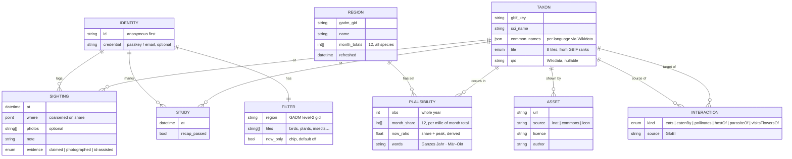
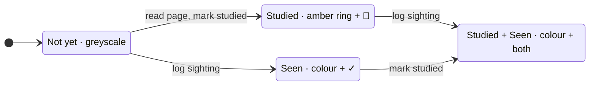
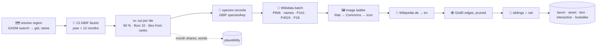

# 🧪 [0001] standkreis-dex — a Pokédex for nature, and the first walk

> **Spec.** Lives while the epic is open; distilled into an ADR and deleted when it closes. Decisions and their rejected alternatives are in the immutable records [0001](../records/0001-standkreis-dex-the-first-walk.md) (the product) and [0002](../records/0002-etl-the-plausible-set.md) (the plausible set and the ETL). Research behind it: [`docs/research/`](../research/).

| 🗓️ Date | 👤 Owner | 🎯 Status |
| --- | --- | --- |
| 2026-09-05 | Sven Reiser | Grilled · UI chosen ([review 0003](../handoffs/0003-ui-spike-review.md)) · plausible set decided ([record 0002](../records/0002-etl-the-plausible-set.md)) · next: M4, the ETL |

---

## 🧭 What it is

A **personal collection layer over open biodiversity data**, on web and phone, that gets a curious casual adult outside and teaches them something every time they open it.

**The promise:** *See what could be living around you right now, learn about it before you meet it, and fill the silhouette when you do.*

**Who:** curious casuals who want to get closer to nature. Sven is user #1. Not kids (Seek owns that, and app-store kids rules forbid location). Not power naturalists (iNaturalist owns that).

**Where:** global from day one. Every species list and every species page is computed from worldwide open data, never curated per region.

**Money:** free forever. Donations if server bills ever hurt. This is a product decision that unlocks non-commercial data (BirdNET, Xeno-canto, iNaturalist CC BY-NC photos) and is not to be quietly reopened.

## 🚫 What it refuses to be

| Refusal | Why |
| --- | --- |
| A species-identification engine | The ID engine is a commodity you rent (Pl@ntNet, BioCLIP 2). iNaturalist's model is closed. Accuracy is not the moat. |
| A science platform | No identifier community, no research-grade pipeline. Sightings can be *exported* to iNaturalist later; they are never *the* dataset. |
| A leaderboard | Volume rewards degrade behaviour and churn users. No ranks, no comparison, no rarity multipliers. XP exists as **private progression** (record Q8c): capped, never shown to anyone else, never on a share card. |
| A social network in v1 | Share-out cards only. Friends and feeds are possible later on the same identity model, and are where every competitor's ethics problems live. |
| A foraging or toxicity guide | The best app scores 74% on real poisoning cases. Fungi are in the dex; edibility is never stated. |
| A reading app | Learning is progress, but only *seeing* fills a silhouette. See §Two axes. |

---

## 🧬 The model

### Sightings are the atom, the dex is a view

A species is **discovered** on its first sighting. "Seen 14 times, first in March" is derived, never stored. Sessions (walks) and places (patches) can be derived later by clustering sightings on time and location; neither is modelled now.

### Two axes per species

| Axis | Set by | Renders as | Counts on home |
| --- | --- | --- | --- |
| 📖 **Studied** | Opening the species page and marking it. XP for studied is paid only after the two-question recap; until the recap exists, studied earns nothing | Greyscale image, amber ring and 📖 | "12 studiert" |
| 👁️ **Seen** | Logging a sighting: claimed (no proof), photographed, or ID-assisted | Colour photo, yours if there is one, else the reference image, and a green ✓ | "8 entdeckt" |

Both counters sit over a **denominator**, the plausible set of the active filter: "12 studiert · 8 entdeckt · 22 möglich". It changes with region and tiles, never with the month: the set is the region's whole year. The month is a **sort** ("jetzt wahrscheinlich", the default) and an opt-in **chip** ("nur jetzt"). The chip narrows the grid, not the denominator. The denominator is not a score.

Learning makes winter a season instead of a churn cliff. Seeing stays the only thing that fills the grid, so the walk stays the payoff. Quests (deferred) bridge the two: *study three species that arrive in April* → *the three you studied are flying now within 10 km*.

### The plausible set

> Decided in [record 0002](../records/0002-etl-the-plausible-set.md) on probe data for Mainz-Bingen and Kyoto. Tables in [findings 0005](../handoffs/0005-etl-grill-findings.md).

The dex shows **the species that open data has actually recorded in your region**, cut per tile so that birders do not drown botanists.

| Rule | Value | Why |
| --- | --- | --- |
| 🗺️ Region | One **GADM level-2 polygon** (Landkreis, city, county), GBIF `gadmGid`. No grid | A 10 km grid over Mainz-Bingen spills 78 % of its species from Mainz and Wiesbaden; the polygon is what the user picked and exists everywhere |
| 📅 Window | **Whole year, last ten years** (2016–2026), observation records only | Month never decides membership: a Mauersegler you found in May must not vanish in September |
| 🔢 Source | **GBIF alone** | iNaturalist research grade is already one GBIF dataset (11 % here, 34 % in Kyoto); iNat alone lacks 40 of GBIF's common September species |
| ✂️ Cut | Per tile: the species that make up **90 % of the tile's observations**, **floor 10** records | Invariant to how many recorders a group has; 931 species for Mainz-Bingen (🐦 69 🦌 8 🦋 396 🌿 388 🍄 23 🐸 7 🦎 5 + 35 spiders and snails); 303 for Kyoto |
| 🧩 Tiles | **8**, from GBIF ranks: 🐦 Aves · 🦌 Mammalia · 🐸 Amphibia · 🦎 Squamata + Testudines + Crocodylia · 🐟 other Chordata · 🦋 **Insekten & Spinnen** = Animalia minus Chordata · 🌿 Plantae · 🍄 Fungi incl. lichens | Fish tile is off by default and shown only when the region's set has any (Kyoto: 19 river fish; Mainz-Bingen: none) |
| 🕰️ Month | Per species and month: **share of the region's observations that month**, in per mille, from twelve facet calls | Effort-normalised without a model; 9 of 10 known phenologies come out right |
| 🔀 Sort | "jetzt wahrscheinlich" = this month's share ÷ the species' peak month | Default grid order and the empty search shortlist |
| 🏷️ Chip | "nur jetzt" = share ≥ 25 % of peak | Mainz-Bingen in September: 364 of 929 |
| 📊 Words | All twelve months ≥ 10 % of peak → **"Ganzes Jahr"**, else the runs of months ≥ 25 % of peak ("Mär–Okt", "Feb · Okt–Dez") | Shown with the bars in Vorkommen; the bars keep the honesty where the words round |
| 🧭 Outside the set | Logging searches the **full GBIF backbone**. A species found outside the set joins your dex and gets content like a set member. It never enters the region's set, shows no bars, says "hier selten gemeldet", and sorts last | One sighting is not plausibility; the denominator does not move (record 0002 E13) |
| 🌐 Language | Intro **de → en → honest empty**, language marked. Per region the UI carries one line with the share of species whose text is English only | Kyoto: German intro 44 %, English 78 %; images and ecology are as good as in Mainz-Bingen |

The set is what open recorders saw, not the fauna: Fuchs and Wildschwein have no GBIF record in Mainz-Bingen in ten years, and a national scheme outside GBIF is invisible. The spec says so where it matters; the grid does not pretend.

---

## 🗄️ Data sources (all free, all open)

Coverage numbers are Mainz-Bingen's 931 species ([findings 0005](../handoffs/0005-etl-grill-findings.md)).

| Need | Source | Licence | Coverage | Notes |
| --- | --- | --- | --- | --- |
| Taxonomy backbone, names, ranks | **GBIF** `species/{key}`, `species/match`; the species facet already folds subspecies | CC0 / CC BY | 100 % | The taxonomy of record. Catalogue of Life rejected as a second backbone |
| Plausible set, month shares | **GBIF** `occurrence/search` facets by `gadmGid` × year range × month | per dataset | 100 % | 13 calls per region, cached 30 days. iNaturalist not used for the set |
| Wikidata link | P846 (GBIF key), fallback exact-name search with rank check | CC0 | 94 % + 6 % | Item not a species → take nothing from it; two items → the one with a dewiki sitelink |
| German name | de.wikipedia sitelink title (Wikidata's German label is the Latin name by convention) | CC0 | 89 % | Kyoto 48 %; English label 94 %, Japanese 81 % |
| IUCN status | Wikidata P141 | CC0 | 22 % | Mostly birds and mammals |
| Alter · Nachwuchs | AnAge via Wikidata P4024 | CC BY | 16 % | Vertebrates only; empty row is honest |
| Lebensraum | ~~EOL TraitBank, IUCN habitat~~ **dropped** | | 1 % open | Both need a token: "token, later". Row removed from the Steckbrief |
| Intro text | Wikipedia **de → en** REST `page/summary` | CC BY-SA | de 87 %, en 86 % | Language marked on the page |
| **Ecology: interactions** | **GloBI** `interaction?sourceTaxon=…`, kinds eats/eatenBy (+preysOn), pollinates, hostOf, parasiteOf, visitsFlowersOf | per source, mostly CC0/CC BY | 100 % of a 258 sample | Drop interactsWith and adjacentTo; common birds hit the 1,000-edge cap, prune before storing |
| Look-alikes | Same genus **within the region's set**, computed in the ETL | — | 358 of 931 | No external call |
| Lead image | **Ladder:** iNat taxon default photo if CC0/BY/BY-NC → Commons P18 unless specimen/plate/larva/egg/map → next licensed iNat photo → tile icon | per file | iNat 100 % (84 % licensed), Commons 92 % | **Attribution stored per image, rendered per image view** (§⚖️) |
| Sounds | Xeno-canto API v3 (key required) | mostly CC BY-NC-SA | not probed | Fine under free-forever |
| Plant ID assist (deferred) | Pl@ntNet API | free 500/day, non-profit tier | | |
| Everything-else ID assist (deferred) | BioCLIP 2, self-hosted | MIT | | ViT-L, server-side |
| Bird sound ID (deferred) | BirdNET | CC BY-NC-SA | | Fine under free-forever |

Every asset carries its licence and attribution in the database. If free-forever is ever reversed, this table is the list of what has to go.

---

## 🗃️ ETL

> Decided in [record 0002](../records/0002-etl-the-plausible-set.md) E11. The probe in [`scripts/etl-probe/`](../../scripts/etl-probe/README.md) ran the whole pipeline in miniature (`matrix.mjs`) and produced the first fixture.

**Tables written:** `region` · `taxon` · `plausibility` · `asset` · `text` (intro, language, source) · `interaction` · `lookalike`.

| Job | Trigger | Refresh | Cost |
| --- | --- | --- | --- |
| Plausibility (A–C) | The first user who picks the region; the grid says "wird vorbereitet", never fetches at request time | Monthly, cached 30 days | 13 GBIF calls per region, seconds |
| Content (D–I) | A species enters any region's set for the first time, or is logged outside every set (E13) | Once; never expires; manual purge only | ≈ 6 calls per species; one region ≈ 5,700 calls ≈ 20 min, bounded by iNaturalist at 1 request/s |
| Ten regions | | | ≈ 31,000 calls; iNaturalist at half its daily cap once, then near zero |

One worker. 4 GBIF facets in flight, 1 request/s to iNaturalist, ~3/s to Wikidata and GloBI. Every response cached on disk by URL so a re-run costs nothing. A takedown path for images is required before a second user.

---

## 🏗️ Architecture

| Layer | Choice | Why |
| --- | --- | --- |
| App | **Next.js App Router PWA**, TypeScript, Tailwind, tRPC, Prisma, Postgres | Sven's stack; debug in a browser; one codebase |
| Phone | **Capacitor wrap of the same static export**, when a second user or a home screen needs it | ~95% shared; camera, geolocation, SQLite, haptics via plugins; Apple wants the native touches the product wants anyway |
| Identity | **Anonymous identity minted on first launch**; passkey or email attaches later to sync across devices. Export and delete available in both states | Seek's frictionless first minute without Seek's data-loss disaster |
| Species data | **ETL into Postgres** (§🗃️): taxa, plausibility per region with twelve month shares, interactions, assets with attribution. Plausibility monthly, content once | Nature APIs are slow and rate-limited; the dex must open offline-ish |
| Offline | Service worker caches the dex for the active filter; sightings queue and sync | Nature has no signal |
| Geo | GeoJSON in ordinary columns, GADM gid as the region key. The 10 km cell exists only on the species map and the location ladder. No PostGIS | Same standing constraint as the sibling repos |
| Language | German and English from the scaffold, every string behind an i18n key | The owner is user #1 and German; the product is global. Vocabulary is fixed in German first (studiert · entdeckt) |

### Navigation

Bottom app bar **Atlas · Quests · ＋ · Tagebuch · Profil**; the ＋ is an action, not a tab. The fifth tab was "Du" until 2026-09-05; the owner chose **Profil · Profile** for the familiar word, the tab id and route stay `you`. The user-facing word is **Atlas** (2026-09-05): it names what the data is, a distribution atlas of the Standkreis, is about the place rather than the observer, and is one word in de and en. "Dex" stays as internal vocabulary (schema, dex state, this spec) and "Pokédex" stays in the pitch. Rejected: Dex (needs Pokémon literacy), Sammlung (in German nature vocabulary it means dead specimens), Entdecken (a verb, and it collides with the entdeckt axis), Feldbuch (too bookish). Home is **the dex under the global filter**, grid view in the first slice, list and map views deferred. Filters (region, tiles) are first-class and set during onboarding; the month is the default sort and the opt-in chip "nur jetzt". In slice one the Quests tab holds a single "kommt bald" line (Q10 stands); Tagebuch is the sightings by day; Du is counters, XP, groups, export, delete and the passkey upgrade, with Einstellungen behind a gear.

---

## 🚶 The first slice: one complete walk

**Definition of done:** Sven uses it on one real walk, and opens it again the next day for no reason.

### Acceptance criteria

- [ ] Onboarding sets a region and species groups in under a minute, no account, no permission dialogs before they're needed.
- [ ] Home shows the plausible set for that filter as a silhouette grid, and the set feels like "what I could find on Saturday" to Sven.
- [ ] A species page composes GBIF, Wikidata, Wikipedia and GloBI, renders attribution per image view (caption under the image, one Quellen line per page), and shows an honest empty state where a source has nothing.
- [ ] Marking a species studied changes its rendering in the grid and the home counter.
- [ ] Logging a sighting by search and claim, with or without a photo, fills the silhouette and updates the counter. Species outside the plausible set are searchable and join the dex.
- [ ] Sightings and studies persist under the anonymous identity, survive a reload, and sync to a second browser once a passkey is attached.
- [ ] Export of all sightings and studies as JSON works in both identity states. Account deletion works.
- [ ] The dex for the active filter opens with no network.
- [ ] Sven has used it on one walk.

### Explicitly not in the first slice

| Deferred | Next slice? | Depends on |
| --- | --- | --- |
| Weekly generated quests (three active, seasonal, graph-driven, study↔find bridge) | second | plausible-by-month + interactions, both built in slice one |
| Snap-and-send ID assist with an explaining taxon ladder | second or third | Pl@ntNet key, BioCLIP 2 host |
| Share-out card with coarsened location | third | a render route |
| List and map views of the dex | when grid is proven | |
| Capacitor wrap and store listing | when a second person wants it | the PWA |
| LLM editor composing ecology prose from GloBI/EOL facts with citations | polish | the graph must exist first |
| Sessions, places, friends, feed, BirdNET | later grills | |

---

## ⚖️ Ethics rules (product, not fine print)

| Rule | Mechanism |
| --- | --- |
| Sensitive species never show precise locations to anyone but their observer | Auto-obscure IUCN threatened and nationally protected taxa to a cell; coarsen all locations on share cards; strip EXIF GPS on share |
| Locations go down a ladder | Stored exact on the device; shown as **Gemeinde** on every list (Tagebuch, save screen); exact only on the single sighting; the 10 km cell on the species map; coarse on anything shared. The save screen says so: "genau gespeichert · geteilt nur grob" |
| Progression is private | XP and level appear on Du and on Tagebuch rows only: never on a share card, never compared to anyone, no decay, no streak, no rarity multiplier, repeats capped to once per species and month. Studied pays only after the recap. The only public-facing numbers are the two counters and their denominator |
| No incentive to approach, handle or disturb | No rarity multipliers, no location-pinned quests, quest on habitats and seasons not coordinates |
| Wild only | Wild / captive / cultivated prompt on sighting; captive sightings never fill the dex |
| No lethal certainty | No edibility or toxicity statements of our own anywhere. Third-party intro text (Wikipedia) may mention it; fungi pages carry a standing legal notice: no statement, no guarantee, text not checked by us |
| Your data is yours | Export and delete in one screen, both identity states |
| No AI-generated imagery | User photos or licensed reference images with attribution |
| Attribution per image view | Caption on every image at readable size (species page, fill sheet, onboarding splash); one sources line under the grid and one Quellen line at the bottom of every species page; full author and licence on long-press. No caption per grid cell. Copied Wikipedia intros carry CC BY-SA share-alike until they are rewritten from the facts |
| Name and photo are yours | Both optional, local only, never in a sync payload before a passkey exists, never on a share card |

---

## 🎨 UI (step 4, chosen)

Explored in [handoff 0002](../handoffs/0002-ui-exploration-spike.md); variants, owner picks and the 46 doubts in the [findings](../handoffs/0002-ui-exploration-findings.md); checks and answers in [review 0003](../handoffs/0003-ui-spike-review.md). Every screen ✅.

1. ✅ **Onboarding**: three screens, one action each. A dark photographic splash with a real Commons photo and its caption, the promise, then "Meinen Standort nutzen" with the OS permission explained *before* it appears ("wir speichern nur den Landkreis"), "Ort eingeben" as the fallback. Groups as tiles, all on, tap to switch off. A ready screen with the filtered count for this month, nine grey tiles and one line per axis. No account or sync mention before the first sighting. Reason: outdoors nobody types, and the explained ask is what Seek never did. [region](../adr/0001-standkreis-dex-the-first-walk/0002-onboard-1-region.webp) · [groups](../adr/0001-standkreis-dex-the-first-walk/0002-onboard-2-groups.webp) · [ready](../adr/0001-standkreis-dex-the-first-walk/0002-onboard-3-ready.webp). Rejected: search first, a skip on the groups screen.
2. ✅ **Atlas grid**: flat 3-column tiles with the German name under each. Not yet discovered = the reference image in greyscale at 45 %; studied = greyscale at 70 % with an amber inset ring and a 📖 badge; discovered = colour photo (own first, else the reference image) with a green ✓; both badges when both. Header: title, grid · list · map toggle, one bar amber-then-green with "12 studiert · 8 entdeckt · 22 möglich", möglich being the active filter's set. One search field with a filter button that shows only the count; region, tiles, state, sort and the "nur jetzt" chip in a bottom drawer (Zeitraum as a filter dropped, record 0002 E2); a bottom-right button takes over once the bar scrolls away. One sources line under the grid, no caption per cell. Back restores filter and scroll. [grid](../adr/0001-standkreis-dex-the-first-walk/0002-grid-a.webp) · [dark](../adr/0001-standkreis-dex-the-first-walk/0002-grid-a-dark.webp) · [drawer](../adr/0001-standkreis-dex-the-first-walk/0002-grid-a-filter-drawer.webp) · [360](../adr/0001-standkreis-dex-the-first-walk/0002-grid-a-360.webp). Rejected: group silhouettes (generic, not reproducible), photo cut into a silhouette, per-cell state text, the "likely now" dot.
3. ✅ **Species page**: full page. Image slider with the caption under it, three names, the two-axis state row (📖 studiert · ✓ entdeckt · date), the Wikipedia intro, then sections: **Steckbrief** (Größe · Alter · Nachwuchs · Zug · Status · Stimme; Lebensraum dropped, record 0002 E8), **Vorkommen** (year strip in words and bars, OpenStreetMap with the 10 km cell), **Verwechslungsgefahr** (look-alike tiles carrying dex state), **Ökologie** (chip rows by kind, each chip carrying the target's dex state, honest empty state). One faint Quellen line at the bottom; section headers carry no source. Sticky "Studiert" and "Entdeckt". Fungus pages carry the legal notice above the intro. [Amsel](../adr/0001-standkreis-dex-the-first-walk/0002-species-p1-amsel.webp) · [sections](../adr/0001-standkreis-dex-the-first-walk/0002-species-p1-amsel-scrolled.webp) · [bottom](../adr/0001-standkreis-dex-the-first-walk/0002-species-p1-amsel-scrolled-2.webp) · [Fliegenpilz](../adr/0001-standkreis-dex-the-first-walk/0002-species-p1-fungus-notice.webp) · [dark](../adr/0001-standkreis-dex-the-first-walk/0002-species-p1-amsel-dark.webp). Rejected: radial graph, sheet over grid, 4:3 hero, an ecology score, a "Beschreibung" heading.
4. ✅ **Log a sighting**: the centred ＋ opens a chooser (Foto · Galerie · Suchen, Suchen primary). Search with an empty query *is* the shortlist ("jetzt wahrscheinlich · noch nicht entdeckt"); typing searches the whole backbone. Save on one screen: species, when, where ("genau gespeichert · geteilt nur grob"), optional photo, note; the save button is the wild/captive answer, "Wild · speichern" primary and "Gehalten · speichern" secondary. Three taps outdoors. "Entdeckt" on a species page jumps straight to the save screen. Reason: the wild/captive question is unavoidable but free, and the camera is visible but not first (Q10). [chooser](../adr/0001-standkreis-dex-the-first-walk/0002-log-1-chooser.webp) · [shortlist](../adr/0001-standkreis-dex-the-first-walk/0002-log-2-search-empty.webp) · [results](../adr/0001-standkreis-dex-the-first-walk/0002-log-2-search-results.webp) · [save](../adr/0001-standkreis-dex-the-first-walk/0002-log-3-save.webp). Rejected: a separate wild/captive dialog, camera as the default tile, a confirm step after save.
5. ✅ **The fill moment**: in the grid, not over it. The cell sweeps from grey to colour (own photo, else the reference image) with a green ring and the entdeckt counter ticking once; a compact sheet from below names what was saved ("Entdeckt · Eichelhäher · 4. Sep · Mainz-Bingen · Ort grob gespeichert"), labels a reference-image fill with its attribution, offers "Foto" only when none is attached, and leads on with "Zur Art ›". No acknowledge button, no confetti, no XP on the sheet. One medium haptic when the photo lands. Repeats get a quiet toast and no fill. [sheet](../adr/0001-standkreis-dex-the-first-walk/0002-fill-sheet.webp) · [own photo](../adr/0001-standkreis-dex-the-first-walk/0002-fill-sheet-own-photo.webp). Rejected: full-screen card (a share card in disguise), silhouette outline resting on the photo.
6. ✅ **Bottom bar**: Atlas · Quests · ＋ · Tagebuch · Du, one stroke icon set, the ＋ raised and centred as an action. Tagebuch earns its tab because the sighting is the atom (Q1). Quests holds a single "kommt bald" line in slice one. [bar](../adr/0001-standkreis-dex-the-first-walk/0002-grid-a.webp). Rejected: a Lernen tab, Missions, Social, more than five.

Mocked ahead of their slice and chosen, not built in slice one: **7 Quests** as three cards with the why sentence, **8 Tagebuch** by day with Neu entdeckt · Studiert chips and no chip on repeats, **9 Einstellungen** behind a gear, **10 Du** with a blue XP bar and level, region and group progress. Shots and doubts in the findings.

**Design language, chosen:** light default (the walk is in sunlight), paper background, white cards, saturated green `#16a34a` for surfaces and `#15803d` for text. One colour per axis: **amber = studiert, green = entdeckt, blue = progression** (avatar ring, level badge, XP bar, nowhere else). Amber before green in text and bars; badges on the grid and the species state row only. Dark theme follows the system, every colour is a token, the onboarding splash stays dark in both. Vocabulary studiert · entdeckt; the mock speaks German, the app ships German and English with i18n keys from the scaffold. No AI imagery anywhere: Commons photos with captions, drawn group icons.

## ❓ Open, for later grills

- Quest generation rules in detail: how many, how refreshed, how repeats are avoided in a small region.
- The recap: two questions per species, where they come from, what counts as passed. Until it exists, studied earns no XP.
- The XP curve: 150 per level is the mock's number; tune on real data.
- Snap-and-send UX: ladder animation, confidence display, correcting a wrong suggestion.
- ~~The plausibility threshold and cell size~~ → record 0002. Open instead: whether 931 tiles feel like a checklist once scrolled; the lever is the 90 % tile share.
- The fish tile's own cut, if a coastal region floods it.
- When exactly the passkey upgrade is offered, and how "see this on your laptop" is worded.
